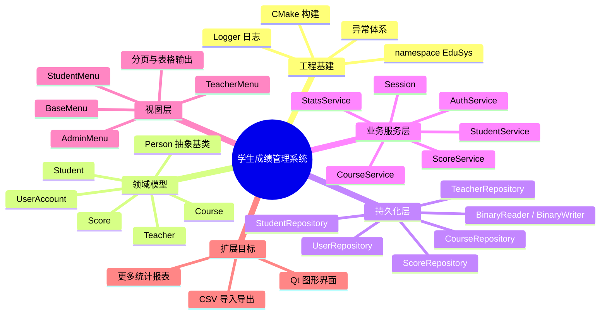
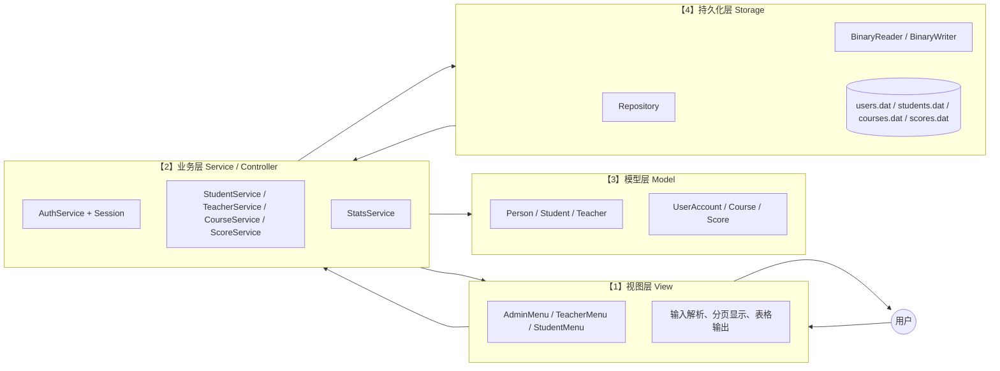
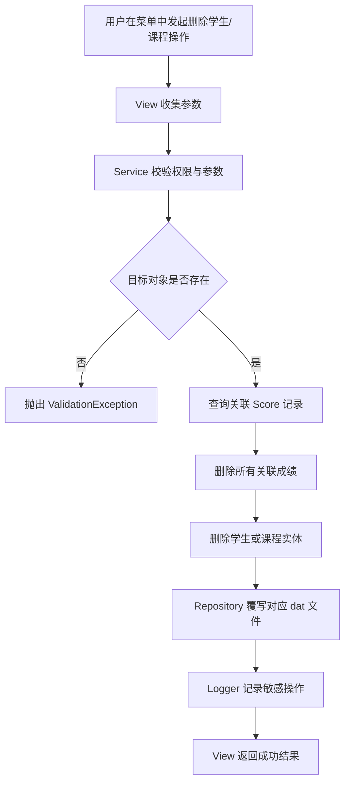
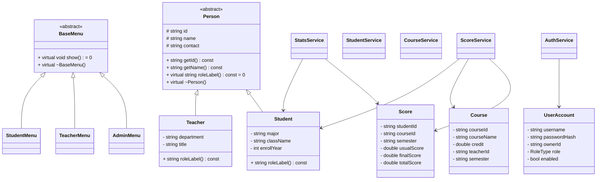
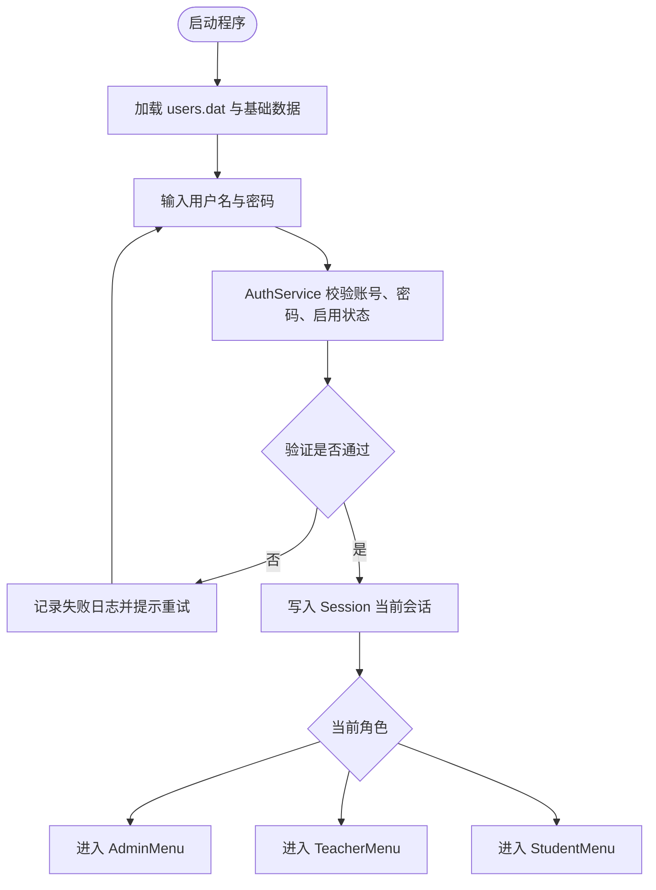

# EduSys - 学生成绩管理系统

EduSys 是一个基于 `C++17` 的学生成绩管理系统。仓库里现在有两条入口，需要先区分清楚：

- `edusys.exe`：CLI 入口，装配逻辑在 `src/app/main.cpp`
- `edusys_gui.exe`：Qt Widgets 入口，装配逻辑在 `src/app/gui_main.cpp`

两条入口共享同一套 `AppContext`、`service`、`model`、`storage` 和 `report`。GUI 复用同一套业务逻辑，只替换界面层。

当前仓库已经完成的内容：

- 三类角色登录与权限控制：`Admin`、`Teacher`、`Student`
- 学生、课程、成绩三大核心对象的 CRUD（新增、查询、修改、删除）与查询
- GPA、课程统计、课程排名、学业预警
- `.dat` 二进制持久化与显式序列化
- `warning_report.txt` 文本报告与课程 CSV 导出
- `--self-test` 自检入口与 `tools/corrupt_check.bat` 文件损坏脚本
- `introduceQt` 分支的 Qt Widgets GUI
- 架构图册、答辩问答稿、测试用例文档、CLI 演示教程

这份 `README.md` 不只写运行命令，也会作为项目说明和代码解读文档使用。下面会先分清入口，再按功能链和目录树逐级展开，把主要文件的具体内容、职责边界、使用时机都讲清楚。

## 1. 快速开始

### 1.0 先解释几个常见词

建议先了解下面这些术语，再阅读后续运行说明和代码说明：

| 词 | 在本项目里的意思 |
| --- | --- |
| CLI | 控制台版本，也就是运行 `edusys.exe` 后在终端窗口里输入菜单编号、学号、课程号。 |
| GUI | 图形界面版本，也就是 `edusys_gui.exe` 弹出的 Qt 窗口。 |
| Qt Widgets | Qt 的传统桌面控件方案，按钮、输入框、表格、标签页都属于 Widgets。 |
| CMake | 生成工程和构建规则的工具。Qt 分支用它生成 `edusys` 和 `edusys_gui` 两个目标。 |
| `AppContext` | 应用装配对象。可以把它理解成“把仓储、服务、报表导出器统一准备好的一张工作台”。CLI 和 GUI 都从这里拿同一批服务对象。 |
| `Session` | 当前登录状态。里面记录“当前是谁、是什么角色、对应哪个学生或教师编号”。权限判断主要看它。 |
| Service / 服务层 | 写业务规则的地方，例如谁能删学生、教师能不能改某门课的成绩、分数范围是否合法。 |
| Repository / 仓储 | 负责从 `data/*.dat` 读出对象、再把对象写回文件的类。它不决定业务规则，只负责存取。 |
| Model / 实体 | 学生、教师、课程、成绩、账号这些数据对象本身。 |
| ReportExporter | 把统计结果写成 `warning_report.txt` 或 CSV 文件的导出器。 |
| seed | 第一次运行且数据为空时，系统自动写入默认账号和样例数据。 |
| upsert | “有就更新，没有就新增”。成绩录入用这个策略，避免同一学生同一课程同一学期重复多条记录。 |
| `.dat` | 本项目自己的二进制数据文件，不是普通文本，不建议手工打开修改。 |
| 显式序列化 | 每个对象自己规定字段按什么顺序写入文件、再按什么顺序读回来。 |
| 级联删除 | 删除一个对象时，顺手清掉和它相关的其他记录。例如删学生时，也删除该学生成绩和学生账号。 |
| 白名单 | 只允许出现在清单里的对象被操作。教师端的“我的课程”就是白名单。 |
| `--self-test` | 程序内置的自动回归检查入口，不进入菜单，直接验证一批边界。 |

### 1.1 基础操作流程

本节提供基础运行步骤。后续章节用于功能说明、代码解读和答辩准备，可按需阅读。

Windows 下常见有两种终端：`cmd`（命令提示符）和 PowerShell。两者大部分命令相近，但 PowerShell 执行当前目录下的 `.bat` 或 `.exe` 时，需要在前面加 `.\`。

如果你是从文件资源管理器右键“在终端中打开”，通常打开的是 PowerShell，提示符前面会看到 `PS`。如果你是从开始菜单打开 `cmd`，提示符一般不会带 `PS`。下面的命令请按你当前窗口的终端类型来选，不要混用。

如果使用 `cmd`，进入项目根目录：

```cmd
cd /d D:\Student_Score_Management_System
```

如果使用 PowerShell，进入项目根目录：

```powershell
cd D:\Student_Score_Management_System
```

进入目录后，确认当前目录为项目根目录：

```cmd
dir README.md
dir CMakeLists.txt
dir src
dir include
```

如果能列出这些文件或目录，说明当前目录正确。后面运行 `edusys.exe`、`edusys_gui.exe` 时，也建议都在项目根目录执行，因为程序里的 `data/...` 是按当前运行目录来找的。

CLI 快速命令如下。你如果看到的是 `PS D:\...>`，请直接看 PowerShell 写法；你如果看到的是 `D:\...>`，请看 `cmd` 写法。

`cmd` 写法：

```cmd
build.bat
edusys.exe --self-test
edusys.exe
tools\corrupt_check.bat
```

PowerShell 写法：

```powershell
.\build.bat
.\edusys.exe --self-test
.\edusys.exe
.\tools\corrupt_check.bat
```

命令含义如下：

- `build.bat` / `.\build.bat`：用 `g++` 在仓库根目录构建 `edusys.exe`
- `edusys.exe --self-test` / `.\edusys.exe --self-test`：执行 Week 11 + Week 13 A-E 组内建自检
- `edusys.exe` / `.\edusys.exe`：进入正常登录与菜单交互，用户名留空直接退出，连续 3 次认证失败后退出
- `tools\corrupt_check.bat` / `.\tools\corrupt_check.bat`：执行 Week 13 F 组文件损坏测试并自动恢复

这里的 Week 11 / Week 13 是课程开发阶段编号，不是日历周。A-E / F 是测试分组：A-E 主要覆盖认证、字段非法、重复主键、级联删除、教师权限；F 专门覆盖 `.dat` 文件损坏。`corrupt_check.bat` 会临时制造损坏文件并从备份恢复，运行时不要手动中断脚本。

首次操作建议按下面顺序执行：

1. 执行构建命令：`cmd` 中用 `build.bat`，PowerShell 中用 `.\build.bat`。
2. 如果编译成功，根目录下会生成或更新 `edusys.exe`。如果出现编译错误，应先处理错误，再继续执行后续命令。
3. 如果 PowerShell 提示“无法将 build.bat 项识别为命令”，通常是少了 `.\`，应改成 `.\build.bat`。
4. 如果编译时报 `cannot open output file edusys.exe: Permission denied`，通常是 `edusys.exe` 仍在运行。先关闭正在运行的 CLI 窗口，或在任务管理器里结束 `edusys.exe` 后再重新构建。
5. 执行自检命令：`cmd` 中用 `edusys.exe --self-test`，PowerShell 中用 `.\edusys.exe --self-test`。
6. 如果看到 `Week 11 : self-check PASSED` 和 `Week 13 : boundary-check PASSED`，说明核心功能和边界检查正常。
7. 执行交互程序：`cmd` 中用 `edusys.exe`，PowerShell 中用 `.\edusys.exe`。
8. 登录时可使用 `admin / admin123`，进入管理员菜单后按菜单编号操作。
9. 退出当前账号时，在菜单里输入 `0`；关闭整个 CLI 程序时，回到登录界面后用户名留空并回车。
10. `tools\corrupt_check.bat` 是文件损坏测试，PowerShell 中要写成 `.\tools\corrupt_check.bat`；它适合自检通过后执行，课堂手工演示功能时不一定要先执行它。

如果目标是演示 CLI 端功能，建议优先使用 README 第 19.5 节。该文档按“输入内容、预计输出、演示顺序”组织，更适合课堂现场演示。

### 1.2 CLI 参数约定

当前 CLI 只认两种启动方式：

- 无参数：进入交互式登录和菜单
- `--self-test`：进入 Week 11 + Week 13 自检

除此之外的其他参数都会被当成非法参数直接报错退出。

### 1.3 Qt 入口

`introduceQt` 分支下还有一条独立 GUI 入口，构建命令由 Qt / CMake 决定，核心是生成 `edusys_gui.exe`。阅读这一段前，先确认自己确实在 Qt 分支；如果只是演示或验证 CLI，`edusys.exe` 仍然可以单独运行，不需要先启动 GUI。

下面命令里的 `-DCMAKE_PREFIX_PATH=...` 要填 Qt 安装目录，不是本项目目录，也不是 `build-qt-introduceQt` 目录。例如你的 Qt 安装在 `D:\Qt\6.11.0\mingw_64`，这里就填这个路径。

如果已经安装 Qt，并且路径类似 `D:\Qt\6.11.0\mingw_64`，可以按下面顺序操作：

1. 进入项目根目录。
2. 输入 `git branch --show-current`，确认当前分支是不是 `introduceQt`。
3. 如果不是 `introduceQt`，输入 `git switch introduceQt`。
4. 确认 Qt 的 CMake、Ninja、MinGW 路径都存在，例如 `D:\Qt\Tools\CMake_64\bin\cmake.exe`、`D:\Qt\Tools\Ninja\ninja.exe`、`D:\Qt\Tools\mingw1310_64\bin\g++.exe`。
5. 运行 CMake 配置命令，生成 `build-qt-introduceQt` 构建目录。
6. 运行 Ninja 编译命令，生成 `edusys.exe` 和 `edusys_gui.exe`。
7. 启动 GUI：`cmd` 中运行 `build-qt-introduceQt\edusys_gui.exe`，PowerShell 中运行 `.\build-qt-introduceQt\edusys_gui.exe`。
8. 如果弹出登录窗口，说明 GUI 已经启动成功。

`cmd` 写法：

```cmd
cmake -S . -B build-qt-introduceQt -G Ninja -DCMAKE_PREFIX_PATH=...
cmake --build build-qt-introduceQt --target edusys edusys_gui
build-qt-introduceQt\edusys_gui.exe
```

PowerShell 写法：

```powershell
cmake -S . -B build-qt-introduceQt -G Ninja -DCMAKE_PREFIX_PATH=...
cmake --build build-qt-introduceQt --target edusys edusys_gui
.\build-qt-introduceQt\edusys_gui.exe
```

说明：

- 先用 `git branch --show-current` 确认当前分支；如果不在 Qt 分支，可用 `git switch introduceQt` 切过去。
- `build.bat` 只负责 CLI，不负责 Qt；想运行 GUI 不要只执行 `build.bat`。
- `edusys_gui.exe` 的启动入口是 `src/app/gui_main.cpp`，不会复用 CLI 的 `src/app/main.cpp`。
- 两条入口共享 `AppContext`、服务层、仓储层和报表层。`AppContext` 是 CLI 和 GUI 共用的运行时装配入口。
- 当前 `CMakeLists.txt` 已经给 `edusys_gui` 加了 `Qt6::CoreTools` 和构建后 `windeployqt`，所以用 CMake/Ninja 构建完成后，通常不需要手工拷贝 Qt 运行时 DLL。

如果使用当前机器上已经验证过的 Qt MinGW 路径，可以使用下面的完整命令。

`cmd` 写法：

```cmd
D:\Qt\Tools\CMake_64\bin\cmake.exe -S . -B build-qt-introduceQt -G Ninja -DCMAKE_PREFIX_PATH=D:\Qt\6.11.0\mingw_64 -DCMAKE_MAKE_PROGRAM=D:\Qt\Tools\Ninja\ninja.exe -DCMAKE_CXX_COMPILER=D:\Qt\Tools\mingw1310_64\bin\g++.exe
D:\Qt\Tools\Ninja\ninja.exe -C build-qt-introduceQt edusys edusys_gui
build-qt-introduceQt\edusys_gui.exe
```

PowerShell 写法：

```powershell
D:\Qt\Tools\CMake_64\bin\cmake.exe -S . -B build-qt-introduceQt -G Ninja -DCMAKE_PREFIX_PATH=D:\Qt\6.11.0\mingw_64 -DCMAKE_MAKE_PROGRAM=D:\Qt\Tools\Ninja\ninja.exe -DCMAKE_CXX_COMPILER=D:\Qt\Tools\mingw1310_64\bin\g++.exe
D:\Qt\Tools\Ninja\ninja.exe -C build-qt-introduceQt edusys edusys_gui
.\build-qt-introduceQt\edusys_gui.exe
```

三条命令分别对应：

- 第一条：配置工程。正常情况下会看到 `Configuring done`、`Generating done`、`Build files have been written to: ...`。
- 第二条：编译程序。正常情况下会看到 Ninja 编译进度，最后没有错误输出。
- 第三条：启动 GUI。正常情况下会弹出登录框。

登录测试可使用默认账号：

| 用户名 | 密码 | 打开的窗口 |
| --- | --- | --- |
| `admin` | `admin123` | 管理员端 |
| `t001` | `t001pw` | 教师端 |
| `s001` | `s001pw` | 学生端 |

GUI 退出方式：在角色窗口点击“退出登录”会回到登录框；在登录框点击“退出”，或者用户名留空后确认退出，会关闭整个 GUI。

### 1.4 两种构建方式

#### 方式 A：CMake / MSVC

下面两条命令在 `cmd` 和 PowerShell 中都可以直接执行，不需要额外前缀。

```text
cmake -S . -B build
cmake --build build --config Release
```

说明：

- 这条路径适合 Visual Studio / CMake 用户
- 产物通常位于 `build/Release/edusys.exe` 或 CMake 指定输出目录
- `build/` 目录里的内容大多数是自动生成文件，不是手写业务代码

#### 方式 B：`g++` 备用脚本

`cmd` 写法：

```cmd
build.bat
```

PowerShell 写法：

```powershell
.\build.bat
```

说明：

- 这条路径适合课程环境中只装了 MinGW / g++ 的情况
- `build.bat` 会编译 CLI 需要的 `src/app/main.cpp`、公共层、模型层、报表层、服务层、存储层和 `src/view/*.cpp`，不会编译 `src/app/gui_main.cpp` 或 `src/gui/*.cpp`
- `tools/corrupt_check.bat` 默认就假定你运行的是根目录下这个 `edusys.exe`

### 1.5 先分清两条入口

CLI 和 GUI 是两个不同的可执行程序，不是同一个程序里的两个模式。运行 `edusys.exe` 后不会出现“切换到 GUI”的菜单；运行 `edusys_gui.exe` 后也不会进入 CLI 菜单。

如果你现在是来做课程演示，默认看 CLI 这组内容：

- `edusys.exe`
- README 第 19.5 节
- `demo_input.txt`

如果你的目标是 `introduceQt` 分支的桌面窗口版，优先看 GUI 这组内容：

- `edusys_gui.exe`
- `src/app/gui_main.cpp`
- `src/gui/*`

### 1.6 退出方式补充

CLI 里有两种退出：

- 在角色菜单中输入 `0. Logout`，只是退出当前角色菜单，程序会回到登录界面，不会直接关闭程序。
- 如果要彻底关闭 CLI 程序，要在登录界面把用户名留空。

Qt GUI 里也有两种退出：

- 在角色主窗口点“退出登录”，会关闭当前 `AdminWindow` / `TeacherWindow` / `StudentWindow`，然后回到 `LoginDialog`。
- 在登录框里点“退出”，或者用户名留空后确认退出，整个 GUI 程序才会结束。

这个行为由 `src/app/gui_main.cpp` 的登录循环负责，不属于 CLI 菜单逻辑。

## 2. 系统功能概览

### 2.1 三类角色

| 角色 | 能做什么 | 不能做什么 |
| --- | --- | --- |
| `Admin` | 学生/课程/成绩的完整 CRUD（Create/Read/Update/Delete，即新增、查询、修改、删除）、统计、预警报告、CSV 导出、修改自己的密码 | 无业务级限制 |
| `Teacher` | 只查看并维护自己授课课程的成绩、查看自己课程的统计、修改自己的密码 | 不能改学生与课程基础数据，不能动别人的课程 |
| `Student` | 只查看自己的资料、成绩、GPA，修改自己的密码 | 不能写成绩，不能看别人数据 |

### 2.2.0 功能树总图

先看树，再看后面的入口索引和代码链。这里的“叶子节点”指的是用户在菜单里能直接选到、或在窗口里能直接点到的一步。

```text
EduSys 功能树
├─ CLI / edusys.exe
│  ├─ 登录 / 会话
│  │  ├─ 输入用户名密码登录
│  │  ├─ 用户名留空退出
│  │  └─ 连续 3 次失败退出
│  ├─ Admin
│  │  ├─ 学生管理
│  │  │  ├─ 列表
│  │  │  ├─ 按学号查看
│  │  │  ├─ 新增
│  │  │  ├─ 编辑
│  │  │  └─ 删除（级联清理成绩和账号）
│  │  ├─ 课程管理
│  │  │  ├─ 列表
│  │  │  ├─ 按课程号查看
│  │  │  ├─ 新增
│  │  │  ├─ 编辑
│  │  │  └─ 删除（级联清理成绩）
│  │  ├─ 成绩管理
│  │  │  ├─ 全部列表
│  │  │  ├─ 按学生查
│  │  │  ├─ 按课程查
│  │  │  ├─ 录入 / 更新
│  │  │  └─ 删除单条
│  │  ├─ 统计分析
│  │  │  ├─ 课程统计
│  │  │  ├─ 课程排名
│  │  │  └─ 学生 GPA
│  │  ├─ 预警报告
│  │  ├─ CSV 导出
│  │  ├─ 修改密码
│  │  └─ 退出登录
│  ├─ Teacher
│  │  ├─ 我的课程
│  │  ├─ 我的课程成绩
│  │  ├─ 录入 / 更新本课成绩
│  │  ├─ 删除本课成绩
│  │  ├─ 我的课程统计
│  │  ├─ 修改密码
│  │  └─ 退出登录
│  ├─ Student
│  │  ├─ 我的资料
│  │  ├─ 我的成绩
│  │  ├─ 我的 GPA
│  │  ├─ 修改密码
│  │  └─ 退出登录
│  └─ System
│     ├─ --self-test
│     ├─ 空用户名退出
│     ├─ 连续 3 次失败退出
│     └─ tools/corrupt_check.bat（脚本，不是 edusys.exe 菜单项）
├─ Qt GUI / edusys_gui.exe
│  ├─ LoginDialog
│  │  ├─ 登录
│  │  ├─ 空用户名退出
│  │  └─ 连续 3 次失败退出
│  ├─ AdminWindow
│  │  ├─ 学生管理页签
│  │  ├─ 课程管理页签
│  │  ├─ 成绩管理页签
│  │  ├─ 统计分析页签
│  │  ├─ 报告导出页签
│  │  └─ 账户页签
│  ├─ TeacherWindow
│  │  ├─ 我的课程页签
│  │  ├─ 我的课程成绩页签
│  │  ├─ 我的课程统计页签
│  │  └─ 账户页签
│  ├─ StudentWindow
│  │  ├─ 我的资料页签
│  │  ├─ 我的成绩页签
│  │  ├─ 我的 GPA 页签
│  │  └─ 账户页签
│  └─ 表单对话框
│     ├─ StudentEditDialog
│     ├─ CourseEditDialog
│     ├─ ScoreEditDialog
│     └─ ChangePasswordDialog
├─ 共享核心
│  ├─ AppContext
│  ├─ Session
│  ├─ Person -> Student / Teacher
│  ├─ model
│  ├─ storage
│  ├─ service
│  └─ report
└─ 验证入口
   ├─ edusys.exe --self-test
   ├─ tools/corrupt_check.bat
   └─ README 第 19.5 节 / README 第 19.4 节
```

### 2.2 CLI 菜单与 Qt 窗口总览

CLI 和 Qt GUI 是两条并列入口。CLI 入口是 `edusys.exe`，用户通过键盘输入菜单编号；Qt 入口是 `edusys_gui.exe`，用户通过登录框、页签、表格、按钮和弹窗操作。界面代码不同，业务服务代码相同，数据文件路径规则相同。也就是说，CLI 和 GUI 不是互相调用，而是分别把用户操作交给同一套服务层处理。

这里说“功能等价”，主要指学生、课程、成绩、统计、报告导出、密码修改这些业务功能等价；`--self-test` 和 `tools/corrupt_check.bat` 仍然是 CLI/脚本验证入口，不做成 GUI 菜单项。

先看 CLI 的菜单结构：

```text
Login loop
  -> username / password
  -> username empty = quit
  -> 3 failed attempts = exit
  -> AuthService.authenticate()

Admin Menu
  1. Student management
  2. Course management
  3. Score management
  4. Statistics
  5. Generate warning report
  6. Change my password
  7. Export course CSV (stats + ranking)
  0. Logout

Teacher Menu
  1. List my courses
  2. View scores for my course
  3. Record / update one score
  4. Delete one score
  5. Course statistics (my course only)
  6. Change my password
  0. Logout

Student Menu
  1. View my profile
  2. View my scores
  3. View my GPA
  4. Change my password
  0. Logout
```

再看 Qt GUI 的窗口结构：

```text
GUI startup
  -> QApplication
  -> AppContext.initializeData()
  -> LoginDialog
       username empty / click Exit = quit application
       3 failed attempts = quit application
       AuthService.authenticate()
  -> createRoleWindow(session)

AdminWindow
  Tab 1. 学生管理
  Tab 2. 课程管理
  Tab 3. 成绩管理
  Tab 4. 统计分析
  Tab 5. 报告导出
  Tab 6. 账户

TeacherWindow
  Tab 1. 我的课程
  Tab 2. 我的课程成绩
  Tab 3. 我的课程统计
  Tab 4. 账户

StudentWindow
  Tab 1. 我的资料
  Tab 2. 我的成绩
  Tab 3. 我的 GPA
  Tab 4. 账户
```

这一段要分清：CLI 的“菜单编号”只属于 `src/view/`；Qt 的“页签和按钮”只属于 `src/gui/`。它们不是互相调用的关系，而是并列调用 `AppContext` 里装配好的服务对象。`AppContext` 负责统一装配认证、学生、课程、成绩、统计、报表等服务，CLI 和 GUI 都从这里取得这些对象。

还要注意一个运行目录细节：代码里的 `data/...` 是相对当前运行目录的路径。通常在项目根目录启动两个程序时，CLI 和 GUI 会读写同一个 `data/` 目录；如果从不同工作目录启动，它们可能各自读写不同位置下的 `data/`。为了减少混乱，建议统一从项目根目录启动 `edusys.exe` 和 `edusys_gui.exe`。

### 2.2.1 CLI 叶子节点到代码的总索引

如果只想快速对照“菜单里选什么、代码走哪里、数据写哪里”，可以先看这张表。README 第 19.5 节 的章节号是课堂手工演示参考，不是程序里的代码行号。
如果你只是要运行或演示项目，先看前两列；如果你要读代码或答辩解释实现，再看后面的 View、Service、数据落点和验证方式。

| 角色/入口 | 菜单功能 | View 入口 | Service / Report 入口 | 主要数据落点 | 演示/验证方式 |
| --- | --- | --- | --- | --- | --- |
| 登录/会话 | 用户名密码登录、空用户名退出、3 次失败退出 | `runInteractiveLoop()` | `AuthService::authenticate()` | `data/users.dat`、`data/app.log` | `cli-demo-guide` 第 3、9 节；`--self-test` A 组 |
| Admin / 学生管理叶子组 | 列表、按学号查、新增、编辑、删除学生 | `AdminMenu::studentMenu()` | `StudentService::listAll/findById/create/update/remove()` | `data/students.dat`、删除时还影响 `scores.dat` 和 `users.dat` | `cli-demo-guide` 第 4.1-4.6 节；`--self-test` B/C/D 组 |
| Admin / 课程管理叶子组 | 列表、按课程号查、新增、编辑、删除课程 | `AdminMenu::courseMenu()` | `CourseService::listAll/findById/create/update/remove()` | `data/courses.dat`、删除时还影响 `scores.dat` | `cli-demo-guide` 第 4.7-4.12 节；`--self-test` B/C 组 |
| Admin / 成绩管理叶子组 | 成绩列表、按学生查、按课程查、录入/更新、删除单条成绩 | `AdminMenu::scoreMenu()` | `ScoreService::listAll/findByStudent/findByCourse/upsert/remove()` | `data/scores.dat` | `cli-demo-guide` 第 4.13-4.19 节；`--self-test` B/E 组 |
| Admin / 统计分析叶子组 | 课程统计、课程排名、学生 GPA | `AdminMenu::statsMenu()` | `StatsService::computeCourseStats/rankByCourse/computeGpaFor()` | 只读 `students.dat/courses.dat/scores.dat` | `cli-demo-guide` 第 4.20-4.23 节 |
| Admin / 预警报告 | 生成学业预警报告 | `AdminMenu::generateWarningReport()` | `ReportExporter::exportWarningReport()` | `data/warning_report.txt` | `cli-demo-guide` 第 4.24 节 |
| Admin / 修改密码 | 修改管理员自己的密码 | `AdminMenu::changePassword()` | `AuthService::changePassword()` | `data/users.dat` | `cli-demo-guide` 第 7 节；`--self-test` A 组覆盖失败边界 |
| Admin / CSV 导出 | 导出课程统计 CSV 和排名 CSV | `AdminMenu::exportCsv()` | `ReportExporter::exportCourseStatsCsv/exportRankingCsv()` | `data/course_stats_<courseId>.csv`、`data/ranking_<courseId>.csv` | `cli-demo-guide` 第 4.25 节 |
| Teacher / 我的课程 | 查看我的课程 | `TeacherMenu::listMyCourses()` | `CourseService::listAll()` 后按 `teacherId` 过滤 | 只读 `data/courses.dat` | `cli-demo-guide` 第 5.2 节 |
| Teacher / 我的课程成绩链 | 查看本课程成绩、录入/更新、删除、统计 | `TeacherMenu::viewMyScores/upsertScore/deleteScore/courseStats()` | `ScoreService` 和 `StatsService`，先经 `pickOwnCourseId()` 选择本人课程 | 读写 `data/scores.dat`，统计只读 | `cli-demo-guide` 第 5.3-5.7 节；`--self-test` E 组 |
| Teacher / 修改密码 | 修改教师自己的密码 | `TeacherMenu::changePassword()` | `AuthService::changePassword()` | `data/users.dat` | `cli-demo-guide` 第 7 节说明入口，按需手工演示 |
| Student / 资料成绩GPA | 查看我的资料、我的成绩、我的 GPA | `StudentMenu::viewProfile/viewMyScores/viewMyGpa()` | `StudentService`、`ScoreService`、`StatsService` | 只读 `students.dat/scores.dat/courses.dat` | `cli-demo-guide` 第 6.2-6.4 节 |
| Student / 修改密码 | 修改学生自己的密码 | `StudentMenu::changePassword()` | `AuthService::changePassword()` | `data/users.dat` | `cli-demo-guide` 第 7 节说明入口，按需手工演示 |
| `--self-test` | 自动回归检查，不进入菜单 | `main()` 参数分支 | 多个 Service 直接被调用 | 可能写日志；首次空数据会自动写入默认示例数据 | `README` 第 13.1 节、README 第 19.4 节 |
| `tools/corrupt_check.bat` | 文件损坏恢复检查 | 批处理脚本 | 外部制造损坏后运行 `edusys.exe --self-test` | 临时备份/恢复 `data/*.dat`，输出到 `data/__corrupt_out__/` | `README` 第 13.2 节、README 第 19.4 节 F 组 |

这张表也说明了一个边界：README 第 19.5 节 的主线会实际演示大部分 CLI 操作，但不是每个失败分支都逐项手打；失败边界主要由 `--self-test`、`corrupt_check.bat` 和演示文档的可选补充部分覆盖。

### 2.2.2 Qt GUI 叶子节点到代码的总索引

下面这张表只讲 Qt GUI，不讲 CLI 菜单。它的作用是把 `edusys_gui.exe` 里每一个主要窗口功能和真实代码连起来，说明 GUI 操作会经过同一套服务层，并在相同运行目录下读写同一批真实数据文件。

表里的“Qt 代码入口”和“Service / Report 入口”都是源码位置或函数名，不是需要手动执行的命令。真正运行 GUI 的命令仍然是启动 `edusys_gui.exe`。

| GUI 入口/窗口 | 页面或动作 | Qt 代码入口 | Service / Report 入口 | 主要数据落点 | 与 CLI 的关系 |
| --- | --- | --- | --- | --- | --- |
| GUI 启动 | 初始化 Qt 应用、初始化 `AppContext`、数据为空时写入默认示例数据、进入登录循环 | `src/app/gui_main.cpp` 的 `main()` | `AppContext::initializeData()` | 首次数据为空时写入 `data/*.dat`，日志写入 `data/app.log` | 和 CLI 一样先装配核心层；GUI 不进入 `runInteractiveLoop()` |
| GUI 登录 | 用户名密码登录、空用户名退出、点击退出、连续 3 次失败退出 | `LoginDialog::tryLogin()` | `AuthService::authenticate()` | 读取 `data/users.dat`，写 `data/app.log` | 行为对齐 CLI 登录循环，只是错误提示换成 `QMessageBox` |
| 角色分发 | 按 `Session.role` 打开对应主窗口 | `createRoleWindow()` | 使用 `Session` 判断 `Admin/Teacher/Student` | 不直接落盘 | 和 CLI 的角色分发规则相同，但创建的是 Qt 主窗口 |
| AdminWindow | 6 个页签的主窗口容器 | `AdminWindow::AdminWindow()` | 后续页签分别调用各自服务 | 按具体功能落盘 | 对应 CLI 的 Admin 菜单功能集合 |
| Admin / 学生管理页签 | 列表、按学号查看、新增、编辑、级联删除 | `createStudentPage()`、`refreshStudentTable()`、`showStudentById()`、`createStudent()`、`editSelectedStudent()`、`removeSelectedStudent()` | `StudentService::listAll/findById/create/update/remove()` | `students.dat`；删除学生时还影响 `scores.dat`、`users.dat` | 功能等价于 CLI `AdminMenu::studentMenu()` |
| Admin / 课程管理页签 | 列表、按课程号查看、新增、编辑、级联删除 | `createCoursePage()`、`refreshCourseTable()`、`showCourseById()`、`createCourse()`、`editSelectedCourse()`、`removeSelectedCourse()` | `CourseService::listAll/findById/create/update/remove()` | `courses.dat`；删除课程时还影响 `scores.dat` | 功能等价于 CLI `AdminMenu::courseMenu()` |
| Admin / 成绩管理页签 | 全部成绩、按学生查、按课程查、录入/更新、编辑、删除单条 | `createScorePage()`、`refreshScoreTable()`、`showScoresByStudent()`、`showScoresByCourse()`、`createScore()`、`editSelectedScore()`、`removeSelectedScore()` | `ScoreService::listAll/findByStudent/findByCourse/upsert/remove()` | `scores.dat` | 功能等价于 CLI `AdminMenu::scoreMenu()` |
| Admin / 统计分析页签 | 课程统计、课程排名、学生 GPA | `createStatsPage()`、`queryCourseStats()`、`queryCourseRanking()`、`queryStudentGpa()` | `StatsService::computeCourseStats/rankByCourse/computeGpaFor()` | 只读 `students.dat/courses.dat/scores.dat` | 功能等价于 CLI `AdminMenu::statsMenu()` |
| Admin / 报告导出页签 | 学业预警报告、课程统计 CSV、课程排名 CSV | `createReportPage()`、`exportWarningReport()`、`exportCourseStatsCsv()`、`exportRankingCsv()` | `ReportExporter::exportWarningReport/exportCourseStatsCsv/exportRankingCsv()` | `warning_report.txt`、`course_stats_<courseId>.csv`、`ranking_<courseId>.csv` | 导出路径和 CLI 保持一致 |
| Admin / 账户页签 | 修改密码、退出登录 | `createAccountPage()`、`ChangePasswordDialog` | `AuthService::changePassword()` | `users.dat` | 退出登录是关闭主窗口，`gui_main.cpp` 再回到登录框 |
| TeacherWindow | 4 个页签的教师窗口容器 | `TeacherWindow::TeacherWindow()` | 后续页签分别调用课程、成绩、统计、认证服务 | 按具体功能落盘 | 对应 CLI 的 Teacher 菜单功能集合 |
| Teacher / 我的课程页签 | 查看本人课程 | `createMyCoursesPage()`、`refreshMyCourses()`、`myCourses()` | `CourseService::listAll()` | 只读 `courses.dat` | Service 已按教师 `ownerId` 过滤；GUI 表格只展示本人课程 |
| Teacher / 我的课程成绩页签 | 选择本人课程、加载成绩、录入/编辑/删除成绩 | `createMyScoresPage()`、`refreshMyScores()`、`createScore()`、`editSelectedScore()`、`removeSelectedScore()` | `ScoreService::findByCourse/upsert/remove()` | `scores.dat` | GUI 先用下拉框限制课程；Service 仍会拒绝越权课程 |
| Teacher / 我的课程统计页签 | 选择本人课程、课程统计、课程排名 | `createMyStatsPage()`、`queryCourseStats()`、`queryCourseRanking()` | `StatsService::computeCourseStats/rankByCourse()` | 只读 `courses.dat/scores.dat/students.dat` | 教师只能统计自己的课，规则与 CLI 一致 |
| Teacher / 账户页签 | 修改密码、退出登录 | `createAccountPage()`、`ChangePasswordDialog` | `AuthService::changePassword()` | `users.dat` | 退出后回到 GUI 登录框 |
| StudentWindow | 4 个页签的学生窗口容器 | `StudentWindow::StudentWindow()` | 后续页签分别调用学生、成绩、统计、认证服务 | 按具体功能落盘 | 对应 CLI 的 Student 菜单功能集合 |
| Student / 我的资料页签 | 查看自己的学生档案 | `createProfilePage()` | `StudentService::findById(session_, session_.getOwnerId())` | 只读 `students.dat` | 和 CLI 一样只能看自己 |
| Student / 我的成绩页签 | 查看自己的成绩列表 | `createMyScoresPage()`、`refreshMyScores()` | `ScoreService::findByStudent(session_, session_.getOwnerId())` | 只读 `scores.dat` | 和 CLI 一样只能看自己 |
| Student / 我的 GPA 页签 | 查看自己的 GPA | `createMyGpaPage()`、`refreshMyGpa()` | `StatsService::computeGpaFor(session_, session_.getOwnerId())` | 只读 `students.dat/courses.dat/scores.dat` | 和 CLI 一样只能算自己 |
| Student / 账户页签 | 修改密码、退出登录 | `createAccountPage()`、`ChangePasswordDialog` | `AuthService::changePassword()` | `users.dat` | 退出后回到 GUI 登录框 |
| GUI 表单对话框 | 新增/编辑学生、课程、成绩、修改密码 | `StudentEditDialog`、`CourseEditDialog`、`ScoreEditDialog`、`ChangePasswordDialog` | 学生/课程/成绩对话框收集字段后由窗口调用 Service；改密码对话框内部调用 `AuthService::changePassword()` | 按被调用 Service 决定 | 对话框不直接写 `.dat`，复杂规则仍由 Service 处理 |
| CLI 保留入口 | 自动自检、坏文件脚本、手工 CLI 演示 | 不属于 `src/gui/` | `--self-test`、`tools/corrupt_check.bat`、README 第 19.5 节 | 按各自入口决定 | 这些不是 GUI 菜单项，仍由 CLI/脚本维护 |

如果要一句话概括这张表：从业务层角度看，Qt GUI 是把“输入输出方式”从 `cin/cout` 换成了 Qt 控件；从界面层角度看，GUI 仍然需要单独处理窗口、对话框、按钮事件和表格刷新。真正决定能不能登录、能不能越权、能不能写入、删除时清理哪些关联数据的地方，仍然是 `service/` 和 `storage/`。

### 2.3 默认样例账号

| 用户名 | 密码 | 角色 | 说明 |
| --- | --- | --- | --- |
| `admin` | `admin123` | `Admin` | 管理员账号，不关联任何 `Person` 实体 |
| `t001` | `t001pw` | `Teacher` | 关联教师 `T001` |
| `t002` ~ `t006` | `t002pw` ~ `t006pw` | `Teacher` | 分别关联教师 `T002` ~ `T006` |
| `s001` | `s001pw` | `Student` | 关联学生 `S001` |
| `s003` ~ `s101` | `s003pw` ~ `s101pw` | `Student` | 分别关联学生 `S003` ~ `S101` |

补充说明：

- 仓库第一次运行且五个 `.dat` 文件都为空时，会自动 seed 初始数据；已有数据时只加载当前持久化状态，不再把已删除的演示学生、教师、课程或成绩自动补回。
- 当前演示数据重点覆盖 100 个学生、6 位教师、20 门课程和一批成绩记录。学生分布在 12 个班级以上，课程包括工科数学分析、概率论与数理统计、大学物理、C++ 程序设计、数据结构、操作系统、数据库系统等。
- Week 11 自检会确保 `S002` 被级联删除，用来验证“删学生同时清成绩和学生账号”的链路。因此常规演示账号从 `s001`、`s003` 往后使用，不依赖 `s002`。
- 因此“当前数据状态”和“刚 seed 完的初始状态”可能不同，这是设计的一部分，不是数据漂移。

### 2.4 本 README 的审查标准

为了让完全没看过代码的人也能判断“功能是否有对应实现”，后面的解读按下面标准写：

- 说明一个功能时，同时交代它从哪个入口进入。
- 说明一个文件时，同时交代它调用了哪个服务、服务又读写了哪个仓储。
- 说明权限控制时，同时交代哪个角色会被允许、哪个角色会被拒绝、拒绝发生在哪一层。
- 说明持久化时，同时交代数据最终写到哪个 `.dat`、`.txt` 或 `.csv` 文件。
- 说明测试时，同时交代 `--self-test` 或脚本验证的是哪条业务边界。
- 如果某个文件只是构建产物或本地工具配置，就不要把它作为业务功能描述，而是说明它为什么不是核心代码。

也就是说，这份 README 不是只列功能名称，而是按“可追踪链路”来讲。一个功能如果已经实现，应该能顺着这条链看下去：

```text
用户动作
  -> CLI 菜单类 / Qt 窗口类
  -> Service 业务规则
  -> Repository 读写集合
  -> Model 显式序列化
  -> data/ 下的 .dat / .txt / .csv 文件
```

后面会贴一些关键代码片段。读这些代码时不用逐行背语法，重点看三件事：

- 入口在哪里：是 `main.cpp`、`AdminMenu.cpp`、`TeacherMenu.cpp`，还是 Qt 的窗口文件。
- 规则在哪里：通常在 `src/service/*.cpp`，例如权限、校验、级联删除。
- 最后写到哪里：通常是 `data/*.dat`、`data/warning_report.txt` 或 `data/*.csv`。

如果你完全没看过这个项目，可以先只看每段代码前后的文字和表格；等知道功能链路后，再回头看代码细节。

### 2.5 先看懂系统如何启动

这个项目最容易混淆的地方是：CLI 和 GUI 有两个入口，但它们不是两套业务系统。

可以先把启动过程理解成三步：

```text
启动 exe
  -> 创建 AppContext，把数据读写工具和业务服务准备好
  -> 登录成功后，根据角色进入对应菜单或窗口
```

所以 `main.cpp` 和 `gui_main.cpp` 的主要区别不是“业务规则不同”，而是“一个把用户带到控制台菜单，一个把用户带到 Qt 窗口”。真正判断权限、校验字段、读写文件的代码，仍然在同一批 Service 和 Repository 里。

CLI 的入口在 [`src/app/main.cpp`](src/app/main.cpp)。它负责三件事：

- 解析命令行参数，决定是跑 `--self-test` 还是进入交互菜单。
- 创建 `AppContext`，让仓储、服务、导出器都准备好。
- 登录成功后按角色创建 `AdminMenu`、`TeacherMenu` 或 `StudentMenu`。

GUI 的入口在 [`src/app/gui_main.cpp`](src/app/gui_main.cpp)。它也做三件事：

- 创建 `QApplication` 和同一套 `AppContext`。
- 弹出 `LoginDialog` 完成认证。
- 登录成功后按角色创建 `AdminWindow`、`TeacherWindow` 或 `StudentWindow`。

两边共同使用的是 [`src/app/AppContext.cpp`](src/app/AppContext.cpp)。这个文件的构造函数把所有核心对象装配到一起：

如果你不熟悉 C++ 构造函数，先看结构就行：冒号后面这一串叫“成员初始化列表”，每一行都是在创建一个仓储或服务对象；括号里传进去的是它依赖的对象。

```cpp
AppContext::AppContext()
    : studentRepo()
    , teacherRepo()
    , userRepo()
    , courseRepo()
    , scoreRepo()
    , authService(userRepo)
    , studentService(studentRepo, scoreRepo, userRepo)
    , teacherService(teacherRepo, courseRepo, scoreRepo, userRepo)
    , courseService(courseRepo, scoreRepo, teacherRepo)
    , scoreService(scoreRepo, courseRepo, studentRepo)
    , statsService(studentRepo, courseRepo, scoreRepo)
    , reportExporter(statsService) {}
```

这段代码说明几个关键事实：

- `AuthService` 只依赖 `UserRepository`，所以登录只碰账号表。
- `StudentService` 同时依赖学生、成绩、账号仓储，所以它能做“删学生时连成绩和账号一起清”的级联删除。
- `TeacherService` 同时依赖教师、课程、成绩、账号仓储，所以它能做“删教师时先从课程教师列表解绑；课程无教师时再清课程和成绩；教师账号同步删除”的级联维护。
- `CourseService` 同时依赖课程、成绩、教师仓储，所以它能检查授课教师是否存在，也能删课时清理相关成绩。
- `ScoreService` 同时依赖成绩、课程、学生仓储，所以它能检查学生存在、课程存在、教师是否有权操作该课程。
- `StatsService` 依赖学生、课程、成绩仓储，所以统计可以把学生姓名、课程学分和成绩记录合并计算。
- `ReportExporter` 依赖 `StatsService`，说明报表只是把统计结果写成文件，不重新计算一套统计逻辑。

这里的 `studentRepo`、`courseRepo`、`scoreRepo` 这些名字可以理解成“数据表的读写对象”。服务层拿到这些对象以后，才有能力读学生、读课程、写成绩、导出报告。这样写的好处是：控制台和 Qt 不需要自己知道 `.dat` 文件怎么读写，只需要调用服务。

初始化数据也在 `AppContext` 里完成：

```cpp
bool AppContext::initializeData() {
    ensureDirectoryExists(DATA_DIR);

    const bool allEmpty =
        studentRepo.loadAll().empty() && teacherRepo.loadAll().empty() &&
        userRepo.loadAll().empty()    && courseRepo.loadAll().empty()  &&
        scoreRepo.loadAll().empty();

    if (!allEmpty) {
        Logger::instance().info("Existing data files detected -> loading persisted data without demo refill.");
        return false;
    }

    Logger::instance().info("All repositories empty -> seeding initial sample data.");
    seedSampleData(studentRepo, teacherRepo, userRepo, courseRepo, scoreRepo);
    return true;
}
```

这段逻辑的意思是：不是每次启动都覆盖数据。五个仓储全空时会写入基础 seed，并由 `ensureDemoCatalog()` 生成完整演示数据；仓储已经有数据时不会清空重来，也不会补回用户已经删除的演示数据。这样新增、修改、删除学生、教师、课程和成绩后，重启 CLI 或 GUI 仍会保留当前持久化结果。

### 2.6 登录、会话和角色分发

CLI 登录流程从 `runInteractiveLoop()` 开始。用户输入用户名和密码后，入口层不直接查文件，而是调用 `AuthService::authenticate()`：

```cpp
UserAccount acc = authSvc.authenticate(username, password);
Session session;
session.login(acc.getUsername(), acc.getRole(), acc.getOwnerId());
```

这里的 `ownerId` 是账号关联的业务编号：教师账号 `t001` 关联教师编号 `T001`，学生账号 `s001` 关联学生编号 `S001`，`s003` 关联学生编号 `S003`，依次类推。管理员账号不对应某个学生或教师，所以它不依赖 `ownerId` 去限制可见数据。

认证成功后，`main.cpp` 根据账号角色分发到三个菜单：

```cpp
switch (acc.getRole()) {
    case RoleType::Admin: {
        AdminMenu menu(session, authSvc, studentSvc, courseSvc, scoreSvc,
                       statsSvc, reportExporter);
        menu.run();
        break;
    }
    case RoleType::Teacher: {
        TeacherMenu menu(session, authSvc, courseSvc, scoreSvc, statsSvc);
        menu.run();
        break;
    }
    case RoleType::Student: {
        StudentMenu menu(session, authSvc, studentSvc, scoreSvc, statsSvc);
        menu.run();
        break;
    }
}
```

密码校验在 [`src/service/AuthService.cpp`](src/service/AuthService.cpp)：

```cpp
UserAccount AuthService::authenticate(const std::string& username,
                                      const std::string& password) {
    auto users = userRepo_.loadAll();
    auto it = findByUsername(users, username);

    if (it == users.end()) {
        Logger::instance().warn("Auth failed: unknown user '" + username + "'");
        throw AuthException("Invalid username or password");
    }
    if (!it->isEnabled()) {
        Logger::instance().warn("Auth failed: account disabled '" + username + "'");
        throw AuthException("Account is disabled");
    }
    if (!PasswordHasher::verify(password, it->getPasswordHash())) {
        Logger::instance().warn("Auth failed: bad password for '" + username + "'");
        throw AuthException("Invalid username or password");
    }

    Logger::instance().info("Auth OK: '" + username + "'");
    return *it;
}
```

这条链路可以这样审查：

| 审查点 | 代码位置 | 说明 |
| --- | --- | --- |
| 用户输入从哪里来 | `src/app/main.cpp` 的 `runInteractiveLoop()` | 只负责读取用户名、密码和处理 3 次失败退出 |
| 账号从哪里查 | `AuthService::authenticate()` 调用 `userRepo_.loadAll()` | 账号数据来自 `data/users.dat` |
| 密码怎么验证 | `PasswordHasher::verify()` | 不直接比较明文 |
| 会话怎么形成 | `Session::login(username, role, ownerId)` | 后续所有权限判断都依赖 `Session` |
| 失败怎么处理 | 抛 `AuthException`，CLI 捕获后显示 `[ERR]` | 失败不会进入任何菜单 |

GUI 登录是同一条服务链。[`src/gui/LoginDialog.cpp`](src/gui/LoginDialog.cpp) 做界面输入，最终仍然调用同一个 `AuthService`，成功后把 `Session` 交给 `gui_main.cpp`，再由 `createRoleWindow()` 创建对应主窗口。

### 2.7 修改密码功能链路

三类角色的 CLI 菜单里都有“Change my password”。入口分别在 [`src/view/AdminMenu.cpp`](src/view/AdminMenu.cpp)、[`src/view/TeacherMenu.cpp`](src/view/TeacherMenu.cpp) 和 [`src/view/StudentMenu.cpp`](src/view/StudentMenu.cpp)。这三个菜单读入旧密码和新密码后，都调用同一个服务方法：

```text
AdminMenu::changePassword()
TeacherMenu::changePassword()
StudentMenu::changePassword()
  -> AuthService::changePassword(session, oldPw, newPw)
  -> UserRepository::loadAll()
  -> PasswordHasher::verify(oldPw, oldHash)
  -> UserAccount::setPasswordHash(PasswordHasher::hash(newPw))
  -> UserRepository::saveAll()
  -> data/users.dat
```

CLI 菜单层只负责读取输入和显示成功/失败，规则在 [`src/service/AuthService.cpp`](src/service/AuthService.cpp)：

```cpp
void AuthService::changePassword(const Session& session,
                                 const std::string& oldPassword,
                                 const std::string& newPassword) {
    if (!session.isLoggedIn()) {
        throw AuthException("Not logged in");
    }
    if (newPassword.empty()) {
        throw ValidationException("New password must not be empty");
    }

    auto users = userRepo_.loadAll();
    auto it = findByUsername(users, session.getUsername());
    if (it == users.end()) {
        throw AuthException("Session user no longer exists: " + session.getUsername());
    }
    if (!PasswordHasher::verify(oldPassword, it->getPasswordHash())) {
        Logger::instance().warn("ChangePassword failed: bad old password for '"
                                + session.getUsername() + "'");
        throw AuthException("Old password is incorrect");
    }

    it->setPasswordHash(PasswordHasher::hash(newPassword));
    userRepo_.saveAll(users);
    Logger::instance().info("Password changed for '" + session.getUsername() + "'");
}
```

这段逻辑可以拆成几步看：

| 步骤 | 发生位置 | 说明 |
| --- | --- | --- |
| 1 | `session.isLoggedIn()` | 未登录不能改密码 |
| 2 | `newPassword.empty()` | 新密码不能为空 |
| 3 | `findByUsername(users, session.getUsername())` | 只能修改当前会话自己的账号 |
| 4 | `PasswordHasher::verify(oldPassword, it->getPasswordHash())` | 旧密码必须正确 |
| 5 | `setPasswordHash(PasswordHasher::hash(newPassword))` | 新密码重新哈希，不保存明文 |
| 6 | `userRepo_.saveAll(users)` | 最终写回 `data/users.dat` |

Week 13 自检覆盖了“未登录改密码”和“新密码为空”两个负面边界；成功改密码本身属于 CLI/GUI 手工演示路径，因为它会改变当前账号密码，演示时需要记住新密码或提前准备可恢复的数据。

### 2.8 学生管理功能链路

学生管理只允许管理员写入，学生本人只能读自己的资料。服务层允许教师只读学生列表，但当前 CLI 教师菜单没有提供“学生列表”入口，所以课堂演示 CLI 时不要把它当成教师端菜单功能。写入限制集中在 [`src/service/StudentService.cpp`](src/service/StudentService.cpp)。

管理员在 CLI 里进入学生管理的入口是 [`src/view/AdminMenu.cpp`](src/view/AdminMenu.cpp) 的 `studentMenu()`。这个菜单负责显示选项、读取学号和字段，然后调用 `StudentService`：

```text
AdminMenu::studentMenu()
  -> studentSvc_.listAll(session_)
  -> studentSvc_.findById(session_, id)
  -> studentSvc_.create(session_, student)
  -> studentSvc_.update(session_, student)
  -> studentSvc_.remove(session_, id)
```

管理员限制在 `StudentService` 的私有辅助函数里：

```cpp
void requireAdmin(const Session& session, const std::string& op) {
    if (!session.isLoggedIn()) {
        throw AuthException("Not logged in (op=" + op + ")");
    }
    if (!session.isAdmin()) {
        throw PermissionException("Admin role required for op=" + op);
    }
}
```

新增学生的核心链路是：

```cpp
void StudentService::create(const Session& session, const Student& student) {
    requireAdmin(session, "Student.create");
    validateStudent(student);

    auto all = studentRepo_.loadAll();
    auto dup = std::find_if(all.begin(), all.end(),
        [&](const Student& s) { return s.getId() == student.getId(); });
    if (dup != all.end()) {
        throw ValidationException("Student id already exists: " + student.getId());
    }
    all.push_back(student);
    studentRepo_.saveAll(all);
    Logger::instance().info("Student created: " + student.getId());
}
```

这段代码能看出：

- `requireAdmin()` 先拦住非管理员。
- `validateStudent()` 检查学号不能为空、姓名不能为空、入学年份必须大于 0；学号唯一性由后面的查重逻辑保证。
- `studentRepo_.loadAll()` 把 `data/students.dat` 读成内存列表。
- `std::find_if()` 检查学号是否重复。
- `studentRepo_.saveAll(all)` 整批覆写学生数据文件。
- `Logger::instance().info()` 把操作写到 `data/app.log`。

学生删除涉及成绩和账号的级联清理，代码如下：

```cpp
void StudentService::remove(const Session& session, const std::string& id) {
    requireAdmin(session, "Student.remove");

    auto students = studentRepo_.loadAll();
    auto it = std::find_if(students.begin(), students.end(),
        [&](const Student& s) { return s.getId() == id; });
    if (it == students.end()) {
        throw ValidationException("Student not found: " + id);
    }

    auto scores = scoreRepo_.loadAll();
    const auto scoresBefore = scores.size();
    scores.erase(std::remove_if(scores.begin(), scores.end(),
        [&](const Score& sc) { return sc.getStudentId() == id; }),
        scores.end());
    const auto removedScores = scoresBefore - scores.size();
    scoreRepo_.saveAll(scores);

    auto users = userRepo_.loadAll();
    const auto usersBefore = users.size();
    users.erase(std::remove_if(users.begin(), users.end(),
        [&](const UserAccount& u) {
            return u.getRole() == RoleType::Student && u.getOwnerId() == id;
        }),
        users.end());
    const auto removedUsers = usersBefore - users.size();
    userRepo_.saveAll(users);

    students.erase(it);
    studentRepo_.saveAll(students);
}
```

这条链路要按顺序理解：

| 步骤 | 发生位置 | 结果 |
| --- | --- | --- |
| 1 | `requireAdmin()` | 非管理员不能删除学生 |
| 2 | `studentRepo_.loadAll()` | 先确认学生确实存在 |
| 3 | `scoreRepo_.loadAll()` + `scoreRepo_.saveAll()` | 删除该学生所有成绩，写回 `data/scores.dat` |
| 4 | `userRepo_.loadAll()` + `userRepo_.saveAll()` | 删除该学生对应登录账号，写回 `data/users.dat` |
| 5 | `studentRepo_.saveAll()` | 删除学生本体，写回 `data/students.dat` |
| 6 | `Logger` | 记录删除了多少成绩和账号 |

上面的代码片段为了突出级联删除顺序，没有把函数末尾的日志行完整贴出。实际实现会继续把删除的学生编号、被清理的成绩数量、被清理的账号数量写入 `data/app.log`。

学生级联删除可以按上述顺序追踪。老师如果问“怎么保证删除学生后没有残留成绩和残留账号”，可以看这里，再看 `--self-test` 里的 D 组检查。

### 2.9 教师管理功能链路

教师管理只有管理员可以写。入口在 `AdminMenu::teacherMenu()` 和 Qt 的 `AdminWindow` 教师管理页签，最终调用 [`src/service/TeacherService.cpp`](src/service/TeacherService.cpp)。

新增教师时，系统写入 `teachers.dat`；如果同时填写登录用户名和初始密码，还会写入 `users.dat` 中的教师账号。删除教师时不是简单地把该教师所有课程直接删掉，而是先从每门相关课程的授课教师列表中移除该教师：

```cpp
for (auto& course : courses) {
    if (!course.hasTeacher(id)) {
        continue;
    }

    course.removeTeacherId(id);
    if (course.getTeacherIds().empty()) {
        removedCourseIds.push_back(course.getCourseId());
    } else {
        ++updatedCourses;
    }
}
```

这段逻辑的含义是：

- 如果课程原来是 `T901,T902` 共同授课，删除 `T901` 后课程仍保留，教师列表变成 `T902`，课程成绩不删除。
- 如果课程原来只有 `T901` 一个老师，删除 `T901` 后课程没有授课教师，系统才删除该课程，并删除该课程下所有成绩。
- 无论该教师是否还有课程，教师本人的登录账号都会从 `users.dat` 中删除，教师资料也会从 `teachers.dat` 中删除。

### 2.10 课程管理功能链路

课程管理同样只有管理员可以写。入口在 `AdminMenu::courseMenu()`，最终调用 [`src/service/CourseService.cpp`](src/service/CourseService.cpp)。

新增课程时，服务层不只检查课程字段，还会检查授课教师是否真实存在。课程的教师字段允许写一个教师编号，也允许用英文逗号写多个教师编号，例如 `T001,T002`：

```cpp
void CourseService::create(const Session& session, const Course& course) {
    requireAdmin(session, "Course.create");
    validateCourse(course);

    validateCourseTeachers(teacherRepo_, course);

    auto courses = courseRepo_.loadAll();
    auto dup = std::find_if(courses.begin(), courses.end(),
        [&](const Course& c) { return c.getCourseId() == course.getCourseId(); });
    if (dup != courses.end()) {
        throw ValidationException("Course id already exists: " + course.getCourseId());
    }
    courses.push_back(course);
    courseRepo_.saveAll(courses);
}
```

这里体现了两个完整性规则：

- 课程号不能重复，因为 `courseRepo_.loadAll()` 后会查重。
- `teacherId` 字段中的每一个教师编号都必须能在 `teachers.dat` 里找到，否则课程不能创建。
- 如果课程由多个老师共同授课，可以输入 `T001,T002`；系统会按教师列表判断权限，而不是只做单个字符串相等判断。

删除课程时，也有级联删除，只不过它只需要清成绩，不需要清账号：

```cpp
void CourseService::remove(const Session& session, const std::string& courseId) {
    requireAdmin(session, "Course.remove");

    auto courses = courseRepo_.loadAll();
    auto it = std::find_if(courses.begin(), courses.end(),
        [&](const Course& c) { return c.getCourseId() == courseId; });
    if (it == courses.end()) {
        throw ValidationException("Course not found: " + courseId);
    }

    auto scores = scoreRepo_.loadAll();
    const auto scoresBefore = scores.size();
    scores.erase(std::remove_if(scores.begin(), scores.end(),
        [&](const Score& sc) { return sc.getCourseId() == courseId; }),
        scores.end());
    const auto removedScores = scoresBefore - scores.size();
    scoreRepo_.saveAll(scores);

    courses.erase(it);
    courseRepo_.saveAll(courses);
}
```

这说明课程删除的真实影响范围是：

- `data/courses.dat` 删除课程本体。
- `data/scores.dat` 删除该课程下所有成绩。
- `data/users.dat` 不变，因为课程不是账号所有者。
- `data/teachers.dat` 不变，因为删课不等于删教师。

### 2.11 成绩管理功能链路

成绩管理涉及的权限判断较多。管理员能管理全部成绩，教师只能管理自己课程的成绩，学生只能看自己的成绩，不能写。

CLI 入口在 `AdminMenu::scoreMenu()` 和 [`src/view/TeacherMenu.cpp`](src/view/TeacherMenu.cpp)。两边最终都落到 [`src/service/ScoreService.cpp`](src/service/ScoreService.cpp)。

成绩写入使用 `upsert`，也就是同一个 `(studentId, courseId, semester)` 已存在则更新，不存在则新增。这里的三个分数含义是：

- `usualScore`：平时分。
- `finalScore`：期末分。
- `totalScore`：总评。

三项分数都由菜单输入，范围都是 `0-100`。系统在这里校验范围，但不自动用平时分和期末分计算总评。

```cpp
void ScoreService::upsert(const Session& session, const Score& score) {
    if (!session.isLoggedIn()) {
        throw AuthException("Not logged in (op=Score.upsert)");
    }
    if (session.isStudent()) {
        throw PermissionException("Student is not allowed to write scores");
    }

    if (score.getStudentId().empty() || score.getCourseId().empty() || score.getSemester().empty()) {
        throw ValidationException("Score key fields (studentId/courseId/semester) must not be empty");
    }
    validateRange(score.getUsualScore(), "usualScore");
    validateRange(score.getFinalScore(), "finalScore");
    validateRange(score.getTotalScore(), "totalScore");

    requireStudentExists(studentRepo_, score.getStudentId());
    Course course = requireCourse(courseRepo_, score.getCourseId());

    if (session.isTeacher() && !course.hasTeacher(session.getOwnerId())) {
        throw PermissionException("Teacher can only write scores of own courses");
    }

    auto scores = scoreRepo_.loadAll();
    auto it = std::find_if(scores.begin(), scores.end(),
        [&](const Score& s) {
            return sameKey(s, score.getStudentId(), score.getCourseId(), score.getSemester());
        });
    const bool isUpdate = (it != scores.end());
    if (isUpdate) {
        *it = score;
    } else {
        scores.push_back(score);
    }
    scoreRepo_.saveAll(scores);
}
```

成绩写入的审查点可以归纳为：

| 审查点 | 具体代码 | 防住的问题 |
| --- | --- | --- |
| 必须登录 | `if (!session.isLoggedIn())` | 未登录用户不能写 |
| 学生不能写 | `if (session.isStudent())` | 学生不能给自己或别人改成绩 |
| 主键字段不能为空 | `studentId/courseId/semester` 检查 | 防止无效成绩记录落盘 |
| 分数范围限制 | `validateRange()` | 防止 `999`、`-1` 这类分数 |
| 学生必须存在 | `requireStudentExists()` | 防止成绩挂到不存在学生上 |
| 课程必须存在 | `requireCourse()` | 防止成绩挂到不存在课程上 |
| 教师白名单 | `!course.hasTeacher(session.getOwnerId())` | 教师不能改自己未任教的课；共同授课课程允许多个教师操作 |
| 同键更新 | `sameKey()` 查找已有成绩 | 避免同一学生同一课程同一学期重复多条 |
| 最终落盘 | `scoreRepo_.saveAll(scores)` | 写回 `data/scores.dat` |

删除成绩也走类似权限链：

```cpp
if (session.isStudent()) {
    throw PermissionException("Student is not allowed to delete scores");
}
if (session.isTeacher()) {
    Course course = requireCourse(courseRepo_, courseId);
    if (!course.hasTeacher(session.getOwnerId())) {
        throw PermissionException("Teacher can only delete scores of own courses");
    }
}
```

删除单条成绩的完整落盘链路是：

```text
AdminMenu::scoreMenu() / TeacherMenu::deleteScore()
  -> ScoreService::remove(session, studentId, courseId, semester)
  -> scoreRepo_.loadAll()
  -> 删除匹配 studentId + courseId + semester 的那一条
  -> scoreRepo_.saveAll(scores)
  -> data/scores.dat
```

这说明教师端的权限控制不是只靠菜单隐藏选项。如果不经过菜单而直接调用服务层，只要 `Session` 是教师，`ScoreService` 仍然会重新检查课程归属。

### 2.11 统计分析功能链路

统计功能集中在 [`src/service/StatsService.cpp`](src/service/StatsService.cpp)。它不写 `cout`，不写文件，只返回结构化结果。这样 CLI、GUI、CSV 导出都能复用同一套统计口径。

GPA 计算的关键是先把总评分映射成绩点，再按课程学分加权：

```cpp
double gpaPointFor(double total) {
    if (total >= 90.0) return 4.0;
    if (total >= 85.0) return 3.7;
    if (total >= 80.0) return 3.3;
    if (total >= 75.0) return 3.0;
    if (total >= 70.0) return 2.7;
    if (total >= 65.0) return 2.3;
    if (total >= 60.0) return 2.0;
    return 0.0;
}
```

`computeGpaFor()` 会同时读取学生、课程和成绩：

```cpp
auto students = studentRepo_.loadAll();
auto courses  = courseRepo_.loadAll();
auto scores   = scoreRepo_.loadAll();

double weightedSum = 0.0;
for (const auto& s : scores) {
    if (s.getStudentId() != studentId) continue;
    const double credit = findCourseCredit(courses, s.getCourseId());
    if (credit <= 0.0) continue;
    weightedSum += gpaPointFor(s.getTotalScore()) * credit;
    result.totalCredit += credit;
    ++result.courseCount;
}
result.gpa = (result.totalCredit > 0.0) ? (weightedSum / result.totalCredit) : 0.0;
```

课程统计 `computeCourseStats()` 会计算：

- `count`：课程成绩条数
- `avg`：平均总评
- `max` / `min`：最高分和最低分
- `passRate`：总评大于等于 `SCORE_PASS = 60.0` 的比例
- `excellentRate`：总评大于等于 `SCORE_EXCELLENT = 90.0` 的比例

课程排名 `rankByCourse()` 的核心是按总评降序排序：

```cpp
std::sort(out.begin(), out.end(),
    [](const RankEntry& a, const RankEntry& b) { return a.totalScore > b.totalScore; });
```

预警报告的数据来源是 `computeAllWarnings()`。它按学生聚合 GPA 和挂科数，只把达到阈值的学生放进结果：

```cpp
const bool warn = (gpa < kWarnGpaThreshold) || (it->second.failCount >= kWarnFailThreshold);
if (!warn) continue;
```

这条规则的阈值来自 [`include/EduSys/service/StatsService.hpp`](include/EduSys/service/StatsService.hpp) 里的 `kWarnGpaThreshold = 2.0` 和 `kWarnFailThreshold = 2`。两个条件是 OR 关系：GPA 低于 2.0，或者挂科门数达到 2 门及以上，都会进入预警结果。

### 2.12 报告和 CSV 导出功能链路

报告导出集中在 [`src/report/ReportExporter.cpp`](src/report/ReportExporter.cpp)。它的定位是“把 `StatsService` 的结构化结果写成文件”，不是重新实现统计。

预警报告的链路是：

```text
AdminMenu::generateWarningReport()
  -> ReportExporter::exportWarningReport(session)
  -> StatsService::computeAllWarnings(session)
  -> data/warning_report.txt
```

对应代码：

```cpp
std::string ReportExporter::exportWarningReport(const Session& session) {
    auto warnings = stats_.computeAllWarnings(session);

    std::ofstream out(kWarningReportPath, std::ios::out | std::ios::trunc);
    if (!out.is_open()) {
        throw StorageException(std::string("Failed to open warning report: ") + kWarningReportPath);
    }
    ...
    Logger::instance().info("Warning report exported: hits=" + std::to_string(warnings.size())
                            + " path=" + kWarningReportPath);
    return kWarningReportPath;
}
```

报告文件里的内容大致长这样：

```text
EduSys Academic Warning Report
Generated at : 2026-06-06 10:30:00
Operator     : admin (Admin)
Threshold    : GPA < 2.0  OR  failCount >= 2
Hits         : 1

StuId   Name             GPA  Fail  FailedCourses
S004    Demo Student     1.70     2  C001,C002
```

真实文件会根据当前 `data/*.dat` 里的成绩变化而变化。生成逻辑是：先由 `StatsService::computeAllWarnings()` 得到预警学生列表，再由 `ReportExporter` 把生成时间、操作者、阈值和每个学生的预警信息写入 `data/warning_report.txt`。

课程统计 CSV 的链路是：

```text
AdminMenu::exportCsv()
  -> ReportExporter::exportCourseStatsCsv(session, courseId)
  -> StatsService::computeCourseStats(session, courseId)
  -> data/course_stats_<courseId>.csv
```

排名 CSV 的链路是：

```text
AdminMenu::exportCsv()
  -> ReportExporter::exportRankingCsv(session, courseId)
  -> StatsService::rankByCourse(session, courseId)
  -> data/ranking_<courseId>.csv
```

CSV 导出还多做了两层防护。第一层是权限，只有管理员能导出：

```cpp
if (!session.isAdmin()) {
    throw PermissionException("Admin role required for CSV export");
}
```

第二层是文件名安全检查，避免课程号里带路径分隔符、Windows 文件名非法字符或 ASCII 控制字符：

```cpp
void requireSafeCourseIdForFilename(const std::string& courseId) {
    if (courseId.empty()) {
        throw ValidationException("CSV export: courseId must not be empty");
    }
    for (char c : courseId) {
        if (c == '/' || c == '\\' || c == '"' || c == '\'' ||
            c == ':' || c == '*'  || c == '?' || c == '<'  ||
            c == '>' || c == '|'  || c <  0x20) {
            throw ValidationException(
                "CSV export: courseId contains unsafe character: " + courseId);
        }
    }
}
```

所以这里不是直接使用用户输入生成文件名，而是先拒绝明显危险字符，再生成固定目录下的 CSV。

### 2.13 二进制持久化功能链路

所有 `.dat` 文件都通过 [`include/EduSys/storage/BinaryRepository.hpp`](include/EduSys/storage/BinaryRepository.hpp) 统一读写。它是模板类，具体类型可以是 `Student`、`Course`、`Score` 等。

读取逻辑是：

```cpp
std::vector<T> loadAll() {
    if (!fileExists()) {
        return {};
    }
    BinaryReader r(path_);
    checkHeader(r);
    const std::uint32_t count = r.readUint32();
    std::vector<T> items;
    items.reserve(count);
    for (std::uint32_t i = 0; i < count; ++i) {
        items.push_back(T::readFrom(r));
    }
    return items;
}
```

写入逻辑是：

```cpp
void saveAll(const std::vector<T>& items) {
    BinaryWriter w(path_);
    writeHeader(w, static_cast<std::uint32_t>(items.size()));
    for (const auto& item : items) {
        item.writeTo(w);
    }
}
```

这套设计有几个重要含义：

- 文件不存在时不会立即终止流程，而是返回空列表，交给 `AppContext::initializeData()` 判断是否 seed。
- 每个文件开头都有 `EDSY + version + count`，坏文件能在 `checkHeader()` 阶段尽早暴露。
- 仓储不知道实体字段细节，字段顺序由 `Student::writeTo()`、`Score::writeTo()` 这类实体方法决定。
- 写入采用整批覆写，不做复杂增量更新，代码更容易审查。

从业务功能到文件的落点可以这样看：

| 业务对象 | 仓储类型 | 实体类型 | 文件 |
| --- | --- | --- | --- |
| 账号 | `UserRepository` | `UserAccount` | `data/users.dat` |
| 学生 | `StudentRepository` | `Student` | `data/students.dat` |
| 教师 | `TeacherRepository` | `Teacher` | `data/teachers.dat` |
| 课程 | `CourseRepository` | `Course` | `data/courses.dat` |
| 成绩 | `ScoreRepository` | `Score` | `data/scores.dat` |

这也是 `tools/corrupt_check.bat` 能测试文件损坏的原因：只要破坏文件头或计数字段，仓储读取时就会抛 `StorageException`，损坏数据不会被按正常数据处理。

### 2.14 CLI 和 Qt 为什么能共存

CLI 和 GUI 共存不是靠复制业务代码，而是靠分层边界。白话一点说，就是界面层分开写，业务层和数据层共用。两条界面入口调用同一组服务和仓储：

```text
CLI: src/view/AdminMenu.cpp / TeacherMenu.cpp / StudentMenu.cpp
GUI: src/gui/AdminWindow.cpp / TeacherWindow.cpp / StudentWindow.cpp

共同调用:
AuthService / StudentService / TeacherService / CourseService / ScoreService / StatsService / ReportExporter

共同读写（路径相对当前运行目录）:
data/users.dat / data/students.dat / data/teachers.dat / data/courses.dat / data/scores.dat
```

Qt 主循环里的角色分发如下：

```cpp
std::unique_ptr<QMainWindow> createRoleWindow(EduSys::AppContext& appContext,
                                              const EduSys::Session& session) {
    using namespace EduSys;

    switch (session.getRole()) {
        case RoleType::Admin:
            return std::make_unique<AdminWindow>(appContext, session);
        case RoleType::Teacher:
            return std::make_unique<TeacherWindow>(appContext, session);
        case RoleType::Student:
            return std::make_unique<StudentWindow>(appContext, session);
    }

    throw EduSys::EduException("Unsupported session role.");
}
```

主窗口关闭后回到登录框的逻辑也在 `gui_main.cpp`：

```cpp
while (true) {
    EduSys::LoginDialog loginDialog(appContext);
    if (loginDialog.exec() != QDialog::Accepted) {
        logger.info("EduSys GUI shutdown normally (login cancelled).");
        break;
    }

    auto* mainWindow = createRoleWindow(appContext, loginDialog.session()).release();
    mainWindow->setAttribute(Qt::WA_DeleteOnClose);
    mainWindow->show();

    QEventLoop eventLoop;
    QObject::connect(mainWindow, &QObject::destroyed, &eventLoop, &QEventLoop::quit);
    eventLoop.exec();
}
```

这段代码说明：

- GUI 登录成功后不是进入 CLI 菜单，而是创建 Qt 主窗口。
- GUI 的 `Session` 和 CLI 的 `Session` 是同一种对象。
- GUI 窗口关闭后不会直接结束程序，而是回到登录循环。
- 在相同运行目录下启动时，GUI 和 CLI 修改的是同一批 `data/*.dat` 文件，所以 GUI 改完后 CLI 能读到，CLI 改完后 GUI 也能读到。
- `createRoleWindow(...).release()` 把窗口指针交给 Qt 管理；`Qt::WA_DeleteOnClose` 表示窗口关闭时自动删除；`destroyed` 信号触发局部 `QEventLoop` 退出，所以这里不是让窗口对象无人管理。

### 2.15 这门作业训练到的 C++ 内容

这一节不是再讲新功能，而是把“这门课要学的东西”直接对到代码里。老师如果问“你有没有真的用到类、继承、模板、文件读写”，可以先看这里，再回去看后面的具体实现。

| 训练内容 | 代码里体现在哪里 | 读的时候看什么 |
| --- | --- | --- |
| 类与对象 | `include/EduSys/model/*.hpp`、`src/model/*.cpp`，还有 `AppContext`、`Session`、各个 `Service` | 看对象字段、构造函数、getter/setter、对象之间怎么传引用 |
| 继承与多态 | `Person -> Student / Teacher`，`BaseMenu -> AdminMenu / TeacherMenu / StudentMenu`，`QMainWindow -> AdminWindow / TeacherWindow / StudentWindow`，`QDialog -> LoginDialog / ChangePasswordDialog / EditDialog` | 看 `virtual`、纯虚函数、重写函数、派生类怎么接管入口 |
| 模板编程 | `BinaryRepository<T>` | 看 `loadAll()` 和 `saveAll()` 怎么通过 `T::readFrom()` / `item.writeTo()` 适配不同实体 |
| 文件读写 | `BinaryReader`、`BinaryWriter`、`BinaryRepository<T>`、`ReportExporter`、`model/*::readFrom/writeTo` | 看 `.dat`、`.txt`、`.csv` 是怎么被逐字段写入和读回的 |
| 分层设计 | `src/app/`、`src/view/`、`src/gui/`、`src/service/`、`src/storage/`、`src/report/` | 看入口层、业务层、存储层、导出层怎么分开 |
| 权限控制 | `AuthService`、`StudentService`、`TeacherService`、`CourseService`、`ScoreService`、`StatsService` | 看 `Session` 怎么决定谁能看、谁能改、谁会被拒绝 |

如果要把这门作业的技术点串成一句话，可以这样理解：`model` 负责对象本身，`storage` 负责把对象和文件对应起来，`service` 负责业务规则，`view/gui` 负责输入输出，`AppContext` 把这些东西装配在一起。这样分层之后，CLI 和 Qt 只是换了界面，不是换了业务。

如果老师问“Qt 版本是不是另写了一套演示数据”，可以按代码说明：`gui_main.cpp` 和 `main.cpp` 都创建同一个 `AppContext`，而 `AppContext` 装配的是同一批仓储和服务。通常从项目根目录启动时，两者最终读写同一个 `data/` 目录；如果人为从不同工作目录启动，就要注意 `data/` 会按各自运行目录解析。

## 3. 文档应该怎么读

如果你是第一次打开项目，先读本 README 的第 1-3 章，分清 CLI、GUI、默认账号和总体功能。读完这些之后，再按下面顺序深入：

| 顺序 | 文件 | 适合什么时候看 |
| --- | --- | --- |
| 1 | README 第 19.2 节 | 先建立项目整体结构的认识 |
| 2 | README 第 19.3 节 | 准备答辩，或者想知道“为什么这样设计” |
| 3 | README 第 19.4 节 | 想看可验证性、边界测试与损坏恢复 |
| 4 | README 第 19.5 节 | 想按 CLI 做主线演示，并查看可选补充功能 |
| 5 | README 第 19.6 节 | 想查看 `introduceQt` GUI 的验收状态 |
| 6 | README 第 19.1 节 | 想看最初设计意图、范围控制和架构红线 |

## 4. 仓库目录树总览

这棵树不是把工作区里每一个临时文件都列出来，而是列“理解项目需要看的核心阅读树”：核心源码、核心文档、核心脚本、主要运行产物和构建目录。当前工作区里的本地材料、未跟踪文件和异常残留会在树后单独说明，不代表都应该提交。

下面这棵树分成两类：

- **人工维护文件**：源码、文档、脚本、说明文件
- **运行期/构建期产物**：`.dat`、日志、CSV、`build/` 生成物

第一次看目录树时，可以按这个顺序理解：

1. 先看 `include/` 和 `src/`：这是系统代码本体，前者偏“声明有什么”，后者偏“具体怎么做”。
2. 再看 `data/`：这是程序运行后保存状态和导出结果的地方。
3. 再看 README 第 19 节和 `tools/`：第 19 节集中保留原文档，`tools/` 负责辅助验证。
4. 最后看 `build/` 和 `build-qt-*`：它们是构建工具生成的内容，不是理解业务功能的起点。

```text
Student_Score_Management_System/
├─ .gitignore
├─ CMakeLists.txt
├─ build.bat
├─ README.md
├─ demo_input.txt
├─ data/
│  ├─ users.dat
│  ├─ students.dat
│  ├─ teachers.dat
│  ├─ courses.dat
│  ├─ scores.dat
│  ├─ app.log
│  ├─ warning_report.txt
│  ├─ course_stats_<courseId>.csv
│  ├─ ranking_<courseId>.csv
│  ├─ __corrupt_out__/
│  │  ├─ F1.out
│  │  ├─ F2.out
│  │  ├─ F3.out
│  │  └─ sanity.out
│  ├─ __selftest_status__.txt
│  ├─ __selftest_capture__.txt
│  ├─ __selftest_after_patch__.txt
│  ├─ __selftest_after_patch_status__.txt
│  ├─ __root_selftest_after_patch__.txt
│  └─ __root_selftest_after_patch_status__.txt
├─ docs/
│  └─ .gitkeep
├─ include/
│  └─ EduSys/
│     ├─ app/
│     │  ├─ .gitkeep
│     │  └─ AppContext.hpp
│     ├─ common/
│     │  ├─ Constants.hpp
│     │  ├─ Exception.hpp
│     │  ├─ Logger.hpp
│     │  ├─ PasswordHasher.hpp
│     │  └─ Types.hpp
│     ├─ model/
│     │  ├─ Person.hpp
│     │  ├─ Student.hpp
│     │  ├─ Teacher.hpp
│     │  ├─ UserAccount.hpp
│     │  ├─ Course.hpp
│     │  └─ Score.hpp
│     ├─ report/
│     │  └─ ReportExporter.hpp
│     ├─ service/
│     │  ├─ .gitkeep
│     │  ├─ AuthService.hpp
│     │  ├─ CourseService.hpp
│     │  ├─ ScoreService.hpp
│     │  ├─ Session.hpp
│     │  ├─ StatsService.hpp
│     │  └─ StudentService.hpp
│     ├─ storage/
│     │  ├─ .gitkeep
│     │  ├─ BinaryReader.hpp
│     │  ├─ BinaryWriter.hpp
│     │  ├─ BinaryRepository.hpp
│     │  ├─ StudentRepository.hpp
│     │  ├─ TeacherRepository.hpp
│     │  ├─ UserRepository.hpp
│     │  ├─ CourseRepository.hpp
│     │  └─ ScoreRepository.hpp
│     ├─ gui/
│     │  ├─ AdminWindow.hpp
│     │  ├─ ChangePasswordDialog.hpp
│     │  ├─ CourseEditDialog.hpp
│     │  ├─ LoginDialog.hpp
│     │  ├─ ScoreEditDialog.hpp
│     │  ├─ StudentEditDialog.hpp
│     │  ├─ StudentWindow.hpp
│     │  └─ TeacherWindow.hpp
│     └─ view/
│        ├─ .gitkeep
│        ├─ BaseMenu.hpp
│        ├─ AdminMenu.hpp
│        ├─ TeacherMenu.hpp
│        └─ StudentMenu.hpp
├─ src/
│  ├─ app/
│  │  ├─ AppContext.cpp
│  │  ├─ gui_main.cpp
│  │  └─ main.cpp
│  ├─ common/
│  │  ├─ Logger.cpp
│  │  └─ PasswordHasher.cpp
│  ├─ model/
│  │  ├─ Student.cpp
│  │  ├─ Teacher.cpp
│  │  ├─ UserAccount.cpp
│  │  ├─ Course.cpp
│  │  └─ Score.cpp
│  ├─ report/
│  │  └─ ReportExporter.cpp
│  ├─ service/
│  │  ├─ .gitkeep
│  │  ├─ AuthService.cpp
│  │  ├─ StudentService.cpp
│  │  ├─ CourseService.cpp
│  │  ├─ ScoreService.cpp
│  │  └─ StatsService.cpp
│  ├─ storage/
│  │  ├─ .gitkeep
│  │  ├─ BinaryReader.cpp
│  │  └─ BinaryWriter.cpp
│  ├─ gui/
│  │  ├─ ChangePasswordDialog.cpp
│  │  ├─ CourseEditDialog.cpp
│  │  ├─ LoginDialog.cpp
│  │  ├─ ScoreEditDialog.cpp
│  │  ├─ StudentEditDialog.cpp
│  │  ├─ StudentWindow.cpp
│  │  ├─ TeacherWindow.cpp
│  │  └─ AdminWindow.cpp
│  └─ view/
│     ├─ .gitkeep
│     ├─ BaseMenu.cpp
│     ├─ AdminMenu.cpp
│     ├─ TeacherMenu.cpp
│     └─ StudentMenu.cpp
├─ tools/
│  └─ corrupt_check.bat
└─ build/
   ├─ EduSys.sln
   ├─ edusys.vcxproj
   ├─ ALL_BUILD.vcxproj
   ├─ ZERO_CHECK.vcxproj
   ├─ CMakeCache.txt
   ├─ cmake_install.cmake
   ├─ CMakeFiles/...
   ├─ edusys.dir/...
   └─ x64/...
```

另外还有 `build-qt-introduceQt/`、`build-qt-mingw2/`、`build-qt-mingw/`、`build-qt/`、`build-qt-gui-check/`、`build-qt-verify/` 这些 Qt 构建目录。它们和 `build/` 一样属于构建生成内容，这里不把每个中间文件逐个展开。

当前工作区还可能存在一些本地材料或未跟踪文件。它们不属于学生成绩管理系统的核心源码；如果后续要提交，需要先确认它们是否应该纳入版本库。

| 文件 / 目录 | 当前性质 | 是否影响系统运行 | 建议 |
| --- | --- | --- | --- |
| `.claude/settings.json` | 本地 AI 工具配置，当前未跟踪 | 不被 CMake、`build.bat` 或程序运行读取 | 默认不作为项目交付内容提交。 |
| `.claude/settings.local.json` | 本地 AI 工具配置，当前已跟踪 | 不影响学生成绩管理系统本身 | 保留或清理前先确认课程提交要求。 |
| `weeklog.xlsx`、`weekly_report.xlsx`、`大作业周记（详细认真版）.xlsx` | 课程过程材料 / Excel 产物 | 不被 `edusys.exe` 读取 | 可作为课程材料另行管理，不算系统源码。 |
| `tools/build_detailed_weekly_journal_xlsx.py` | 生成周记 Excel 的辅助脚本，当前未跟踪 | 不参与系统构建和运行 | 如需提交周记生成过程，再考虑纳入版本库。 |
| `(unspecified file_path)` | 异常命名残留文件，当前未跟踪 | 不被源码、CMake 或脚本引用 | 建议确认来源；无用途时可清理。 |

下面开始逐级展开。

## 5. 根目录逐文件说明

| 文件 / 目录 | 具体内容 | 功能与定位 |
| --- | --- | --- |
| [`.gitignore`](.gitignore) | 当前主要忽略根目录 `edusys.exe` 与 `build/Release/edusys.exe` 这类容易造成运行产物混淆的文件。 | 防止把本地编译结果误提交进仓库，避免测试脚本和真实源码状态错位。 |
| [`CMakeLists.txt`](CMakeLists.txt) | 定义项目名 `EduSys`、C++17 标准、MSVC / 非 MSVC 编译选项，以及 `edusys` / `edusys_gui` 两个目标的源文件列表。 | 面向 CMake/Visual Studio/Qt 的正式构建入口。 |
| [`build.bat`](build.bat) | 一个简洁的 `g++` 构建脚本，按脚本列出的 CLI/core/view 源文件编译为根目录 `edusys.exe`，不包含 Qt GUI 源文件。 | 课程环境备用构建方案；适合“没有完整 CMake 工具链，但能用 g++”的情况。 |
| [`README.md`](README.md) | 也就是你正在看的这份文档。 | 仓库导航、运行说明、目录树总解说。 |
| README 第 19.1 节 | 开题报告修订版，包含任务分析、目标范围、架构图、风险评估、Qt 预留思路、开发红线。 | 这是项目“为什么这样设计”的源头文档。 |
| README 第 19.5 节 | CLI 端演示手册，按输入输出手把手演示 `edusys.exe`。 | 给课堂演示准备的纯 CLI 教程。 |
| README 第 19.6 节 | `introduceQt` 分支 GUI 验收记录。 | 记录 Qt 版当前做到哪一步、哪些项还需要手工勾验。 |
| [`demo_input.txt`](demo_input.txt) | 一份标准输入脚本，串起 Admin、Teacher、Student 三段演示路径。 | 用于通过标准输入复现一段交互流程，适合录屏、答辩彩排、回归展示；它不等同于完整手工验收表。 |
| [`.claude/`](.claude) | 本地 AI 工具权限配置目录，其中 `settings.local.json` 已在版本库中，`settings.json` 是当前工作区本地文件。 | 它不是学生成绩管理系统的业务代码，不参与编译、不参与运行、不影响 `edusys.exe` 或 `edusys_gui.exe`。 |
| [`data/`](data) | 所有运行期数据、日志、报表、CSV 与损坏测试输出都放在这里。 | 这是程序的“工作目录”；删掉其中的 `.dat` 会影响状态。 |
| [`docs/`](docs) | 目前只保留 `.gitkeep`，原 Markdown 已统一合并到 README 第 19 节。 | 不再作为独立文档目录使用。 |
| [`include/`](include) | 公开头文件树。 | 体现类型定义、服务接口、仓储接口与菜单类边界。 |
| [`src/`](src) | 具体实现。 | 所有业务行为都最终在这里落地。 |
| [`tools/`](tools) | 工程辅助脚本。 | 当前核心验证脚本是 F 组文件损坏脚本；周记生成脚本属于本地辅助材料。 |
| [`build/`](build) | CMake / MSVC 自动生成目录。 | 不是手写业务代码目录；通常可重新生成，但如果其中内容已被 Git 跟踪，清理前要先确认版本库状态。 |

## 6. README 第 19 节合并文档说明

原 `docs/` 下的 Markdown 现在已经合并到 README 第 19 节。下面这张表说明第 19 节各部分分别对应什么内容。

| 文件 | 具体内容 | 功能与定位 |
| --- | --- | --- |
| [`docs/.gitkeep`](docs/.gitkeep) | 占位文件。 | 原 Markdown 删除后，用来保留 `docs/` 目录；不参与编译、不承载文档正文。 |
| README 第 19.2 节 | 复用了 README 第 19.1 节 里的 5 张 Mermaid 图：思维导图、分层图、类关系图、级联删除图、登录与权限流程图；每张图旁边都加了“当前仓库哪份文件对应哪条结构”的对证说明。末尾还有“Qt 适配讨论”。 | 当你要说明项目整体结构、Qt 会改哪一层时，先看它。 |
| README 第 19.3 节 | 一份答辩问答稿，共 14 条核心 Q&A，围绕四层分层、显式序列化、权限矩阵、测试入口、Qt 复用边界等高频问题组织。每条都附当前文件与行号。 | 准备答辩表述时看它。 |
| README 第 19.4 节 | Week 13 的测试总表，按 A-F 六组组织：认证与会话、字段校验、唯一性、级联删除残留、教师白名单、文件损坏。文末附日志证据与设计取舍备注。 | 当你要说明除正常路径外还覆盖了哪些边界和异常场景时，看它。 |
| README 第 19.5 节 | CLI 演示的逐步操作说明，包含输入内容、预期输出、演示顺序和清理步骤。 | 课堂现场演示控制台版时可按步骤执行。 |
| README 第 19.6 节 | `introduceQt` GUI 的当前验收记录。 | 用来查看当前 GUI 验收状态和待确认项。 |

说明：原独立 Markdown 已不再保留，正式阅读入口统一为本 README。

## 7. `include/EduSys/` 目录逐级说明

这一层代表**接口面**。它告诉你系统有哪些概念、有哪些服务、有哪些菜单，但不负责把所有细节写出来。

对 C++ 初学者可以这样理解：多数 `.hpp` 文件负责声明类、函数和依赖关系，真正执行逻辑通常在 `src/` 目录里的同名或对应 `.cpp` 文件中。例外是模板类，例如 `BinaryRepository.hpp`，模板代码通常必须放在头文件里，编译器才能为不同实体类型生成对应实现。

另外，目录里的 `.gitkeep` 不是程序文件，不参与编译，也不会被 `#include`。它只是一个占位文件，用来让 Git 在目录还没有正式文件时也能保留这个目录；后来目录里有真实文件后，`.gitkeep` 保留也不会影响程序。

### 7.1 `include/EduSys/app/`

| 文件 | 具体内容 | 功能与定位 |
| --- | --- | --- |
| [`include/EduSys/app/.gitkeep`](include/EduSys/app/.gitkeep) | 预留占位文件。 | 保留应用装配层目录。 |
| [`include/EduSys/app/AppContext.hpp`](include/EduSys/app/AppContext.hpp) | 声明共享运行时上下文：仓储对象、服务对象、报表导出器，以及 `initializeData()`。 | CLI 和 Qt 两条入口都依赖它做统一装配。 |

### 7.2 `include/EduSys/common/`

| 文件 | 具体内容 | 功能与定位 |
| --- | --- | --- |
| [`include/EduSys/common/Constants.hpp`](include/EduSys/common/Constants.hpp) | 集中定义 `USERS_FILE`、`STUDENTS_FILE`、`DATA_DIR` 等路径常量，以及 `SCORE_MIN`、`SCORE_MAX`、`SCORE_PASS`、`USUAL_WEIGHT` 等业务常量。 | 防止路径、阈值、权重在多处重复写死。 |
| [`include/EduSys/common/Exception.hpp`](include/EduSys/common/Exception.hpp) | 定义异常层次：`EduException`、`StorageException`、`AuthException`、`ValidationException`、`PermissionException`。 | 给上层一个清晰的“错误语义分类”：是存储坏了、认证失败了、字段非法了、还是越权了。 |
| [`include/EduSys/common/Logger.hpp`](include/EduSys/common/Logger.hpp) | 定义 `Logger` 单例与 `LogLevel` 枚举，暴露 `info/warn/error` 接口。 | 给整个项目统一日志入口。 |
| [`include/EduSys/common/PasswordHasher.hpp`](include/EduSys/common/PasswordHasher.hpp) | 声明 `PasswordHasher::hash` 与 `PasswordHasher::verify` 两个静态方法。 | 对外表达“密码不以明文落盘”，同时明确这不是生产级密码学方案。 |
| [`include/EduSys/common/Types.hpp`](include/EduSys/common/Types.hpp) | 定义 `using Id = std::string;` 与 `enum class RoleType`。 | 统一角色枚举和对象编号语义。 |

### 7.3 `include/EduSys/model/`

| 文件 | 具体内容 | 功能与定位 |
| --- | --- | --- |
| [`include/EduSys/model/Person.hpp`](include/EduSys/model/Person.hpp) | 抽象出 `id`、`name`、`contact` 三个公共人员字段，并声明纯虚函数 `roleLabel()`。 | 提供 `Student` 与 `Teacher` 的公共基类，但不把密码、菜单、统计等职责塞进去。 |
| [`include/EduSys/model/Student.hpp`](include/EduSys/model/Student.hpp) | 在 `Person` 基础上增加 `major`、`className`、`enrollYear`，并声明 `writeTo/readFrom`。 | 表达学生实体，同时约定它能被显式序列化。 |
| [`include/EduSys/model/Teacher.hpp`](include/EduSys/model/Teacher.hpp) | 在 `Person` 基础上增加 `department`、`title`，并声明 `writeTo/readFrom`。 | 表达教师实体。 |
| [`include/EduSys/model/UserAccount.hpp`](include/EduSys/model/UserAccount.hpp) | 定义登录账号对象，包含 `username`、`passwordHash`、`role`、`ownerId`、`enabled`。 | 把“登录账号”从 `Person` 体系中独立出来，解决管理员账号不对应具体人的问题。 |
| [`include/EduSys/model/Course.hpp`](include/EduSys/model/Course.hpp) | 定义 `courseId`、`courseName`、`credit`、`teacherId`、`semester`，并提供 `getTeacherIds()`、`hasTeacher()`、`removeTeacherId()` 解析多个授课教师。 | 课程实体通过教师编号列表关联教师，不直接持有教师对象。 |
| [`include/EduSys/model/Score.hpp`](include/EduSys/model/Score.hpp) | 定义 `studentId + courseId + semester` 三元组及三类分数。 | 成绩是独立关联实体，不嵌在 `Student` 里，便于统计、删除和持久化。 |

### 7.4 `include/EduSys/service/`

| 文件 | 具体内容 | 功能与定位 |
| --- | --- | --- |
| [`include/EduSys/service/.gitkeep`](include/EduSys/service/.gitkeep) | 占位文件。 | 保留初始骨架结构。 |
| [`include/EduSys/service/AuthService.hpp`](include/EduSys/service/AuthService.hpp) | 暴露 `authenticate()` 与 `changePassword()`。 | 所有用户名/密码校验都必须走这里，避免各层自己处理认证。 |
| [`include/EduSys/service/CourseService.hpp`](include/EduSys/service/CourseService.hpp) | 暴露课程 `listAll/findById/create/update/remove`。 | 课程读写与级联删除规则的唯一入口。 |
| [`include/EduSys/service/ScoreService.hpp`](include/EduSys/service/ScoreService.hpp) | 暴露成绩查询、按学生查、按课程查、`upsert`、删除单条成绩。 | 成绩权限矩阵、同键覆写策略、范围校验都在这一层统一定义。 |
| [`include/EduSys/service/Session.hpp`](include/EduSys/service/Session.hpp) | 定义轻量会话值对象：`loggedIn`、`username`、`role`、`ownerId`。 | 它不读写文件、不持有仓储，只描述“当前是谁”。 |
| [`include/EduSys/service/StatsService.hpp`](include/EduSys/service/StatsService.hpp) | 定义 `GpaResult`、`CourseStats`、`RankEntry`、`WarningEntry` 四种结构化结果，并暴露 GPA、课程统计、排名、预警计算接口。 | 这是统计层的核心接口，重要特点是“只返回结构化结果，不负责排版和写文件”。 |
| [`include/EduSys/service/StudentService.hpp`](include/EduSys/service/StudentService.hpp) | 暴露学生的读写、查询、删除。 | 学生删除时的级联清理范围在这里被正式定义。 |

### 7.5 `include/EduSys/storage/`

| 文件 | 具体内容 | 功能与定位 |
| --- | --- | --- |
| [`include/EduSys/storage/.gitkeep`](include/EduSys/storage/.gitkeep) | 占位文件。 | 保留目录结构。 |
| [`include/EduSys/storage/BinaryReader.hpp`](include/EduSys/storage/BinaryReader.hpp) | 声明 `readUint8/readInt32/readUint32/readDouble/readString/readBytes`。 | 二进制显式解码器。 |
| [`include/EduSys/storage/BinaryWriter.hpp`](include/EduSys/storage/BinaryWriter.hpp) | 声明 `writeUint8/writeInt32/writeUint32/writeDouble/writeString/writeBytes`。 | 二进制显式编码器。 |
| [`include/EduSys/storage/BinaryRepository.hpp`](include/EduSys/storage/BinaryRepository.hpp) | 模板仓储基类，内置统一文件头 `magic + version + count`，并封装 `loadAll/saveAll`。 | 这是所有 `.dat` 仓储的核心基础设施。 |
| [`include/EduSys/storage/StudentRepository.hpp`](include/EduSys/storage/StudentRepository.hpp) | 把 `BinaryRepository<Student>` 绑定到 `data/students.dat`。 | 学生表仓储。 |
| [`include/EduSys/storage/TeacherRepository.hpp`](include/EduSys/storage/TeacherRepository.hpp) | 把 `BinaryRepository<Teacher>` 绑定到 `data/teachers.dat`。 | 教师表仓储。 |
| [`include/EduSys/storage/UserRepository.hpp`](include/EduSys/storage/UserRepository.hpp) | 把 `BinaryRepository<UserAccount>` 绑定到 `data/users.dat`。 | 账号表仓储。 |
| [`include/EduSys/storage/CourseRepository.hpp`](include/EduSys/storage/CourseRepository.hpp) | 把 `BinaryRepository<Course>` 绑定到 `data/courses.dat`。 | 课程表仓储。 |
| [`include/EduSys/storage/ScoreRepository.hpp`](include/EduSys/storage/ScoreRepository.hpp) | 把 `BinaryRepository<Score>` 绑定到 `data/scores.dat`。 | 成绩表仓储。 |

这里五个具体仓储通常没有单独 `.cpp` 文件，是因为它们只是“把某种实体绑定到某个 `.dat` 路径”。真正的读写流程在 `BinaryRepository.hpp`：它负责统一文件头、`loadAll/saveAll`；读写字段时再调用实体自己的 `T::readFrom()` 和 `writeTo()`；底层字节读写由 `BinaryReader.cpp` 和 `BinaryWriter.cpp` 完成。

### 7.6 `include/EduSys/view/`

| 文件 | 具体内容 | 功能与定位 |
| --- | --- | --- |
| [`include/EduSys/view/.gitkeep`](include/EduSys/view/.gitkeep) | 占位文件。 | 保留目录结构。 |
| [`include/EduSys/view/BaseMenu.hpp`](include/EduSys/view/BaseMenu.hpp) | 抽象菜单基类，声明 `readLine/readInt/readDouble/printTable/paginate/printError/printOk`。 | 明确规定：`std::cin/std::cout` 只允许集中出现在 View 层工具里。 |
| [`include/EduSys/view/AdminMenu.hpp`](include/EduSys/view/AdminMenu.hpp) | 管理员菜单类，持有 `Session` 与各类服务引用。 | 把 Admin 可见的所有操作编排成菜单流程。 |
| [`include/EduSys/view/TeacherMenu.hpp`](include/EduSys/view/TeacherMenu.hpp) | 教师菜单类，额外声明 `pickOwnCourseId()` 白名单选择器。 | 在 View 层先做一层“我的课程”过滤，再交给 Service 层权限校验。 |
| [`include/EduSys/view/StudentMenu.hpp`](include/EduSys/view/StudentMenu.hpp) | 学生菜单类。 | 负责“只读自己”的交互展示。 |

### 7.7 `include/EduSys/report/`

| 文件 | 具体内容 | 功能与定位 |
| --- | --- | --- |
| [`include/EduSys/report/ReportExporter.hpp`](include/EduSys/report/ReportExporter.hpp) | 暴露 `exportWarningReport`、`exportCourseStatsCsv`、`exportRankingCsv` 三个导出接口。 | 这是一个独立于 `service/`、`view/`、`storage/` 的轻量适配器，只负责把统计结果变成文本或 CSV 文件。 |

### 7.8 `include/EduSys/gui/`

| 文件 | 具体内容 | 功能与定位 |
| --- | --- | --- |
| [`include/EduSys/gui/LoginDialog.hpp`](include/EduSys/gui/LoginDialog.hpp) | Qt 登录对话框，持有 `AppContext`、`Session`、用户名/密码输入框与失败计数。 | GUI 版的第一个入口。 |
| [`include/EduSys/gui/AdminWindow.hpp`](include/EduSys/gui/AdminWindow.hpp) | 管理员主窗口，7 个页签：学生、教师、课程、成绩、统计、报告、账户。 | 把 CLI 的 Admin 菜单换成 Qt 页签。 |
| [`include/EduSys/gui/TeacherWindow.hpp`](include/EduSys/gui/TeacherWindow.hpp) | 教师主窗口，4 个页签：我的课程、我的课程成绩、我的课程统计、账户。 | 对应 CLI 的 Teacher 菜单。 |
| [`include/EduSys/gui/StudentWindow.hpp`](include/EduSys/gui/StudentWindow.hpp) | 学生主窗口，4 个页签：我的资料、我的成绩、我的 GPA、账户。 | 对应 CLI 的 Student 菜单。 |
| [`include/EduSys/gui/StudentEditDialog.hpp`](include/EduSys/gui/StudentEditDialog.hpp) | 学生新增/编辑对话框。 | 管理员修改学生信息时使用。 |
| [`include/EduSys/gui/TeacherEditDialog.hpp`](include/EduSys/gui/TeacherEditDialog.hpp) | 教师新增/编辑对话框，新增时可填写教师登录账号和初始密码。 | 管理员修改教师信息时使用。 |
| [`include/EduSys/gui/CourseEditDialog.hpp`](include/EduSys/gui/CourseEditDialog.hpp) | 课程新增/编辑对话框。 | 管理员修改课程信息时使用。 |
| [`include/EduSys/gui/ScoreEditDialog.hpp`](include/EduSys/gui/ScoreEditDialog.hpp) | 成绩录入/编辑对话框，带 `setCourseIdLocked()`。 | 教师/管理员录分时使用。 |
| [`include/EduSys/gui/ChangePasswordDialog.hpp`](include/EduSys/gui/ChangePasswordDialog.hpp) | 改密码对话框。 | 三类角色共用。 |

说明：这些 Qt GUI 头文件需要和 `src/gui/*.cpp`、`CMakeLists.txt` 中的 `edusys_gui` 源文件列表保持一致；新增对话框后如果忘记同步 CMake，别人拉取分支后可能无法完整构建 GUI。

## 8. `src/` 目录逐级说明

`src/` 存放具体实现，包含业务逻辑、交互流程、文件读写和报表导出。

### 8.1 `src/app/`

| 文件 | 具体内容 | 功能与定位 |
| --- | --- | --- |
| [`src/app/AppContext.cpp`](src/app/AppContext.cpp) | 统一构造仓储、服务和导出器；`initializeData()` 会检查 `data/` 是否存在并决定是否 seed。 | CLI 和 GUI 两条入口都复用这一层装配。 |
| [`src/app/gui_main.cpp`](src/app/gui_main.cpp) | Qt 版入口，初始化 `QApplication`，弹出 `LoginDialog`，按角色创建 `AdminWindow` / `TeacherWindow` / `StudentWindow`，并在主窗口关闭后回到登录框。 | `introduceQt` 分支的 GUI 主循环。 |
| [`src/app/main.cpp`](src/app/main.cpp) | CLI 入口，负责 `--self-test`、登录循环、角色分发，以及调用 `AdminMenu` / `TeacherMenu` / `StudentMenu`。 | `edusys.exe` 的主入口。 |

### 8.2 `src/common/`

| 文件 | 具体内容 | 功能与定位 |
| --- | --- | --- |
| [`src/common/Logger.cpp`](src/common/Logger.cpp) | 实现 `Logger` 单例，生成时间戳，按 `INFO/WARN/ERROR` 级别同步追加写入 `data/app.log`。 | 让所有关键事件都有落盘证据，尤其适合自检与损坏恢复场景。 |
| [`src/common/PasswordHasher.cpp`](src/common/PasswordHasher.cpp) | 用固定盐 + `FNV-1a 64-bit` 生成 16 字符十六进制摘要，并实现密码比对。 | 这是课程环境下“避免明文落盘”的轻量方案，不追求生产级密码学安全。 |

### 8.3 `src/model/`

| 文件 | 具体内容 | 功能与定位 |
| --- | --- | --- |
| [`src/model/Student.cpp`](src/model/Student.cpp) | 实现学生构造、字段 setter、`roleLabel()`，以及学生对象的显式 `writeTo/readFrom`。 | 让 `Student` 可以通过仓储持久化。 |
| [`src/model/Teacher.cpp`](src/model/Teacher.cpp) | 实现教师构造、字段 setter、`roleLabel()`，以及显式序列化。 | 与 `Student` 形成对称实现。 |
| [`src/model/UserAccount.cpp`](src/model/UserAccount.cpp) | 实现账号对象构造、密码哈希更新、启停状态、`ownerId` 写入与反序列化。 | 登录账号的实际落盘格式在这里定义。 |
| [`src/model/Course.cpp`](src/model/Course.cpp) | 实现课程构造、字段修改与显式序列化。 | 课程记录的 `.dat` 布局在这里确定。 |
| [`src/model/Score.cpp`](src/model/Score.cpp) | 实现成绩构造与显式序列化。 | 定义 `(studentId, courseId, semester, usual, final, total)` 如何存盘。 |

### 8.4 `src/service/`

| 文件 | 具体内容 | 功能与定位 |
| --- | --- | --- |
| [`src/service/.gitkeep`](src/service/.gitkeep) | 占位文件。 | 历史骨架保留。 |
| [`src/service/AuthService.cpp`](src/service/AuthService.cpp) | 实现账号查找、启用状态检查、密码验证、认证失败日志、修改密码逻辑。 | 认证和密码修改统一经由此层处理。 |
| [`src/service/StudentService.cpp`](src/service/StudentService.cpp) | 实现学生字段校验、权限检查、创建/修改/查询；删除时按顺序清成绩、清学生账号、再删学生本体。 | 删除学生后是否会留下残留账号和成绩记录，相关处理主要在这里实现。 |
| [`src/service/TeacherService.cpp`](src/service/TeacherService.cpp) | 实现教师字段校验、权限检查、创建/修改/查询；新增教师时可同步创建教师账号，删除教师时先从课程教师列表中移除该教师，只有课程无教师时才删除课程和成绩。 | 教师管理和教师删除级联一致性集中在这里。 |
| [`src/service/CourseService.cpp`](src/service/CourseService.cpp) | 实现课程字段校验、教师存在性校验、创建/修改/查询；删除课程时级联清成绩。 | 管理课程数据的一致性。 |
| [`src/service/ScoreService.cpp`](src/service/ScoreService.cpp) | 实现成绩范围校验、学生/课程存在性校验、角色权限矩阵、教师仅能操作自己课程、同键 `upsert`、删除单条成绩。 | 成绩相关权限和业务规则主要集中在这里。 |
| [`src/service/StatsService.cpp`](src/service/StatsService.cpp) | 实现 GPA 分段映射、课程平均分、及格率、优秀率、排名、预警汇总。所有接口都只返回结构化数据，不做任何 `cout` 或文件写入。 | 这是“统计逻辑与表现层解耦”的关键文件。 |

### 8.5 `src/storage/`

| 文件 | 具体内容 | 功能与定位 |
| --- | --- | --- |
| [`src/storage/.gitkeep`](src/storage/.gitkeep) | 占位文件。 | 目录骨架保留。 |
| [`src/storage/BinaryReader.cpp`](src/storage/BinaryReader.cpp) | 实现显式解码，包含 `readString()` 的长度上限保护和 `Unexpected EOF` 检查。 | 负责从二进制文件安全读回结构化字段。 |
| [`src/storage/BinaryWriter.cpp`](src/storage/BinaryWriter.cpp) | 实现显式编码，失败时立即抛 `StorageException`。 | 负责把结构化字段写回二进制文件。 |

### 8.6 `src/view/`

| 文件 | 具体内容 | 功能与定位 |
| --- | --- | --- |
| [`src/view/.gitkeep`](src/view/.gitkeep) | 占位文件。 | 保留目录结构。 |
| [`src/view/BaseMenu.cpp`](src/view/BaseMenu.cpp) | 实现统一输入、数值解析、分页打印、表格输出、标题分隔线、成功/失败消息。 | 所有菜单都共享同一套 CLI 交互工具，避免每个菜单重复实现输入输出逻辑。 |
| [`src/view/AdminMenu.cpp`](src/view/AdminMenu.cpp) | 实现管理员主菜单及其子菜单：学生管理、课程管理、成绩管理、统计、预警报告、CSV 导出、改密码。 | Admin 的交互编排集中在这里。 |
| [`src/view/TeacherMenu.cpp`](src/view/TeacherMenu.cpp) | 实现教师菜单，并通过 `pickOwnCourseId()` 先过滤“我的课”，再允许录分、删分、查统计。 | View 层白名单防线所在文件。 |
| [`src/view/StudentMenu.cpp`](src/view/StudentMenu.cpp) | 实现学生个人资料、个人成绩、个人 GPA、修改密码四类只读/自助操作。 | 学生端交互入口。 |

### 8.7 `src/report/`

| 文件 | 具体内容 | 功能与定位 |
| --- | --- | --- |
| [`src/report/ReportExporter.cpp`](src/report/ReportExporter.cpp) | 实现三类导出：`warning_report.txt`、课程统计 CSV、课程排名 CSV。这里包含当前时间格式化、CSV 转义、课程编号安全性检查、输出文件落盘与日志记录。 | 把 `StatsService` 的结构化结果转换成最终文件，是一个适配器式实现。 |

### 8.8 `src/gui/`

| 文件 | 具体内容 | 功能与定位 |
| --- | --- | --- |
| [`src/gui/LoginDialog.cpp`](src/gui/LoginDialog.cpp) | Qt 登录对话框，三次失败后退出，用户名留空直接结束启动。 | GUI 版的登录入口。 |
| [`src/gui/AdminWindow.cpp`](src/gui/AdminWindow.cpp) | 管理员主窗口，7 个页签，内部用 `QTableWidget`、编辑对话框和 `QMessageBox` 串起学生/教师/课程/成绩/统计/报告/账户功能。 | CLI Admin 菜单的桌面版。 |
| [`src/gui/TeacherWindow.cpp`](src/gui/TeacherWindow.cpp) | 教师主窗口，4 个页签，课程选择先过白名单，再调用成绩与统计服务。 | CLI Teacher 菜单的桌面版。 |
| [`src/gui/StudentWindow.cpp`](src/gui/StudentWindow.cpp) | 学生主窗口，4 个页签，展示个人资料、成绩、GPA 和账户操作。 | CLI Student 菜单的桌面版。 |
| [`src/gui/StudentEditDialog.cpp`](src/gui/StudentEditDialog.cpp) | 学生新增/编辑窗口，负责表单校验和对象回填。 | 管理员编辑学生时复用。 |
| [`src/gui/TeacherEditDialog.cpp`](src/gui/TeacherEditDialog.cpp) | 教师新增/编辑窗口，负责教师表单校验；新增时可同步采集登录用户名和初始密码。 | 管理员编辑教师时复用。 |
| [`src/gui/CourseEditDialog.cpp`](src/gui/CourseEditDialog.cpp) | 课程新增/编辑窗口，负责课程表单校验和对象回填。 | 管理员编辑课程时复用。 |
| [`src/gui/ScoreEditDialog.cpp`](src/gui/ScoreEditDialog.cpp) | 成绩新增/编辑窗口，支持锁定课程号并校验分数字段。 | 管理员/教师录分时复用。 |
| [`src/gui/ChangePasswordDialog.cpp`](src/gui/ChangePasswordDialog.cpp) | 改密码窗口，先做三项表单校验，再调用 `AuthService::changePassword()`。 | 三类角色共用的账户操作窗口。 |

说明：这些 GUI 文件都应被 `CMakeLists.txt` 的 `edusys_gui` 目标引用；新增对话框后如果忘记改 CMake，GUI 构建会在链接或编译阶段失败。

## 9. `tools/` 目录逐文件说明

| 文件 | 具体内容 | 功能与定位 |
| --- | --- | --- |
| [`tools/corrupt_check.bat`](tools/corrupt_check.bat) | 这是 Week 13 F 组脚本。它会先检查根目录 `edusys.exe` 是否存在且是否可能过旧，再验证 `data/*.dat` 是否齐全；之后做 `.dat` 快照备份，依次制造 3 类文件损坏场景：删除 `scores.dat`、把 `users.dat` 头的 `EDSY` 改成 `XXXX`、把 `scores.dat` 计数字段伪造为 `255`；每次都运行 `edusys.exe --self-test` 捕获输出并恢复现场；最后再跑一次 sanity 自检。 | 损坏数据会被识别，脚本会恢复原文件并记录输出。 |

当前工作区里的 `tools/build_detailed_weekly_journal_xlsx.py` 是周记 Excel 生成脚本，属于课程过程材料辅助工具，不是学生成绩管理系统的核心验证脚本；如果要提交，需要单独确认。

这个脚本生成的是 `weeklog.xlsx`、`weekly_report.xlsx` 或 `大作业周记（详细认真版）.xlsx` 这类过程材料。它们不是系统输入文件，`edusys.exe` 不会读取这些 Excel，也不会因为它们存在或不存在而改变功能。

## 10. `data/` 目录逐文件说明

`data/` 不是源码目录，但它是程序运行时的主要状态目录。

先按用途分一下：

| 类别 | 文件 | 是否需要手工维护 |
| --- | --- | --- |
| 业务状态 | `users.dat`、`students.dat`、`teachers.dat`、`courses.dat`、`scores.dat` | 通常不手工改，由程序读写。 |
| 运行日志 | `app.log` | 程序自动追加，答辩或排查时可查看。 |
| 导出结果 | `warning_report.txt`、`course_stats_<courseId>.csv`、`ranking_<courseId>.csv` | 由 Admin 菜单导出，重复导出会覆盖同名文件。 |
| 损坏测试输出 | `__corrupt_out__/F1.out` 等 | 由 `tools/corrupt_check.bat` 生成，用来留存 F 组测试输出。 |
| 自检捕获留痕 | `__selftest_*.txt`、`__root_selftest_*.txt` | 由外部脚本或人工重定向留下，不是每次运行程序都会自动生成。 |

### 10.1 五个核心 `.dat` 文件

| 文件 | 具体内容 | 功能与定位 |
| --- | --- | --- |
| [`data/users.dat`](data/users.dat) | 存放登录账号：用户名、密码哈希、角色、`ownerId`、启用状态。 | 没有它就无法认证登录。 |
| [`data/students.dat`](data/students.dat) | 存放学生实体：学号、姓名、联系方式、专业、班级、入学年份。 | 学生管理的持久化载体。 |
| [`data/teachers.dat`](data/teachers.dat) | 存放教师实体：工号、姓名、联系方式、院系、职称。 | 教师存在性校验依赖它。 |
| [`data/courses.dat`](data/courses.dat) | 存放课程实体：课程号、课程名、学分、授课教师编号、学期。 | 课程管理和成绩外键校验依赖它。 |
| [`data/scores.dat`](data/scores.dat) | 存放成绩记录：学生编号、课程编号、学期、平时分、期末分、总评。 | GPA、统计、排名、预警的底层数据来源。 |

### 10.2 运行日志与导出结果

| 文件 | 具体内容 | 功能与定位 |
| --- | --- | --- |
| [`data/app.log`](data/app.log) | 记录程序启动、认证成功/失败、创建学生、删除课程、导出报告、自检成功、Fatal 错误等事件。 | 自检、答辩、排障三用。 |
| [`data/warning_report.txt`](data/warning_report.txt) | 学业预警文本报告，包括生成时间、操作人、阈值、命中学生列表。 | Admin 菜单第 5 项产物。 |
| `data/course_stats_<courseId>.csv` | 某门课程的统计 CSV，例如当前工作区可能存在 `course_stats_C001.csv` 或 `course_stats_C900.csv`。 | Admin 菜单第 7 项产物之一，具体文件名由导出时输入的课程号决定。 |
| `data/ranking_<courseId>.csv` | 某门课程的排名 CSV，例如当前工作区可能存在 `ranking_C001.csv` 或 `ranking_C900.csv`。 | Admin 菜单第 7 项产物之一，具体文件名由导出时输入的课程号决定。 |

### 10.3 `__corrupt_out__/` 文件损坏测试输出

| 文件 | 具体内容 | 功能与定位 |
| --- | --- | --- |
| [`data/__corrupt_out__/F1.out`](data/__corrupt_out__/F1.out) | 删除 `scores.dat` 后运行 `--self-test` 的捕获输出。 | 对应 F1 用例。 |
| [`data/__corrupt_out__/F2.out`](data/__corrupt_out__/F2.out) | 篡改 `users.dat` magic 后运行 `--self-test` 的捕获输出。 | 对应 F2 用例。 |
| [`data/__corrupt_out__/F3.out`](data/__corrupt_out__/F3.out) | 伪造 `scores.dat` count 字段后的捕获输出。 | 对应 F3 用例。 |
| [`data/__corrupt_out__/sanity.out`](data/__corrupt_out__/sanity.out) | 三个损坏场景恢复后再次跑 `--self-test` 的输出。 | 记录恢复后的自检结果。 |

补充说明：

- `data/__corrupt_backup__/` 是 `corrupt_check.bat` 运行时临时创建的备份目录，脚本结束后会删除
- `.dat` 文件都是二进制格式，不建议手工修改

### 10.4 自检捕获与状态文件

这些文件是 `--self-test` 及其补丁后重跑的捕获结果和退出状态记录，主要用来留痕，不是业务数据，也不是手工维护内容。需要注意：`edusys.exe --self-test` 本身主要打印到控制台并写 `data/app.log`；下面这些 `.txt` 多数是外部脚本或人工重定向保存下来的结果，不是每次运行自检都必然生成。

| 文件 | 具体内容 | 功能与定位 |
| --- | --- | --- |
| [`data/__selftest_status__.txt`](data/__selftest_status__.txt) | 记录一次自检运行的退出码状态。 | 最小化的自检结果标记。 |
| [`data/__selftest_capture__.txt`](data/__selftest_capture__.txt) | 记录一次自检运行的捕获输出。 | 自检正文留痕。 |
| [`data/__selftest_after_patch__.txt`](data/__selftest_after_patch__.txt) | 记录补丁后的自检捕获输出。 | 用来确认打补丁后自检仍然通过。 |
| [`data/__selftest_after_patch_status__.txt`](data/__selftest_after_patch_status__.txt) | 记录补丁后的自检退出码。 | 与上一个文件配对使用。 |
| [`data/__root_selftest_after_patch__.txt`](data/__root_selftest_after_patch__.txt) | 记录仓库根目录执行自检时的捕获输出。 | 证明从根目录调用也能正常回归。 |
| [`data/__root_selftest_after_patch_status__.txt`](data/__root_selftest_after_patch_status__.txt) | 记录仓库根目录执行自检时的退出码。 | 与上一个文件配对使用。 |

## 11. `build/` 目录说明

`build/` 目录是 **CMake / Visual Studio 自动生成目录**，不属于手写业务逻辑。它通常可以重新生成；但如果其中部分文件已经被 Git 跟踪，直接删除会表现为大量删除记录，清理前要先看 `git status`。

考虑到里面文件很多，而且大多数只是 IDE / 编译系统的中间产物，这里按类别说明，而不是把每个 `.obj` 和 `.tlog` 当成业务文件来解释。

| 文件 / 子目录 | 具体内容 | 功能与定位 |
| --- | --- | --- |
| [`build/EduSys.sln`](build/EduSys.sln) | Visual Studio 解决方案文件。 | 用 VS 打开整个项目时的入口。 |
| [`build/edusys.vcxproj`](build/edusys.vcxproj) | 主可执行项目的 MSVC 工程文件。 | 告诉 VS 如何编译 `edusys`。 |
| [`build/edusys.vcxproj.filters`](build/edusys.vcxproj.filters) | VS 过滤器定义。 | 控制 Solution Explorer 里的显示分组。 |
| [`build/ALL_BUILD.vcxproj`](build/ALL_BUILD.vcxproj) | CMake 自动生成的聚合目标。 | 一次性构建整个解决方案。 |
| [`build/ALL_BUILD.vcxproj.filters`](build/ALL_BUILD.vcxproj.filters) | 上述聚合目标的 VS 过滤器。 | IDE 辅助文件。 |
| [`build/ZERO_CHECK.vcxproj`](build/ZERO_CHECK.vcxproj) | CMake 自动生成的检查目标。 | 重新判断 `CMakeLists.txt` 是否变化、是否需要重配。 |
| [`build/ZERO_CHECK.vcxproj.filters`](build/ZERO_CHECK.vcxproj.filters) | 对应的过滤器。 | IDE 辅助文件。 |
| [`build/CMakeCache.txt`](build/CMakeCache.txt) | CMake 配置缓存。 | 记录编译器路径、生成器选项、变量值。 |
| [`build/cmake_install.cmake`](build/cmake_install.cmake) | CMake 安装脚本。 | 只有在执行安装动作时才有意义。 |
| [`build/CMakeFiles/`](build/CMakeFiles) | 编译器探测、配置日志、规则文件、stamp 文件等。 | CMake 内部工作区。 |
| [`build/edusys.dir/`](build/edusys.dir) | 对象文件、链接日志、增量编译跟踪。 | 主项目的构建中间目录。 |
| [`build/x64/`](build/x64) | VS x64 配置下的中间产物与 recipe。 | 平台 / 配置级别的构建状态目录。 |

如果你是第一次读仓库，可以先把 `build/` 当成“自动生成、可以忽略细节”的目录；主要业务代码在 `src/` 和 `include/`。

### 11.1 Qt 构建目录

`build-qt-introduceQt/`、`build-qt-mingw/`、`build-qt-mingw2/`、`build-qt-gui-check/`、`build-qt-verify/` 等目录也属于构建生成目录。它们通常由 CMake、Ninja 和 Qt 工具链生成，里面会有 `.obj`、`.ninja_log`、`CMakeCache.txt`、自动生成的 Qt 部署脚本等。

需要注意：当前工作区里有一些 `build-qt-*` 文件已经被 Git 跟踪或处于修改状态。不要简单地整目录删除；清理前先运行：

```text
git status --short
git ls-files build-qt-introduceQt
```

如果这些命令显示目录内文件已被跟踪，删除它们会在 Git 里表现为大量删除记录。除非明确要整理构建产物，否则不建议在交付前直接清空这些目录。

## 12. 代码结构与职责边界

仓库虽然文件不少，但架构逻辑可以概括为：

```text
用户 -> CLI View 菜单 / Qt GUI 窗口 -> Service 规则 -> Storage 仓储 -> .dat 文件
                                      |
                                      -> StatsService -> ReportExporter -> .txt/.csv
```

四条主要边界如下：

1. `view/` 和 `gui/` 只做交互，不直接读写 `.dat`
2. `service/` 集中权限、校验、级联和统计规则
3. `storage/` 只负责显式序列化，不做业务判断
4. `model/` 只描述数据结构，不混入菜单与算法

这四条边界正是 `introduceQt` 分支能把 GUI 和核心层顺利对接起来的关键。在保持这些边界的情况下，Qt 这条线可以把 `view/` 的控制台菜单换成 `src/gui/` 的窗口，并让 `src/app/gui_main.cpp` 接管主循环，而核心层继续原样复用。

## 13. 测试与验证入口

### 13.1 `edusys.exe --self-test`

这条入口覆盖两段内容：

- Week 11 端到端自检
  - 正确登录 `admin`
  - 错密码被拒绝
  - 学生角色越权创建学生被拒绝
  - 越界分数被拒绝
  - 首次 seed 时执行一次破坏性演化：确认 `S003` 存在、更新 `S001`、临时创建并删除 `S002`
- Week 13 A-E 只读边界验证
  - 认证 / 会话错误
  - 字段非法
  - 重复主键
  - 级联删除残留
  - 教师白名单双重防线

需要注意：`--self-test` 是自动回归入口，不是 CLI 菜单演示。它不会让你手工输入菜单编号。首次空数据运行时，它会触发 seed 后的样例演化，例如确认 `S003` 存在、更新 `S001`、临时创建并删除 `S002`；非首次运行时主要验证当前持久化数据是否符合预期。

补充一点：`main()` 对命令行参数还有严格检查，除了 `--self-test` 之外，其他参数都会直接报 `Unknown argument: ... (supported: --self-test)` 并退出。这个行为也是 CLI 参数校验的一部分。

### 13.2 `tools/corrupt_check.bat`

这条入口负责 F 组“坏文件”场景：

- F1：删除 `scores.dat`
- F2：把 `users.dat` 头四字节从 `EDSY` 改成 `XXXX`
- F3：把 `scores.dat` 的计数字段虚报为 `255`

这条脚本外置而不是内置进 `--self-test`，是为了让 `--self-test` 尽量保持只读，由外部脚本负责制造和恢复损坏场景。

### 13.3 `demo_input.txt`

它不是测试用例表，而是一条“演示脚本”：

- 先以 `admin` 登录，新增学生、录入成绩、查看统计、导出预警报告
- 再以 `t001` 登录，只查看并操作自己的课程
- 最后以 `s001` 登录，只看自己的资料、成绩、GPA

这条脚本可用于：

- 录屏
- 答辩前彩排
- 验证交互菜单是否仍然连贯

运行方式示例。这个功能是把文本文件内容当作键盘输入传给 CLI 程序，`cmd` 和 PowerShell 的写法不同。

`cmd` 写法：

```cmd
edusys.exe < demo_input.txt
```

PowerShell 写法：

```powershell
Get-Content .\demo_input.txt | .\edusys.exe
```

这两条命令都会把 `demo_input.txt` 里的多行文本当作键盘输入传给 `edusys.exe`。它走的是真实 CLI 交互，因此可能新增、修改或删除 `data/*.dat` 里的演示数据；它不是边界测试，也不等同于 `--self-test`。

这里需要把三个材料区分开：

| 材料 | 作用 |
| --- | --- |
| 本 README | 解释项目功能、代码链路和目录结构。 |
| README 第 19.5 节 | 适合课堂手工演示，按步骤写了“输入什么、预计看到什么”。 |
| `demo_input.txt` | 适合把一串输入一次性喂给程序，检查主流程是否还能串起来。 |

所以如果老师要看“你怎么一步一步演示 CLI 主线功能和可选补充项”，优先打开 README 第 19.5 节；如果只是想快速复现一段流程，再考虑 `demo_input.txt`。

## 14. 数据格式与输出约定

### 14.1 `.dat` 文件头

所有 `.dat` 仓储都走统一头部格式：

```text
magic[4] = 'E' 'D' 'S' 'Y'
version  = uint32
count    = uint32
```

`uint32` 指 32 位无符号整数。当前仓储格式版本是 `1`，定义在 [`include/EduSys/storage/BinaryRepository.hpp`](include/EduSys/storage/BinaryRepository.hpp) 的 `kFormatVersion = 1u`。

这样做的原因有三个：

- 能尽早识别“这不是合法的 EduSys 数据文件”
- 如果后续升级格式，可以依赖 `version` 做兼容判断
- 所有实体都通过 `writeTo/readFrom` 显式逐字段编解码，不依赖对象内存布局

### 14.2 `warning_report.txt`

文本报告会输出：

- 生成时间
- 操作人
- 预警阈值
- 命中学生条目
- 每名学生的 GPA、挂科门数、挂科课程列表

### 14.3 CSV 导出

当前 CSV 导出有两类：

- `course_stats_<courseId>.csv`
- `ranking_<courseId>.csv`

课程统计 CSV 表头是：

```csv
CourseId,CourseName,Count,Avg,Max,Min,PassRatePct,ExcellentRatePct
C001,Data Structure,3,82.33,95.00,60.00,100.00,33.33
```

课程排名 CSV 表头是：

```csv
Rank,StudentId,StudentName,TotalScore
1,S001,Alice,95.00
```

两者都复用 `StatsService` 的结构化结果，不改任何统计口径。`ReportExporter.cpp` 里还额外做了：

- CSV 字段转义
- 文件名安全字符检查
- 导出日志记录

## 15. `introduceQt` 分支的目录边界现状

这里说明 GUI 与核心层的目录边界，也单独说明 Qt GUI 现在有哪些业务功能。前面的第 2 章已经把 CLI 和 Qt 的功能索引并列列出来；这一章再从 `introduceQt` 分支角度解释“这些 Qt 文件各自负责什么、为什么没有破坏原来的 CLI”。

### 15.1 当前界面层分工

CLI 侧：

- `src/view/*.cpp` 与 `include/EduSys/view/*.hpp` 仍然是 CLI 菜单层
- `src/app/main.cpp` 继续负责 CLI 主循环与菜单分派

GUI 侧：

- `src/app/gui_main.cpp` 负责 Qt 主循环
- `src/gui/*.cpp` 与 `include/EduSys/gui/*.hpp` 负责 Qt 窗口、对话框和控件逻辑

### 15.2 当前不需要动的部分

- `include/EduSys/model/*` 与 `src/model/*`
- `include/EduSys/storage/*` 与 `src/storage/*`
- `include/EduSys/service/*` 与 `src/service/*`
- `include/EduSys/report/ReportExporter.hpp`
- `src/report/ReportExporter.cpp`
- `Session`、异常体系、日志体系、常量定义

换句话说，当前仓库已经把“会跟界面变化的部分”和“不会跟界面变化的部分”分开了。`introduceQt` 分支就是沿着这条边界把控制台 View 换成 Qt Widgets，而不是去动核心业务层。

### 15.3 Qt GUI 的构建边界

CLI 备用构建可以走 `build.bat`。Qt GUI 不走 `build.bat`，而是由 CMake 目标 `edusys_gui` 构建。

这样分开是因为 Qt 需要 `find_package(Qt6 REQUIRED COMPONENTS Widgets CoreTools)`、`Qt6::Widgets` 链接、Qt 运行时环境，以及构建后的 `windeployqt` 部署步骤；强行塞进 `build.bat` 会让原本简单的 CLI 构建路径变复杂。

`edusys_gui` 目标受 `EDUSYS_BUILD_GUI` 开关控制，默认是 `ON`。普通构建不用管这个开关；如果配置 CMake 时手动传过 `-DEDUSYS_BUILD_GUI=OFF`，就不会生成 GUI 目标。

`CMakeLists.txt` 的分工如下。第一次读这里时只需要看分组，不需要逐个记住每个文件名：

```cmake
set(EDUSYS_CORE_SOURCES
    src/app/AppContext.cpp
    src/common/Logger.cpp
    src/common/PasswordHasher.cpp
    src/model/Student.cpp
    src/model/Teacher.cpp
    src/model/UserAccount.cpp
    src/model/Course.cpp
    src/model/Score.cpp
    src/report/ReportExporter.cpp
    src/service/AuthService.cpp
    src/service/StudentService.cpp
    src/service/CourseService.cpp
    src/service/ScoreService.cpp
    src/service/StatsService.cpp
    src/storage/BinaryReader.cpp
    src/storage/BinaryWriter.cpp
)
```

这一组是共用核心层。CLI 和 GUI 都链接它，所以学生、课程、成绩、统计、报表、密码、文件读写不会分成两套。

```cmake
set(EDUSYS_CLI_SOURCES
    src/app/main.cpp
    src/view/BaseMenu.cpp
    src/view/AdminMenu.cpp
    src/view/TeacherMenu.cpp
    src/view/StudentMenu.cpp
)

add_executable(edusys ${EDUSYS_CLI_SOURCES})
target_link_libraries(edusys PRIVATE edusys_core)
```

这一组是 CLI 入口。它包含 `src/view/` 菜单文件，所以能运行控制台菜单和 `--self-test`。

```cmake
set(EDUSYS_GUI_SOURCES
    src/app/gui_main.cpp
    src/gui/LoginDialog.cpp
    src/gui/AdminWindow.cpp
    src/gui/StudentEditDialog.cpp
    src/gui/CourseEditDialog.cpp
    src/gui/ScoreEditDialog.cpp
    src/gui/ChangePasswordDialog.cpp
    src/gui/TeacherWindow.cpp
    src/gui/StudentWindow.cpp
)

if(EDUSYS_BUILD_GUI)
    find_package(Qt6 REQUIRED COMPONENTS Widgets CoreTools)

    add_executable(edusys_gui WIN32 ${EDUSYS_GUI_SOURCES})
    target_link_libraries(edusys_gui PRIVATE edusys_core Qt6::Widgets)
    set_target_properties(edusys_gui PROPERTIES
        RUNTIME_OUTPUT_DIRECTORY "${CMAKE_BINARY_DIR}"
    )

    add_custom_command(TARGET edusys_gui POST_BUILD
        COMMAND $<TARGET_FILE:Qt6::windeployqt>
                --dir $<TARGET_FILE_DIR:edusys_gui>
                --compiler-runtime
                --no-translations
                $<TARGET_FILE:edusys_gui>
        COMMENT "Deploying Qt runtime dependencies for edusys_gui"
        VERBATIM
    )
endif()
```

这一组是 GUI 入口。它包含 `src/gui/` 窗口文件，链接 `Qt6::Widgets`，并在构建后自动部署 Qt 运行时。这里没有把 `src/view/*.cpp` 加进来，说明 GUI 不依赖 CLI 菜单；同样，CLI 目标也没有把 `src/gui/*.cpp` 加进去，说明 CLI 不依赖 Qt。

实际构建时，在已经配置好 Qt MinGW 环境的前提下，可以使用下面这种命令。下面路径是本机示例，不要求每台电脑完全一样。前两条命令使用绝对路径，`cmd` 和 PowerShell 都可以直接执行；如果后面要启动构建目录里的 `edusys_gui.exe`，PowerShell 中仍然要写 `.\build-qt-introduceQt\edusys_gui.exe`。

```cmd
D:\Qt\Tools\CMake_64\bin\cmake.exe -S . -B build-qt-introduceQt -G Ninja -DCMAKE_PREFIX_PATH=D:\Qt\6.11.0\mingw_64 -DCMAKE_MAKE_PROGRAM=D:\Qt\Tools\Ninja\ninja.exe -DCMAKE_CXX_COMPILER=D:\Qt\Tools\mingw1310_64\bin\g++.exe
D:\Qt\Tools\Ninja\ninja.exe -C build-qt-introduceQt edusys edusys_gui
```

路径可以按本机 Qt 安装位置调整。关键不是固定某一个盘符，而是保证 `CMAKE_PREFIX_PATH` 指向 Qt 的 `mingw_64` 目录，`CMAKE_CXX_COMPILER` 指向同一套 Qt MinGW 的 `g++.exe`。

### 15.4 Qt GUI 的启动链路

GUI 的入口在 `src/app/gui_main.cpp`。启动顺序是：

1. 创建 `QApplication`。
2. 取得 `Logger`，开始写 `data/app.log`。
3. 创建 `AppContext`。
4. 调用 `appContext.initializeData()`，检查 `data/` 目录和数据文件状态，数据为空时写入默认示例数据。
5. 弹出 `LoginDialog`。
6. 登录成功后，根据 `Session` 角色创建 `AdminWindow`、`TeacherWindow` 或 `StudentWindow`。
7. 主窗口关闭后回到登录框。

有一个细节要注意：代码里先取得 `Logger`，而 `Logger` 会打开 `data/app.log`；之后才调用 `initializeData()`。当前 `Logger` 会先确保日志父目录存在，`initializeData()` 也会再次检查数据目录，所以从项目目录正常启动时，即使 `data/` 目录不存在，也会重新创建目录并在空仓状态下 seed 示例数据。

对应代码片段是：

```cpp
EduSys::AppContext appContext;
const bool seededThisRun = appContext.initializeData();

if (seededThisRun) {
    QMessageBox::information(
        nullptr,
        QString::fromUtf8(u8"示例数据已初始化"),
        QString::fromUtf8(
                    u8"检测到当前仓储为空，系统已写入默认示例账号：\n"
                    u8"管理员：admin / admin123\n"
                    u8"教师：t001 / t001pw，t002 / t002pw ... t006 / t006pw\n"
                    u8"学生：s001 / s001pw，s003 / s003pw ... s101 / s101pw"));
}
```

这段说明 GUI 和 CLI 一样会走 `AppContext` 初始化。不同点是 GUI 用 `QMessageBox` 告诉用户样例数据已初始化，而 CLI 通常把信息打印在控制台或写日志。这里的初始化主要处理“数据文件为空时写入默认数据”，不是说它可以在任何情况下修复被删除的 `data/` 目录。

角色分发代码是：

```cpp
std::unique_ptr<QMainWindow> createRoleWindow(EduSys::AppContext& appContext,
                                              const EduSys::Session& session) {
    using namespace EduSys;

    switch (session.getRole()) {
        case RoleType::Admin:
            return std::make_unique<AdminWindow>(appContext, session);
        case RoleType::Teacher:
            return std::make_unique<TeacherWindow>(appContext, session);
        case RoleType::Student:
            return std::make_unique<StudentWindow>(appContext, session);
    }

    throw EduSys::EduException("Unsupported session role.");
}
```

这里没有重新判断用户名，也没有重新查账号。登录阶段已经生成 `Session`，角色窗口直接使用这个会话对象，也就是不再重新登录一次。CLI 也是一样的思路：认证完成后，后续菜单拿着 `Session` 调服务。

登录循环代码是：

```cpp
while (true) {
    EduSys::LoginDialog loginDialog(appContext);
    if (loginDialog.exec() != QDialog::Accepted) {
        logger.info("EduSys GUI shutdown normally (login cancelled).");
        break;
    }

    auto* mainWindow = createRoleWindow(appContext, loginDialog.session()).release();
    mainWindow->setAttribute(Qt::WA_DeleteOnClose);
    mainWindow->show();

    QEventLoop eventLoop;
    QObject::connect(mainWindow, &QObject::destroyed, &eventLoop, &QEventLoop::quit);
    eventLoop.exec();
}
```

这里要注意两点：

- 登录框取消、空用户名退出或三次失败，会让 `loginDialog.exec()` 返回非 `Accepted`，然后 GUI 程序结束。
- 角色窗口关闭后，局部 `QEventLoop` 退出，但外层 `while` 没有结束，所以会再次出现登录框。

### 15.5 Qt 登录框 `LoginDialog`

`LoginDialog` 对应 CLI 的登录入口，但它不是把 CLI 输入函数包一层，而是自己使用 Qt 控件收集用户名和密码。它的声明在 `include/EduSys/gui/LoginDialog.hpp`：

```cpp
class LoginDialog : public QDialog {
public:
    explicit LoginDialog(AppContext& appContext, QWidget* parent = nullptr);

    const Session& session() const noexcept { return session_; }

private:
    void tryLogin();

    AppContext& appContext_;
    Session     session_;
    QLineEdit*  usernameEdit_ = nullptr;
    QLineEdit*  passwordEdit_ = nullptr;
    int         failedAttempts_ = 0;
};
```

这几个成员的含义是：

- `AppContext& appContext_` 用来拿到 `AuthService`。
- `Session session_` 用来保存登录成功后的用户、角色和 `ownerId`。
- `usernameEdit_` 和 `passwordEdit_` 是两个输入框。
- `failedAttempts_` 记录本次登录框里已经失败几次。

真实认证发生在 `src/gui/LoginDialog.cpp` 的 `tryLogin()`：

```cpp
try {
    const UserAccount account =
        appContext_.authService.authenticate(username.toStdString(), password.toStdString());
    session_.login(account.getUsername(), account.getRole(), account.getOwnerId());
    accept();
} catch (const AuthException& e) {
    ++failedAttempts_;
    QMessageBox::warning(
        this,
        QString::fromUtf8(u8"登录失败"),
        QString::fromUtf8(u8"%1\n\n当前失败次数：%2 / 3")
            .arg(errorText(e))
            .arg(failedAttempts_));

    passwordEdit_->clear();
    passwordEdit_->setFocus();

    if (failedAttempts_ >= 3) {
        QMessageBox::critical(
            this,
            QString::fromUtf8(u8"登录终止"),
            QString::fromUtf8(u8"连续 3 次认证失败，程序将退出。"));
        reject();
    }
}
```

这里可以看出，GUI 仍然调用 `AuthService::authenticate()`，不直接打开 `users.dat`。成功后用账号里的角色信息登录 `Session`；失败后只增加 GUI 自己的失败计数，并用弹窗显示错误。

空用户名退出的处理是：

```cpp
if (username.isEmpty()) {
    QMessageBox::information(
        this,
        QString::fromUtf8(u8"结束登录"),
        QString::fromUtf8(u8"用户名为空，本次启动将直接退出。"));
    reject();
    return;
}
```

这个行为和 CLI 的“登录界面输入空用户名退出程序”保持一致。

### 15.6 Qt 管理员窗口 `AdminWindow`

`AdminWindow` 是 GUI 里功能最多的窗口。它的声明在 `include/EduSys/gui/AdminWindow.hpp`，从函数名就能看出 6 个页签的边界：

```cpp
class AdminWindow : public QMainWindow {
public:
    AdminWindow(AppContext& appContext, Session session, QWidget* parent = nullptr);

private:
    QWidget* createStudentPage();
    QWidget* createCoursePage();
    QWidget* createScorePage();

    void refreshStudentTable();
    void showStudentById();
    void createStudent();
    void editSelectedStudent();
    void removeSelectedStudent();

    void refreshCourseTable();
    void showCourseById();
    void createCourse();
    void editSelectedCourse();
    void removeSelectedCourse();

    void refreshScoreTable();
    void showScoresByStudent();
    void showScoresByCourse();
    void createScore();
    void editSelectedScore();
    void removeSelectedScore();

    QWidget* createStatsPage();
    void queryCourseStats();
    void queryCourseRanking();
    void queryStudentGpa();

    QWidget* createReportPage();
    void exportWarningReport();
    void exportCourseStatsCsv();
    void exportRankingCsv();

    QWidget* createAccountPage();
};
```

构造函数里把 6 个页签挂到 `QTabWidget` 上：

```cpp
auto* tabs = new QTabWidget(this);
tabs->addTab(createStudentPage(), QString::fromUtf8(u8"学生管理"));
tabs->addTab(createCoursePage(), QString::fromUtf8(u8"课程管理"));
tabs->addTab(createScorePage(), QString::fromUtf8(u8"成绩管理"));
tabs->addTab(createStatsPage(), QString::fromUtf8(u8"统计分析"));
tabs->addTab(createReportPage(), QString::fromUtf8(u8"报告导出"));
tabs->addTab(createAccountPage(), QString::fromUtf8(u8"账户"));
```

#### 15.6.1 管理员学生管理页签

学生管理页签提供：刷新列表、按学号查看、新增学生、编辑选中学生、删除选中学生。界面层按钮连接如下：

```cpp
connect(refreshButton, &QPushButton::clicked, this, [this] { refreshStudentTable(); });
connect(viewButton, &QPushButton::clicked, this, [this] { showStudentById(); });
connect(createButton, &QPushButton::clicked, this, [this] { createStudent(); });
connect(editButton, &QPushButton::clicked, this, [this] { editSelectedStudent(); });
connect(removeButton, &QPushButton::clicked, this, [this] { removeSelectedStudent(); });
connect(studentLookupEdit_, &QLineEdit::returnPressed, this, [this] { showStudentById(); });
```

刷新列表调用 `StudentService::listAll()`：

```cpp
const auto students = appContext_.studentService.listAll(session_);
studentTable_->setRowCount(static_cast<int>(students.size()));
```

按学号查看调用 `StudentService::findById()`：

```cpp
const Student student = appContext_.studentService.findById(session_, id.toStdString());
showStudentDetails(student);
```

新增学生先打开 `StudentEditDialog`，对话框只收集字段，真正保存仍回到窗口调用服务：

```cpp
StudentEditDialog dialog(this);
if (dialog.exec() != QDialog::Accepted) {
    return;
}

const Student student = dialog.student();
appContext_.studentService.create(session_, student);
```

编辑学生会先读出当前学生，再把对象放进对话框：

```cpp
const Student current = appContext_.studentService.findById(session_, studentId.toStdString());
StudentEditDialog dialog(current, this);
if (dialog.exec() != QDialog::Accepted) {
    return;
}

Student updated = dialog.student();
appContext_.studentService.update(session_, updated);
```

删除学生前 GUI 会弹确认框，提示会级联删除成绩和学生账号：

```cpp
const auto confirm = QMessageBox::warning(
    this,
    QString::fromUtf8(u8"确认删除学生"),
    QString::fromUtf8(u8"删除学生 %1 后，将同时删除该学生关联的成绩记录和学生账户。\n此操作不可撤销，是否继续？")
        .arg(studentId),
    QMessageBox::Yes | QMessageBox::No,
    QMessageBox::No);
if (confirm != QMessageBox::Yes) {
    return;
}

appContext_.studentService.remove(session_, studentId.toStdString());
```

这里的“级联删除”不是 GUI 自己完成的。GUI 只是提醒用户，实际清理发生在 `StudentService::remove()`：它会清理 `scores.dat` 中该学生的成绩、清理 `users.dat` 中 `ownerId` 指向该学生的学生账号，最后删除 `students.dat` 里的学生记录。

#### 15.6.2 管理员课程管理页签

课程管理页签提供：刷新列表、按课程号查看、新增课程、编辑选中课程、删除选中课程。按钮连接结构和学生页签相同：

```cpp
connect(refreshButton, &QPushButton::clicked, this, [this] { refreshCourseTable(); });
connect(viewButton, &QPushButton::clicked, this, [this] { showCourseById(); });
connect(createButton, &QPushButton::clicked, this, [this] { createCourse(); });
connect(editButton, &QPushButton::clicked, this, [this] { editSelectedCourse(); });
connect(removeButton, &QPushButton::clicked, this, [this] { removeSelectedCourse(); });
```

课程列表和详情分别调用：

```cpp
const auto courses = appContext_.courseService.listAll(session_);
const Course course = appContext_.courseService.findById(session_, id.toStdString());
```

新增和编辑使用 `CourseEditDialog`：

```cpp
CourseEditDialog dialog(this);
if (dialog.exec() != QDialog::Accepted) {
    return;
}

const Course course = dialog.course();
appContext_.courseService.create(session_, course);
```

```cpp
const Course current = appContext_.courseService.findById(session_, courseId.toStdString());
CourseEditDialog dialog(current, this);
if (dialog.exec() != QDialog::Accepted) {
    return;
}

Course updated = dialog.course();
appContext_.courseService.update(session_, updated);
```

删除课程同样先弹确认框，再调用服务：

```cpp
const auto confirm = QMessageBox::warning(
    this,
    QString::fromUtf8(u8"确认删除课程"),
    QString::fromUtf8(u8"删除课程 %1 后，将同时删除该课程关联的所有成绩记录。\n此操作不可撤销，是否继续？")
        .arg(courseId),
    QMessageBox::Yes | QMessageBox::No,
    QMessageBox::No);
if (confirm != QMessageBox::Yes) {
    return;
}

appContext_.courseService.remove(session_, courseId.toStdString());
```

课程删除的真实级联清理发生在 `CourseService::remove()`：它先从 `scores.dat` 删除该课程所有成绩，再从 `courses.dat` 删除课程记录。GUI 没有自己读写 `scores.dat`。

#### 15.6.3 管理员成绩管理页签

成绩管理页签提供：查看全部、按学生查、按课程查、录入成绩、编辑选中成绩、删除选中成绩。按钮连接如下：

```cpp
connect(refreshButton, &QPushButton::clicked, this, [this] { refreshScoreTable(); });
connect(byStudentButton, &QPushButton::clicked, this, [this] { showScoresByStudent(); });
connect(byCourseButton, &QPushButton::clicked, this, [this] { showScoresByCourse(); });
connect(createButton, &QPushButton::clicked, this, [this] { createScore(); });
connect(editButton, &QPushButton::clicked, this, [this] { editSelectedScore(); });
connect(removeButton, &QPushButton::clicked, this, [this] { removeSelectedScore(); });
```

三个查询入口分别调用：

```cpp
const auto scores = appContext_.scoreService.listAll(session_);
const auto scores = appContext_.scoreService.findByStudent(session_, studentId.toStdString());
const auto scores = appContext_.scoreService.findByCourse(session_, courseId.toStdString());
```

录入成绩使用 `ScoreEditDialog`：

```cpp
ScoreEditDialog dialog(this);
if (dialog.exec() != QDialog::Accepted) {
    return;
}

const Score score = dialog.score();
appContext_.scoreService.upsert(session_, score);
```

编辑成绩时，GUI 从表格选中行拿到 `studentId + courseId + semester` 三元组，再找出当前分数对象放进对话框：

```cpp
ScoreEditDialog dialog(current, this);
if (dialog.exec() != QDialog::Accepted) {
    return;
}

const Score updated = dialog.score();
appContext_.scoreService.upsert(session_, updated);
```

删除单条成绩调用：

```cpp
appContext_.scoreService.remove(
    session_,
    studentId.toStdString(),
    courseId.toStdString(),
    semester.toStdString());
```

成绩是否允许写入、学生是否存在、课程是否存在、分数是否在 `0..100`、同一个 `(studentId, courseId, semester)` 是否应该覆盖，全部由 `ScoreService` 决定。GUI 表单会做一些基础非空和数值范围限制，但它不是最终规则来源。

#### 15.6.4 管理员统计分析页签

统计分析页签提供三件事：课程统计、课程排名、学生 GPA。对应服务调用是：

```cpp
const CourseStats stats = appContext_.statsService.computeCourseStats(session_, courseId.toStdString());
const auto ranking = appContext_.statsService.rankByCourse(session_, courseId.toStdString());
const GpaResult gpa = appContext_.statsService.computeGpaFor(session_, studentId.toStdString());
```

课程统计结果用 `QMessageBox` 展示，课程排名放在 `rankingTable_` 表格里，学生 GPA 也用弹窗展示。统计页签不写 `.dat` 文件，只读取学生、课程、成绩数据。统计口径仍在 `StatsService.cpp`：平均分、最高分、最低分、及格率、优秀率、GPA 分段都在那里计算。

#### 15.6.5 管理员报告导出页签

报告导出页签提供三类文件输出：

```cpp
const std::string path = appContext_.reportExporter.exportWarningReport(session_);
const std::string path = appContext_.reportExporter.exportCourseStatsCsv(session_, courseId.toStdString());
const std::string path = appContext_.reportExporter.exportRankingCsv(session_, courseId.toStdString());
```

导出路径与 CLI 一致：

```text
data/warning_report.txt
data/course_stats_<courseId>.csv
data/ranking_<courseId>.csv
```

GUI 只是把成功路径用 `QMessageBox` 告诉用户。文件内容如何组织、CSV 如何转义、课程编号是否安全，仍然由 `ReportExporter.cpp` 负责。

#### 15.6.6 管理员账户页签

账户页签提供修改密码和退出登录。修改密码使用 `ChangePasswordDialog`：

```cpp
connect(changePwButton, &QPushButton::clicked, this, [this] {
    ChangePasswordDialog dialog(appContext_, session_, this);
    dialog.exec();
});
```

退出登录不是调用某个 AuthService logout，因为 `Session` 是窗口对象持有的值对象，关闭窗口即可结束当前会话：

```cpp
connect(logoutButton, &QPushButton::clicked, this, [this] {
    const auto confirm = QMessageBox::question(
        this,
        QString::fromUtf8(u8"确认退出"),
        QString::fromUtf8(u8"确定要退出登录吗？"),
        QMessageBox::Yes | QMessageBox::No,
        QMessageBox::No);
    if (confirm == QMessageBox::Yes) {
        close();
    }
});
```

窗口关闭后，`gui_main.cpp` 的事件循环返回，程序重新打开登录框。

### 15.7 Qt 教师窗口 `TeacherWindow`

`TeacherWindow` 有 4 个页签：我的课程、我的课程成绩、我的课程统计、账户。构造函数如下：

```cpp
auto* tabs = new QTabWidget(this);
tabs->addTab(createMyCoursesPage(), QString::fromUtf8(u8"我的课程"));
tabs->addTab(createMyScoresPage(), QString::fromUtf8(u8"我的课程成绩"));
tabs->addTab(createMyStatsPage(), QString::fromUtf8(u8"我的课程统计"));
tabs->addTab(createAccountPage(), QString::fromUtf8(u8"账户"));
```

教师端最重要的点是白名单，也就是只能选择和操作自己的课程。GUI 只让教师从“我的课程”里选择课程，服务层也会继续拒绝越权课程。也就是说，教师侧有两道防线。

#### 15.7.1 教师“我的课程”

教师课程列表来自：

```cpp
std::vector<Course> TeacherWindow::myCourses() {
    return appContext_.courseService.listAll(session_);
}
```

而 `CourseService::listAll()` 对教师会过滤课程：

```cpp
if (session.isTeacher()) {
    all.erase(std::remove_if(all.begin(), all.end(),
        [&](const Course& c) { return !c.hasTeacher(session.getOwnerId()); }),
        all.end());
}
```

这说明 GUI 表格看到的课程已经是本人课程。教师看不到别的老师课程，不是因为前端临时隐藏，而是服务层返回结果本身已经过滤。

#### 15.7.2 教师“我的课程成绩”

教师先从下拉框选择课程，然后才能加载或录入成绩。加载成绩调用：

```cpp
const auto scores = appContext_.scoreService.findByCourse(session_, courseId.toStdString());
```

录入成绩时，GUI 会把课程号锁定：

```cpp
ScoreEditDialog dialog(this);
dialog.setCourseIdLocked(courseId.toStdString());
if (dialog.exec() != QDialog::Accepted) {
    return;
}

const Score score = dialog.score();
appContext_.scoreService.upsert(session_, score);
```

`ScoreEditDialog::setCourseIdLocked()` 的实现是：

```cpp
void ScoreEditDialog::setCourseIdLocked(const std::string& courseId) {
    courseIdEdit_->setText(QString::fromStdString(courseId));
    courseIdEdit_->setEnabled(false);
}
```

这解决了一个很实际的问题：教师在 GUI 里不能手动把课程号改成别人的课程号。即使有人绕过 GUI 构造请求，`ScoreService::upsert()` 仍会检查课程教师：

```cpp
if (session.isTeacher() && !course.hasTeacher(session.getOwnerId())) {
    throw PermissionException("Teacher can only write scores of own courses");
}
```

删除成绩也有服务层保护：

```cpp
if (session.isTeacher()) {
    Course course = requireCourse(courseRepo_, courseId);
    if (!course.hasTeacher(session.getOwnerId())) {
        throw PermissionException("Teacher can only delete scores of own courses");
    }
}
```

所以教师侧不是“相信下拉框一定不会出错”，而是 GUI 先限制，Service 再拒绝。

#### 15.7.3 教师“我的课程统计”

教师统计页签调用：

```cpp
const CourseStats stats = appContext_.statsService.computeCourseStats(session_, courseId.toStdString());
const auto ranking = appContext_.statsService.rankByCourse(session_, courseId.toStdString());
```

`StatsService` 对教师也会检查课程归属：

```cpp
if (session.isTeacher() && !courseIt->hasTeacher(session.getOwnerId())) {
    throw PermissionException("Teacher can only query own course stats");
}
```

排名接口也有类似检查：

```cpp
if (session.isTeacher() && !courseIt->hasTeacher(session.getOwnerId())) {
    throw PermissionException("Teacher can only rank own course");
}
```

因此教师端统计的权限边界和 CLI 保持一致。

#### 15.7.4 教师账户页签

教师账户页签和管理员、学生账户页签共用 `ChangePasswordDialog`。退出登录同样是关闭当前 `TeacherWindow`，再由 `gui_main.cpp` 回到登录框。

### 15.8 Qt 学生窗口 `StudentWindow`

`StudentWindow` 有 4 个页签：我的资料、我的成绩、我的 GPA、账户。构造函数如下：

```cpp
auto* tabs = new QTabWidget(this);
tabs->addTab(createProfilePage(), QString::fromUtf8(u8"我的资料"));
tabs->addTab(createMyScoresPage(), QString::fromUtf8(u8"我的成绩"));
tabs->addTab(createMyGpaPage(), QString::fromUtf8(u8"我的 GPA"));
tabs->addTab(createAccountPage(), QString::fromUtf8(u8"账户"));
```

学生端全部业务都是“看自己”和“改自己密码”，没有写成绩、改课程、改学生档案的入口。

#### 15.8.1 学生“我的资料”

学生资料页签直接使用当前会话的 `ownerId`：

```cpp
const Student me = appContext_.studentService.findById(session_, session_.getOwnerId());
```

这里没有输入框让学生填写别人学号，所以 GUI 层已经避免了常见误操作。即使有人从别处调用服务，`StudentService` 仍会做权限判断。

#### 15.8.2 学生“我的成绩”

学生成绩页签调用：

```cpp
const auto scores = appContext_.scoreService.findByStudent(session_, session_.getOwnerId());
```

`ScoreService::findByStudent()` 对学生角色也有保护：

```cpp
if (session.isStudent() && studentId != session.getOwnerId()) {
    throw PermissionException("Student can only read own scores");
}
```

所以学生端看到的成绩来自服务层过滤，不是 GUI 自己从全部成绩里随便筛一下。

#### 15.8.3 学生“我的 GPA”

学生 GPA 页签调用：

```cpp
const GpaResult gpa = appContext_.statsService.computeGpaFor(session_, session_.getOwnerId());
```

学生只能查自己的 GPA，这个限制由服务层再次检查：

```cpp
if (session.isStudent() && studentId != session.getOwnerId()) {
    throw PermissionException("Student can only query own GPA");
}
```

GPA 的分段、学分加权和课程数量统计都在 `StatsService.cpp`。GUI 只负责把 `GpaResult` 显示成文字。

#### 15.8.4 学生账户页签

学生账户页签仍然使用：

```cpp
ChangePasswordDialog dialog(appContext_, session_, this);
dialog.exec();
```

密码修改最终调用 `AuthService::changePassword()`，所以旧密码是否正确、新密码是否为空、账号是否存在，仍由认证服务保证。

### 15.9 Qt 表单对话框

Qt GUI 没有在主窗口里直接堆所有输入框，而是把新增/编辑动作放进独立对话框。这样每个对话框只负责一种对象，代码更容易读。

`StudentEditDialog` 用于学生新增和编辑。编辑已有学生时会禁用学号，因为学号是学生主键，不应该在编辑时随意改：

```cpp
void StudentEditDialog::loadStudent(const Student& student) {
    idEdit_->setText(QString::fromStdString(student.getId()));
    idEdit_->setEnabled(false);
    nameEdit_->setText(QString::fromStdString(student.getName()));
    majorEdit_->setText(QString::fromStdString(student.getMajor()));
    classEdit_->setText(QString::fromStdString(student.getClassName()));
    yearSpin_->setValue(student.getEnrollYear());
    contactEdit_->setText(QString::fromStdString(student.getContact()));
}
```

表单层做最基础的非空检查：

```cpp
if (idEdit_->text().trimmed().isEmpty()) {
    QMessageBox::warning(this, QString::fromUtf8(u8"表单不完整"), QString::fromUtf8(u8"学号不能为空。"));
    idEdit_->setFocus();
    return;
}
if (nameEdit_->text().trimmed().isEmpty()) {
    QMessageBox::warning(this, QString::fromUtf8(u8"表单不完整"), QString::fromUtf8(u8"姓名不能为空。"));
    nameEdit_->setFocus();
    return;
}
```

学生入学年份在 GUI 里使用 `QSpinBox`，当前窗口限制为 `1900..2100`：

```cpp
yearSpin_ = new QSpinBox(this);
yearSpin_->setRange(1900, 2100);
yearSpin_->setValue(2025);
```

服务层的最终规则更抽象，只要求入学年份大于 0。也就是说，GUI 表单为了正常使用体验做了更窄的输入范围，Service 仍然是业务规则的最终入口。

`CourseEditDialog` 的结构类似，编辑已有课程时禁用课程号，并检查课程号、课程名、授课教师编号：

```cpp
void CourseEditDialog::loadCourse(const Course& course) {
    idEdit_->setText(QString::fromStdString(course.getCourseId()));
    idEdit_->setEnabled(false);
    nameEdit_->setText(QString::fromStdString(course.getCourseName()));
    creditSpin_->setValue(course.getCredit());
    teacherIdEdit_->setText(QString::fromStdString(course.getTeacherId()));
    semesterEdit_->setText(QString::fromStdString(course.getSemester()));
}
```

课程学分在 GUI 里使用 `QDoubleSpinBox`，当前窗口限制为 `0.5..20.0`：

```cpp
creditSpin_ = new QDoubleSpinBox(this);
creditSpin_->setRange(0.5, 20.0);
creditSpin_->setSingleStep(0.5);
creditSpin_->setDecimals(1);
creditSpin_->setValue(2.0);
```

服务层的最终规则是课程学分必须大于 0。这个差别不影响常规课程管理，但说明“GUI 与 CLI 功能等价”不是说每一个输入控件的边界都和 CLI 完全一样；它强调的是业务链路、权限规则和数据落点一致。

`ScoreEditDialog` 用于成绩新增和编辑。分数输入框用 `QDoubleSpinBox` 限制范围：

```cpp
for (QDoubleSpinBox* spin : {usualSpin_, finalSpin_, totalSpin_}) {
    spin->setRange(0.0, 100.0);
    spin->setDecimals(1);
    spin->setSingleStep(0.5);
}
```

编辑已有成绩时，三元主键字段会禁用。这里的三元主键字段指“学生号 + 课程号 + 学期”：

```cpp
studentIdEdit_->setEnabled(false);
courseIdEdit_->setEnabled(false);
semesterEdit_->setEnabled(false);
```

`ChangePasswordDialog` 是三类角色共用的改密码对话框。它先做旧密码、新密码、确认密码的表单校验，再调用认证服务：

```cpp
appContext_.authService.changePassword(session_, oldPw.toStdString(), newPw.toStdString());
```

这些对话框的定位要说清楚：它们只负责“把用户输入变成对象”或“把用户输入传给服务”。学生、课程、成绩编辑对话框本身不直接读写 `.dat`；`ChangePasswordDialog` 会在对话框内部调用 `AuthService::changePassword()`，但也仍然不直接改 `.dat` 文件。复杂权限和最终业务规则仍由 Service 层处理。

### 15.10 Qt GUI 和 CLI 的功能等价边界

Qt GUI 的业务功能目标是与 CLI 等价，但“等价”不是指所有入口都做成窗口按钮。这里分两类：

| 类别 | CLI | Qt GUI |
| --- | --- | --- |
| 登录 | 用户名/密码输入、空用户名退出、三次失败退出 | `LoginDialog` 等价实现 |
| 管理员业务 | 学生、课程、成绩、统计、报告、CSV、改密码 | `AdminWindow` 6 个页签等价实现 |
| 教师业务 | 我的课程、我的课程成绩、我的课程统计、改密码 | `TeacherWindow` 4 个页签等价实现 |
| 学生业务 | 我的资料、我的成绩、我的 GPA、改密码 | `StudentWindow` 4 个页签等价实现 |
| 数据持久化 | 按当前运行目录读写 `data/*.dat` | 在相同运行目录下读写同一批 `data/*.dat` |
| 导出文件 | `warning_report.txt`、CSV | 路径和语义一致 |
| 自动回归 | `edusys.exe --self-test` | 不做成 GUI 菜单项 |
| 文件损坏恢复验证 | `tools/corrupt_check.bat` | 不做成 GUI 菜单项 |
| CLI 手工演示 | README 第 19.5 节、`demo_input.txt` | 不属于 GUI 验收 |

补充一点：GUI 为了减少误输入，会在个别表单控件上设置更窄的常用范围，例如入学年份和课程学分；Service 层仍然是最终业务规则入口。所以这里的“等价”重点是业务功能、权限链路、统计/导出口径和数据落点一致，不是说每一个输入控件的可输入范围都和 CLI 完全相同。

所以在答辩或演示时可以这样解释：

- 如果老师问“GUI 有没有完整业务功能”，可以看 `AdminWindow`、`TeacherWindow`、`StudentWindow` 的页签和服务调用。
- 如果老师问“自动测试怎么保证”，仍然看 `edusys.exe --self-test` 和 `tools/corrupt_check.bat`。
- 如果老师问“GUI 改数据后 CLI 能不能读”，答案是：在相同运行目录下启动时可以，因为两边都通过 `AppContext` 连接同一批仓储和 `data/*.dat` 文件。
- 如果老师问“为什么不把 `--self-test` 做成 GUI 按钮”，答案是它本来就是自动回归入口，不是业务用户功能；保留在 CLI 更适合脚本化和课堂验证。

## 16. 开发阶段回顾

| 周次 | 完成内容 |
| --- | --- |
| Week 9 | 项目骨架、命名空间、核心实体模型、基本目录树 |
| Week 10 | 二进制读写器、模板仓储、`.dat` 文件格式、持久化设施 |
| Week 11 | 认证、会话、三大领域服务、级联删除、端到端自检 |
| Week 12 | 视图层菜单、统计分析、学业预警、报告导出 |
| Week 13 | 集成测试、边界测试、F 组文件损坏脚本 |
| Week 14 | 架构图册、答辩稿、CSV 导出、Qt GUI 接入与验收、README 总整理 |

## 17. 推荐阅读路径

如果你是不同角色，可以按下面方式看仓库：

如果只想打开一个文件，下面提到的原外部 Markdown 都已经完整合并到本 README 第 19 节；原独立 Markdown 文件不再保留。

| 你的身份 | 推荐先看什么 |
| --- | --- |
| 第一次接手这个项目的同学 | 本 README 的第 4-12 节 |
| 想直接改功能的开发者 | `include/` 对应接口头文件，再看 `src/` 实现 |
| 想准备答辩的人 | README 第 19.2 节 + README 第 19.3 节 + 本 README 第 12-15 节 |
| 想验证项目可靠性的人 | README 第 19.4 节 + `tools/corrupt_check.bat` |
| 想继续完善 Qt 分支的人 | README 第 19.6 节 + `src/app/gui_main.cpp` + `src/gui/` 目录 + README 第 19.2 节 末尾的 Qt 段 |

## 18. 一句话总结这棵目录树

如果只用一句话概括这整个仓库：

> `include/` 负责说明接口和边界，`src/` 负责实现业务流程，`README.md` 第 19 节集中保留设计与答辩材料，`data/` 负责承载运行状态，`tools/` 负责验证文件损坏场景，`build/` 是自动生成的构建产物目录。

按这个划分阅读目录树，可以判断每类文件的作用和阅读顺序。

## 19. 统一文档归档（原 Markdown 全文）

本节把原来分散在仓库中的 Markdown 文档统一收进 README。这样阅读者只打开 README，也可以看到开题报告、架构图册、答辩稿、测试说明、CLI 演示教程和 Qt 分支验收记录。

处理方式说明：原 Markdown 源文件已删除，内容集中合并到本节；为避免多个文档的一级标题和 README 主标题冲突，合并时只把标题层级整体下移，正文、表格、代码块和命令示例保持原样。

| 合并序号 | README 位置 | 内容定位 |
| --- | --- | --- |
| 19.1 | README 第 19.1 节 | 开题报告、项目结构、实施计划、Qt 分支计划 |
| 19.2 | README 第 19.2 节 | 架构图册、分层图、类关系图、关键流程图、Qt 适配说明 |
| 19.3 | README 第 19.3 节 | 答辩 Q&A，覆盖架构、持久化、权限、测试和扩展性 |
| 19.4 | README 第 19.4 节 | Week 13 集成测试、边界测试、文件损坏验证说明 |
| 19.5 | README 第 19.5 节 | CLI 端课堂手工演示流程，按角色和功能逐项输入输出 |
| 19.6 | README 第 19.6 节 | introduceQt 分支 Qt GUI 验收记录 |

### 19.1 合并内容：开题报告与 Qt 分支计划

本小节由原 `claude.md` 合并而来；原独立文件已删除，内容集中保留在这里。

#### 华南理工大学 高级语言程序设计大作业
#### 开题报告（修订版）

**作业题目**：学生成绩管理系统  
* **学    院**：计算机科学与工程学院  
* **专    业**：计算机类2025级1班  
* **学生姓名**：夏同  
* **学生学号**：202530451676  
* **任课教师**：徐红云  

---

##### 1. 选题的背景和意义

随着高校教学管理数字化程度的不断提高，学生成绩数据已不再只是“录入后存档”的静态信息，而是课程教学评价、学业预警、奖学金评定与学生发展分析的重要依据。传统的纸面登记或零散表格虽然能够完成最基础的分数记录，但在数据一致性、批量查询、统计分析和权限隔离方面存在明显短板。一旦涉及教师录分、学生查分、课程成绩统计、异常成绩排查等稍复杂的场景，人工维护方式很容易产生重复劳动、信息割裂和误操作风险。

基于此，本课题拟开发一套以 `C++17` 为唯一核心实现语言、面向控制台交互、具备清晰分层结构的“学生成绩管理系统”。系统遵循“先做稳、再做全”的原则，优先保证基础业务闭环完整：能够完成用户登录、学生信息管理、课程信息管理、成绩录入与查询、学业统计分析以及二进制文件持久化。相较于追求过度复杂的技术展示，本项目更强调在课程作业约束下，把一个中等规模软件系统做得结构清晰、职责分明、行为可验证、结果可演示。

从软件工程与面向对象程序设计训练的角度看，本项目具有较强的综合实践意义。系统将通过 `Person -> Student / Teacher` 的实体继承体系与 `BaseMenu -> AdminMenu / TeacherMenu / StudentMenu` 的界面继承体系，体现封装、继承、多态等 C++ 核心特性；通过模板化的仓储层与通用算法工具，体现泛型编程思想；通过异常类、RAII 资源管理、显式序列化接口等做法，训练较规范的工程实现能力。项目不会刻意堆叠不必要的技术噱头，而是把“为什么这样设计”“这样设计如何落地”讲清楚并真正实现出来。

从应用价值看，学生成绩管理系统天然适合作为课程大作业的业务载体：数据对象明确，业务关系清晰，既包含基础的增删改查，又包含排序、筛选、统计、权限控制、文件输入输出等多类编程要点。更重要的是，本项目在第一阶段即坚持将 `Model`、`Service/Controller`、`View` 与 `Storage` 分层剥离，这样既能满足当前控制台版本的开发需要，也为后续平滑接入 Qt 图形界面预留了接口边界，而无需推倒重来。

因此，本课题的目标并不是构造一个空泛的“企业级”概念样板，而是在严格遵守课程要求、仅使用 C++ 及标准库的前提下，完成一个真正可以编译、运行、保存数据、重复使用并具备一定扩展能力的完整教务类程序。这种“可交付优先”的实现思路，更符合课程项目的训练目的，也更利于最终答辩展示与后续迭代。

---

##### 2. 工作任务分析

为保证项目既体现面向对象设计能力，又能在课程周期内稳定交付，本系统不再追求过深的对象图序列化和过早的复杂工程化，而是围绕“实体建模、权限控制、文件持久化、业务服务、统计分析、控制台交互”六条主线展开。整体任务划分如下。

###### 2.1 工程基建与编码规范模块（项目骨架层）

* **建立统一的工程目录与构建方式**：项目从一开始就引入 `CMakeLists.txt`，而不是在开发末期再补构建脚本。这样做有两个目的：一是尽早固定头文件组织与源码边界；二是保证项目从一开始就可以在不同环境下重复构建，便于后续在 Windows 与 Linux 环境中验证可移植性。

* **制定统一的命名空间、头文件与异常规范**：全项目使用独立命名空间 `EduSys`，避免污染全局作用域；禁止在头文件中编写 `using namespace std;`；基础异常统一继承自系统自定义异常基类，如 `EduException`、`StorageException`、`AuthException`、`ValidationException` 等，使错误含义清晰可区分。

* **贯彻 RAII 与资源安全原则**：所有文件流对象、容器对象与字符串资源优先依赖标准库自动管理生命周期；如确有动态分配需求，优先使用 `std::unique_ptr` 或 `std::shared_ptr`，避免无主裸指针；多态基类显式声明虚析构函数，防止通过基类指针释放派生类对象时发生未定义行为。

* **明确“哪些地方允许复杂，哪些地方必须克制”**：本项目鼓励在模板、继承、异常、文件流等课程重点上做规范实现，但不鼓励为展示技巧而手写不必要的数据结构。例如，在没有性能或教学硬性要求时，优先使用 `std::vector`、`std::map`、`std::unordered_map` 组织数据，而不是一开始就自造双向链表或通用容器框架。

* **建立基础日志与调试策略**：考虑到本项目是单线程控制台程序，日志系统采用“同步追加写入”的轻量方案即可，不引入异步线程与复杂缓冲队列。通过 `Logger` 单例统一记录启动、登录失败、敏感操作、存储异常等关键信息，既保留项目完整性，又避免无谓的实现复杂度。

###### 2.2 领域模型与数据关系模块（Model 层）

* **抽象人员实体但避免让基类承担过多职责**：系统保留 `Person` 作为抽象基类，用于抽取人员共有属性，如编号、姓名、联系方式等；由其派生出 `Student` 与 `Teacher`。但 `Person` 不再承担密码存储、菜单展示或 GPA 计算等额外职责，从而避免出现“教师也必须实现 GPA”这类边界混乱问题。

* **将“登录账户”与“业务实体”解耦**：新增 `UserAccount` 实体，用于描述登录账号、密码哈希、角色类型、关联实体编号、启用状态等信息。这样，认证逻辑围绕 `UserAccount` 展开，而学生、教师等业务对象保持纯粹的数据实体角色。对于管理员账号，可直接存在于 `UserAccount` 中而不强制对应 `Person` 派生对象。

* **采用“实体 + 关联记录”的建模方式描述成绩关系**：学生成绩不直接深嵌套在 `Student` 对象内部，也不使用跨对象原始指针互相引用；而是将 `Score` 设计为独立记录，内部仅保存 `studentId`、`courseId`、`semester`、`usualScore`、`finalScore`、`totalScore` 等字段。课程由 `Course` 实体描述，教师与课程通过 `teacherId` 关联。这样可以大幅简化数据保存、查询与删除时的一致性维护。

* **用“ID 关联”替代“对象图持有”**：在内存中，主数据对象由容器统一托管，实体关系主要通过编号关联，而不是大量互相持有对象地址。该策略的优点在于：第一，删除学生或课程时更容易做级联清理；第二，二进制持久化时不需要序列化复杂指针结构；第三，更接近实际数据库式建模思路，结构更加稳定。

* **合理使用继承与多态，不做过细拆分**：第一版系统使用 `Person -> Student / Teacher` 以及 `BaseMenu -> AdminMenu / TeacherMenu / StudentMenu` 两条继承链即可体现面向对象思想。诸如“按大一到大四再细分学生子类”“引入助教多重继承与虚继承”等做法可以保留为后续扩展点，但不作为首版核心实现，以防项目复杂度失控。

###### 2.3 数据持久化与仓储模块（Storage / Repository 层）

* **采用多文件二进制存储，而非整体对象快照**：系统不使用数据库，底层存储采用标准库文件流与二进制文件。与其将整个系统对象图一次性“硬拷贝”到磁盘，不如按业务维度拆分数据文件，例如 `users.dat`、`students.dat`、`teachers.dat`、`courses.dat`、`scores.dat`。这种拆分方式更利于调试、恢复、升级和模块化维护。

* **坚持显式序列化，而非直接写对象内存**：凡是包含 `std::string`、`std::vector` 等成员的类，绝不允许通过 `reinterpret_cast` 直接整块写入文件。每个可持久化实体应提供显式的 `writeTo(BinaryWriter&) const` 与 `readFrom(BinaryReader&)` 风格接口，由统一的二进制读写辅助类负责基本类型与字符串的编码和解码。

* **构建面向实体的仓储接口**：为减少重复代码，可引入模板化仓储基础类，例如 `BinaryRepository<T>` 负责统一的加载、保存和批量覆写流程；而 `StudentRepository`、`CourseRepository`、`ScoreRepository` 等在其基础上再补充面向具体实体的查询规则。这种“模板做共性、具体类做个性”的用法，比试图用一个超级泛型 `IDao` 承担所有逻辑更稳妥。

* **在启动阶段建立内存索引**：数据从文件加载后，控制层可利用 `std::unordered_map<std::string, std::size_t>` 之类结构，为学生编号、课程编号、账号名等字段建立索引，以提升查找效率。这里的优化重点是“中小规模数据下足够快且足够清晰”，而不是追求高并发或极端性能指标。

* **区分“结构化存储”与“安全防护”**：二进制文件的主要价值在于结构化保存与降低手工误改概率，而不应夸大为真正的安全防篡改手段。真正的安全控制仍然来自权限设计、密码哈希、输入校验和业务约束。这样表述更严谨，也更符合课程项目实际。

* **设计轻量的版本与恢复策略**：可在文件头加入简单的版本号或记录数，便于后续升级格式时进行兼容判断；遇到文件不存在时，允许系统自动创建空数据文件或加载初始化样例数据，保证首次启动体验平滑。

###### 2.4 业务服务与控制调度模块（Service / Controller 层）

* **以服务类承接核心业务，而不是把逻辑塞进实体类**：系统核心业务建议拆分为 `AuthService`、`StudentService`、`TeacherService`、`CourseService`、`ScoreService`、`StatsService` 等。实体类只负责表示数据，不直接承担“录入成绩”“选课”“批量统计”“打印菜单”等流程性操作，从而避免形成巨大的上帝类或“胖实体”。

* **以 `UserAccount + RoleType + Permission` 组织权限控制**：权限系统不必在每个函数里散落 `if(role == ...)` 判断，而是将角色权限集中封装在认证与授权层中。控制器在真正执行业务前，先由会话上下文与权限检查函数判断当前账号能否操作，再进入相应服务。这样既保留 RBAC 思路，又避免到处复制权限分支。

* **实现清晰的会话上下文模型**：`Session` 负责记录当前登录账号、角色、关联实体编号和当前登录状态。视图层不直接读写底层文件，只通过控制层与服务层访问会话信息，从而保证登录、登出、身份切换等行为处于统一入口。

* **把级联删除放在服务层统一处理**：删除学生时，由 `StudentService` 或更高层协调器先删除该学生的所有成绩记录，再删除学生本身；删除课程时，同样先清理关联成绩，再更新课程与教师关联信息。级联删除是本项目数据一致性的核心保障之一，应当显式设计并重点测试。

* **强化输入校验与异常边界**：学号重复、课程编号重复、成绩超范围、空名称、非法学期、教师录入未授权课程成绩等场景，都应在服务层主动校验并抛出明确异常，由上层视图统一捕获后给出友好提示。这样既体现异常处理机制，又避免错误悄悄污染持久化文件。

###### 2.5 统计分析与报告导出模块（Algorithm / Report 层）

* **聚焦高价值、可展示的统计功能**：首版系统重点完成以下统计内容：某学生总评与 GPA、某课程成绩分布、班级平均分、及格率、优秀率、按总分或单科成绩排序、按条件筛选挂科学生列表。这些功能既符合成绩管理系统主题，又能充分展示算法、容器与模板的应用。

* **以函数模板封装通用算法工具**：例如可设计 `sortBy`、`filterIf`、`paginate`、`computeAverage`、`computePassRate` 等通用模板函数，使算法与具体实体结构保持适度解耦。模板的使用应服务于减少重复代码，而不是为了形式而泛型化一切。

* **统一 GPA 计算口径并集中实现**：GPA 不再放在 `Person` 这类抽象基类中，而是放在 `StatsService` 中根据学生成绩数据统一计算，必要时可为不同培养层次预留不同公式。这样可以避免“一个基类承担所有统计责任”的设计失衡，也方便后续调整计算规则。

* **导出学业预警与统计文本报告**：当学生存在挂科门数超限、平均分过低或 GPA 低于阈值等情况时，系统可通过 `std::ofstream` 自动生成文本格式的预警报告。这里的重点不是花哨排版，而是实现从数据筛选、结果格式化到物理文件落地的完整闭环。

* **将 CSV 读写定义为二期扩展，而非首版阻塞项**：CSV 与 Excel 互通很有价值，但比起登录、成绩录入和持久化闭环，它更适合作为首版完成后的增强功能。文档中保留该目标，说明扩展方向，但不让其干扰主线交付。

###### 2.6 视图交互、测试与交付模块（View / QA 层）

* **视图层坚持“只负责交互，不负责计算”**：`BaseMenu` 及其派生类只承担菜单展示、输入采集、格式化输出、分页切换、错误消息展示等职责，绝不直接修改文件或书写统计计算逻辑。这样既符合 MVC 边界，也使未来接入 Qt 时能够直接复用服务层。

* **优化控制台可用性而非追求花哨界面**：在 CLI 环境下，通过清晰的主菜单分层、操作编号、返回路径提示、分页显示和表格式输出，就能显著提升系统可用性。与其设计复杂 ASCII 图形，不如优先保证信息对齐、错误提示明确、操作流程顺畅。

* **从一开始准备测试数据与验证案例**：课程项目若没有固定测试集，很容易在功能越来越多后出现回归错误。系统应预置少量管理员、教师、学生、课程和成绩样例，用于验证登录、授权、录分、查询、排序、删除、保存重启等关键流程。

* **将“可交付”作为工程目标**：最终交付不仅包括源码，还包括构建脚本、示例数据、运行说明、测试用例清单和关键类图/流程图。这样才能保证老师或同学拿到项目后可以编译、运行、复现结果，而不是只看文档中宏大的设想。

---

##### 3. 计划的项目结构及其说明

以下是本项目在修订后的总体结构设计。该结构以“实体纯净、服务居中、仓储独立、界面轻量”为核心原则组织。


*(图表 1 修订版宏观架构思维导图)*

###### 3.1 推荐的项目目录结构

```text
Student_Score_Management_System/
  CMakeLists.txt
  README.md
  data/
    users.dat
    students.dat
    teachers.dat
    courses.dat
    scores.dat
    app.log
  include/
    EduSys/
      common/
        Constants.hpp
        Exception.hpp
        Logger.hpp
        Types.hpp
      model/
        Person.hpp
        Student.hpp
        Teacher.hpp
        UserAccount.hpp
        Course.hpp
        Score.hpp
      storage/
        BinaryReader.hpp
        BinaryWriter.hpp
        BinaryRepository.hpp
        UserRepository.hpp
        StudentRepository.hpp
        TeacherRepository.hpp
        CourseRepository.hpp
        ScoreRepository.hpp
      service/
        Session.hpp
        AuthService.hpp
        StudentService.hpp
        CourseService.hpp
        ScoreService.hpp
        StatsService.hpp
      view/
        BaseMenu.hpp
        AdminMenu.hpp
        TeacherMenu.hpp
        StudentMenu.hpp
      app/
        Application.hpp
  src/
    common/
    model/
    storage/
    service/
    view/
    app/
  docs/
    .gitkeep
```

上述结构的设计重点在于把“会被频繁修改的代码”和“相对稳定的基础设施”分开管理。`model` 目录只放实体定义；`storage` 目录只负责文件读写；`service` 层负责大多数业务规则；`view` 层只关心用户看见什么和输入什么；`app` 层负责程序入口与依赖组装。这种组织方式便于分工、调试和后续补充功能。

###### 3.2 分层架构设计图


*(图表 2 修订版分层架构图)*

该分层图强调两个关键原则。第一，业务层是唯一的调度中心：视图层不会直接写文件，仓储层也不会直接决定菜单行为。第二，模型层负责描述“系统里有什么数据”，而不直接负责“用户如何操作它们”。因此，系统中最容易发生变化的交互逻辑和最容易出错的业务规则，都被集中到了可测试性较好的服务层。

###### 3.3 核心类关系设计图


*(图表 3 核心类关系图)*

这里最重要的调整有三点。第一，`UserAccount` 从 `Person` 中拆出，登录账号与业务实体解耦；第二，`Score` 作为独立关联实体存在，而不是塞进学生对象内部深度嵌套；第三，菜单多态保留在视图层，实体类不再负责展示自身，这让 `Model` 与 `View` 的边界更干净。

###### 3.4 数据写入与级联删除流程图


*(图表 4 数据修改与级联删除流程图)*

级联删除流程是本项目数据一致性的关键。由于本系统不依赖数据库，因此不能把“关联清理”这件事交给外部引擎自动完成。必须由服务层显式管理：先清成绩，再删主实体，再持久化，最后记录日志。这样既符合课程项目对业务逻辑实现的考察，也能避免产生“幽灵成绩”。

###### 3.5 登录与权限控制流程图


*(图表 5 登录与权限控制流程图)*

该流程图体现的是“先认证，再授权，再进入界面”的原则。登录成功后，会话上下文只保存当前账号必要信息，而不让视图层直接操作底层文件。对于管理员、教师、学生三类角色，系统允许其进入不同菜单，但公共的认证逻辑与会话管理只保留一份，避免重复实现。

---

##### 4. 已有项目调研报告

在对同类 C++ 课程项目进行调研后，可以发现很多系统表面上“能运行”，但其内部结构经不起扩展和维护。本项目修订版的很多决策，正是针对这些常见问题作出的主动规避。

###### 4.1 常见实现问题与风险

* **实体类直接混入输入输出逻辑**：不少项目在 `Student`、`Course` 等实体类中直接书写 `cin/cout`，甚至把输入校验和菜单打印都塞进成员函数中。这种做法虽然初期写得快，但一旦增加图形界面、文件导出或批量处理需求，底层类会迅速失去复用性。

* **登录账号与业务对象耦合在一起**：有些项目把密码直接放进学生或教师对象中，导致认证逻辑、数据展示逻辑和业务统计逻辑混成一团。这样不仅不利于权限设计，也会让“管理员账号不对应任何学生或教师实体”这类正常需求变得难以处理。

* **用原始指针构造复杂关系网**：初学者项目中经常会出现学生对象持有课程指针、课程对象又持有学生指针、成绩对象再交叉指向双方的情况。这样的对象图一旦涉及删除和持久化，就极易出现悬挂指针、重复释放或残留脏引用问题。

* **把二进制存储误解为“整块写对象”**：很多代码会直接把含有 `std::string` 的对象当作 POD 类型写进文件。这种做法本质上是在把内部指针和实现细节写入磁盘，不仅不可移植，也无法正确恢复原始数据。

* **为了展示“高级特性”而过度设计**：例如一开始就引入过细的学生子类划分、多重继承、手写链表、自建反射式通用 DAO、异步日志线程等。它们并非不能做，而是在课程项目早期做这些，会大幅推迟真正可运行版本的出现。

* **业务逻辑集中在 main 或单个巨类中**：如果登录、菜单、成绩统计、文件读写全部堆在一起，那么后续每加一个需求都要在同一块代码里修改，极易导致错误牵连和调试困难。

###### 4.2 本项目对上述问题的应对思路

* **坚持模型纯净**：`Student`、`Teacher`、`Course`、`Score` 只表达数据本身，不直接处理菜单交互和文件输入输出。

* **坚持关系扁平化**：对象之间优先通过 `id` 关联，而不是通过所有权不清晰的原始指针互相持有。

* **坚持显式序列化**：所有文件写入都通过统一读写器逐字段完成，而不是直接导出对象内存布局。

* **坚持标准库优先**：容器、字符串、文件流、算法和智能指针优先采用标准库实现。标准库不是“偷懒”，而是课程项目中最可靠、最合理的工程基础。

* **坚持 MVP 优先级管理**：先保证登录、录分、查询、统计、保存/读取、级联删除这些主功能闭环，再考虑 CSV、Qt 界面、更多报表和复杂角色模型。

###### 4.3 良好面向对象设计原则在本项目中的落地目标

* **单一职责原则（SRP）**：实体类只负责表达数据，仓储层只负责持久化，服务层只负责业务规则，视图层只负责人机交互。

* **开闭原则（OCP）**：新增统计口径时，优先扩展 `StatsService` 与模板算法工具；新增菜单时，优先继承 `BaseMenu`；尽量避免修改既有核心实体结构。

* **依赖倒置原则（DIP）**：高层模块依赖抽象服务接口或统一仓储边界，而不直接散落文件流细节。

* **里氏替换原则（LSP）**：`Student` 与 `Teacher` 能以 `Person` 指针或引用统一管理；不同菜单也能以 `BaseMenu` 统一调度。

* **接口隔离思想（ISP）**：不设计“全能大接口”；学生服务、课程服务、成绩服务和认证服务各自聚焦于清晰职责，而不是构造一个覆盖一切的大型系统管理类。

---

##### 5. 方案拟定与分析

基于上述分析，本项目将按照“首版可交付、结构可扩展、实现可验证”的原则，拟定如下方案。

###### 5.1 首版必须完成的核心功能

* **账号与登录**
  * 管理员、教师、学生三类账户登录。
  * 账号启用/停用。
  * 密码哈希存储与修改。
  * 登录失败日志记录。

* **基础信息管理**
  * 学生信息录入、修改、删除、查询。
  * 教师信息录入、修改、查询。
  * 课程信息录入、修改、删除、查询。

* **成绩管理**
  * 教师按授课课程录入或修改成绩。
  * 管理员查看全局成绩。
  * 学生仅查看本人成绩。
  * 删除学生或课程时自动级联删除相关成绩。

* **统计分析**
  * 按课程统计平均分、最高分、最低分。
  * 按班级或课程统计及格率、优秀率。
  * 按总评或单科分数排序。
  * 计算学生 GPA 并生成学业预警名单。

* **持久化与重启恢复**
  * 程序启动自动加载已有数据。
  * 数据变更后可保存到二进制文件。
  * 程序关闭重启后数据保持一致。

###### 5.2 关键技术方案说明

* **密码处理方案**：不保存明文密码。考虑到课程项目约束与标准库限制，可使用自实现的轻量哈希方案，例如“固定盐值 + FNV-1a 风格散列”生成字符串摘要。其目标是避免明文直存并保证跨平台结果稳定，而不是宣称达到生产级密码学安全。

* **仓储层方案**：每类实体对应一个数据文件与一个仓储类，仓储类负责整批加载与整批覆写。对于中小规模课程数据，这种方案已经足够稳定，且比增量索引文件、事务日志文件等复杂方案更适合课程作业实现。

* **查询与排序方案**：以内存中的 `std::vector` 为主存储容器，以 `std::unordered_map` 构建快速索引，以 `std::sort`、`std::find_if`、`std::copy_if` 等算法完成筛选、搜索与排序。这样既能体现 STL 能力，又能保证代码简洁。

* **日志方案**：采用单例 `Logger` 统一向 `app.log` 追加文本日志，记录异常、敏感操作和认证失败事件。由于系统本身是单线程 CLI 程序，因此同步日志足以满足需要，不再引入异步复杂度。

* **Qt 预留方案**：未来若引入 Qt，新的 GUI 层应直接调用 `service` 层，不应修改 `model` 与 `storage` 的核心结构。因此在当前控制台版本中，所有可复用的数据都尽量通过普通结构体、返回值和服务接口暴露，而不是依赖控制台专属输出格式。

###### 5.3 明确列为扩展项而非首版阻塞项的功能

* **CSV 导入导出**：保留为增强功能。首版重点先保证二进制读写与核心业务闭环。

* **助教角色与更复杂的多角色体系**：保留为角色扩展方向。首版先完成管理员、教师、学生三类角色。

* **更细粒度的学生分层建模**：如按大一至大四分别派生子类，属于可展示的面向对象扩展，但不是首版必须项。

* **云端部署与图形界面**：可作为演示增强或后续拓展，不影响第一阶段课程作业主功能交付。

###### 5.4 为什么这一方案更适合课程项目落地

这套方案的核心优势在于“每一层都知道自己该做什么”。实体类不再承受菜单、密码、序列化、统计等过多职责；登录逻辑和业务对象剥离后，权限控制更清晰；仓储层采用显式序列化后，数据文件格式更稳定；服务层集中承接规则后，测试重点更加明确。更重要的是，这种方案不会为了展示概念而牺牲实现速度，能够较快做出一个真正可运行的版本，再在其上稳步扩展。

---

##### 6. 实施计划

为了保证每一周都有明确产出，本项目实施计划按“先骨架、再存储、再业务、再视图、再测试、最后补扩展”的顺序推进。

* **第9周：搭建工程骨架与核心实体模型**
  * 建立 `CMakeLists.txt`、基础目录结构与命名空间。
  * 完成异常体系、`Logger`、通用常量与类型定义。
  * 完成 `Person`、`Student`、`Teacher`、`UserAccount`、`Course`、`Score` 的头文件与基础实现。
  * 准备少量初始化样例数据，确保程序可以编译并进入最小运行状态。

* **第10周：完成二进制读写基础设施与仓储层**
  * 实现 `BinaryReader`、`BinaryWriter`。
  * 为各实体补充显式序列化与反序列化接口。
  * 完成 `UserRepository`、`StudentRepository`、`TeacherRepository`、`CourseRepository`、`ScoreRepository`。
  * 验证“保存 -> 退出 -> 重启 -> 重新加载”的完整流程。

* **第11周：完成认证、会话与基础业务服务**
  * 实现 `AuthService` 与 `Session`。
  * 实现学生、课程、成绩的新增、删除、修改、查询接口。
  * 完成权限检查规则，保证管理员、教师、学生访问边界正确。
  * 完成级联删除核心逻辑，并用样例数据进行验证。

* **第12周：完成控制台视图与统计分析功能**
  * 抽象 `BaseMenu`，实现 `AdminMenu`、`TeacherMenu`、`StudentMenu`。
  * 完成表格输出、分页显示、基础导航与错误提示。
  * 实现 GPA、平均分、及格率、优秀率、排序、筛选等统计功能。
  * 打通“登录 -> 进入菜单 -> 执行业务 -> 输出结果”的主流程。

* **第13周：集成调试与边界测试**
  * 系统性测试权限控制、非法输入、重复编号、越界成绩、空文件、文件丢失等情况。
  * 检查保存和删除逻辑是否会残留脏数据。
  * 修复菜单流程、异常处理和数据一致性方面的问题。
  * 补充 README 第 19.4 节，形成较完整的验证记录。

* **第14周：完善文档、补充增强项与准备答辩**
  * 整理类图、流程图、模块说明与运行说明。
  * 视进度补充 CSV 导出、更多统计项或演示数据。
  * 准备答辩展示脚本，突出“为何这样分层”“如何保证数据一致性”“为什么没有直接写对象内存”等关键设计理由。
  * 如时间允许，再讨论 Qt 界面适配或 Linux 环境构建验证，但不影响主版本交付。

---

##### 7. Claude Code 专属开发指令（AI Developer Instructions）

作为辅助开发的 AI Agent，在依据本方案生成 C++ 代码时，必须遵守以下实现准则。它们与修订版架构保持一致，目标是帮助项目稳定落地，而不是堆叠无谓复杂度。

###### 7.1 绝对禁止的实现错误

1. **禁止直接把含有 `std::string`、`std::vector` 等成员的对象整块写入二进制文件**。必须逐字段序列化，不能用“整块内存转储”替代显式读写。

2. **禁止在实体类中直接编写 `std::cin`、`std::cout` 或菜单文本**。`Student`、`Teacher`、`Course`、`Score`、`UserAccount` 等实体必须保持为纯数据对象。

3. **禁止把关系字段误当作容器下标使用**。例如成绩筛选中的阈值变量、学号、课程号等是业务标识，不是 `vector` 下标，不能混淆语义。

4. **禁止无主裸指针跨层流动**。如确需多态对象，优先使用智能指针或引用；若只是表示关联关系，优先存储 `id` 而不是对象地址。

5. **禁止把权限判断散落在所有业务函数中**。角色校验应尽可能集中在认证/授权边界或服务层入口，避免每个函数都复制一遍角色分支。

###### 7.2 架构红线

1. **Model 层只表达数据，不做交互与持久化**：实体类不负责打印菜单，不直接打开文件，不承担控制台输入逻辑。

2. **Storage 层只负责文件读写，不做业务决定**：仓储层可以保存、加载、覆写记录，但不直接判断“老师能不能改这个成绩”“学生能不能看这门课”。

3. **Service 层负责规则与一致性**：级联删除、权限检查、编号唯一性、成绩范围校验、统计口径统一放在服务层处理。

4. **View 层只负责人与程序的交互**：菜单、分页、格式化输出属于视图层；视图层不得直接修改底层数据文件。

5. **所有多态基类必须有虚析构函数**：如 `Person`、`BaseMenu` 等基类都必须显式声明虚析构，保证通过基类指针销毁对象时行为正确。

###### 7.3 推荐的实现倾向

1. **优先使用标准库容器与算法**：`std::vector`、`std::unordered_map`、`std::sort`、`std::find_if`、`std::copy_if` 等应成为首选工具。

2. **模板用于提炼共性，而不是泛型化一切**：可为分页、排序、仓储通用逻辑设计模板，但不要把整个系统硬做成难以理解的超级模板框架。

3. **先保证可运行，再追求更多技巧**：如果某项设计会明显拖慢主功能交付，应先选择更稳定、可验证的实现方式。

4. **保留 Qt 兼容边界，但不提前绑定 Qt 细节**：当前阶段的接口设计只需保证未来 GUI 可以复用 `service` 层，不必在控制台版本中提前引入 Qt 风格类型和信号槽逻辑。

5. **任何重要代码生成后都要围绕“能否编译、能否运行、能否保存数据、能否正确恢复”这四个问题自检**。

---

本修订版方案的核心思想可以概括为一句话：**把课程项目做成一个真正可交付的小型软件系统，而不是一个概念堆砌的大型设想图。** 在这一前提下，项目依然完整覆盖了面向对象、模板、异常、文件流、权限控制、数据结构与算法等 C++ 课程重点，同时显著降低了实施风险，更适合作为后续编码与答辩的统一依据。

---

##### 8. `introduceQt` 分支 Qt GUI 嵌入计划

本章节仅适用于 `introduceQt` 分支，目标是在**不破坏现有 CLI 主版本与回归验证链路**的前提下，为系统新增一个与控制台版本业务功能等价的 Qt 图形界面版本。

###### 8.1 总体目标与默认决策

本次 Qt 计划的目标如下：

* 在 `introduceQt` 分支上引入 **Qt 6 + Qt Widgets + CMake**。
* 实现一个与当前控制台版本**业务能力等价**的桌面 GUI。
* 保留现有 `edusys` CLI 程序与 `--self-test` 路径，避免破坏既有自动化回归能力。
* 保证 GUI 版本与 CLI 版本共用同一套 `model / storage / service / report` 逻辑，避免出现“双份业务规则”。

本次实现默认锁定以下方案：

* **GUI 技术栈**：`Qt Widgets`
* **交付形态**：GUI + CLI 共存
* **平台与工具链**：Windows-first，`Qt 6 MinGW 64-bit`，GUI 分支以 `CMake` 作为唯一正式构建入口
* **功能等价范围**：三类角色业务功能、统计、预警报告、CSV 导出、密码修改、数据持久化全部与控制台一致
* **非等价范围**：`--self-test` 与 `tools/corrupt_check.bat` 继续作为 CLI 维护入口，不纳入 GUI 菜单项

###### 8.2 构建与工程组织方案

为保证 Qt 接入可控，本分支采用“核心层不动、界面层并行新增”的组织方式：

* **保留既有核心目录不变**：`model / storage / service / report` 继续作为 CLI 与 GUI 共用核心层，不向这些层引入 Qt 类型、信号槽语义或控件依赖。
* **保留 `view/` 目录作为控制台 UI**：现有 `BaseMenu / AdminMenu / TeacherMenu / StudentMenu` 不删除，继续服务于 CLI 版本。
* **新增并行的 `gui/` 目录**：专门承载 Qt 窗口、对话框与控件逻辑，避免与控制台 `view/` 混杂。
* **新增共享装配层 `AppContext`**：在 `include/EduSys/app/` 与 `src/app/` 中加入统一上下文，负责封装：
  * `data/` 目录检查
  * 空仓 seed
  * 各 `Repository` 实例
  * `AuthService / StudentService / TeacherService / CourseService / ScoreService / StatsService / ReportExporter`
* **拆分入口文件**：
  * `main.cpp` 继续只负责 CLI 入口与 `--self-test`
  * 新增独立 GUI 入口文件，用于生成 `edusys_gui`
* **CMake 同时维护两个可执行目标**：
  * `edusys`：现有 CLI，可继续跑 `--self-test`
  * `edusys_gui`：新的 Qt Widgets GUI
* **不扩展 `build.bat`**：Qt 构建不硬塞回纯 `g++` 单行编译路径，避免脚本复杂度失控；GUI 分支统一走 CMake

###### 8.3 GUI 信息架构与窗口划分

本次 GUI 采用“登录对话框 + 角色主窗口”模式，不做单窗口多角色切换。

###### 8.3.1 登录入口

新增 `LoginDialog`，用于替代 CLI 的登录循环，行为对齐原则如下：

* 提供用户名与密码输入框
* 认证成功后，根据角色分发到对应主窗口
* 连续 3 次认证失败后退出应用，语义对齐控制台版本
* 用户主动关闭登录框或点击取消，等价于控制台中的“空用户名退出”

###### 8.3.2 主窗口划分

登录成功后按角色进入三个独立主窗口：

* `AdminWindow`
* `TeacherWindow`
* `StudentWindow`

统一要求：

* 采用 `QMainWindow + QTabWidget`
* 不使用 QML
* 不使用 MDI
* 不做复杂主题系统与视觉重设计

###### 8.3.3 数据展示与编辑策略

为了优先保证功能落地而非 GUI 架构复杂度，本次 v1 统一采用如下控件策略：

* **数据展示**：统一采用 `QTableWidget`
* **增删改表单**：统一采用模态 `QDialog`
* **提示与错误反馈**：统一采用 `QMessageBox`

明确不在 v1 引入：

* `QAbstractTableModel`
* 自定义代理模型
* QML / MVVM 风格二次抽象
* 自动化 GUI 测试框架

###### 8.4 功能对齐方案

本次 GUI 必须实现与控制台版本**功能等价**，至少覆盖以下内容。

###### 8.4.1 `AdminWindow`

`AdminWindow` 至少包含 6 个页签：

* **学生管理**
  * 列表查看全部学生
  * 按学号查看单个学生
  * 新增学生
  * 编辑学生
  * 级联删除学生（同步删除相关成绩与学生账号）
* **课程管理**
  * 列表查看全部课程
  * 按课程号查看单个课程
  * 新增课程
  * 编辑课程
  * 级联删除课程（同步删除相关成绩）
* **成绩管理**
  * 查看全部成绩
  * 按学生查询成绩
  * 按课程查询成绩
  * 录入或更新单条成绩
  * 删除单条成绩
* **统计分析**
  * 课程统计
  * 课程排名
  * 学生 GPA 查询
* **报告导出**
  * 生成 `warning_report.txt`
  * 导出课程统计 CSV
  * 导出课程排名 CSV
* **账户**
  * 修改密码
  * 退出登录

###### 8.4.2 `TeacherWindow`

`TeacherWindow` 至少包含 4 个页签：

* 我的课程
* 我的课程成绩
* 我的课程统计
* 账户

教师侧的特殊要求：

* 所有写操作与统计入口都必须先走 GUI 白名单课程选择
* GUI 中只显示授课教师列表包含 `session.ownerId` 的课程
* 即使 GUI 漏判，`service` 层原有硬拒绝规则也必须继续保留

###### 8.4.3 `StudentWindow`

`StudentWindow` 至少包含 4 个页签：

* 我的资料
* 我的成绩
* 我的 GPA
* 账户

学生侧要求保持“只读自己”语义，与 CLI 保持一致。

###### 8.4.4 统一行为约束

* GUI 文案统一使用中文
* 内部类名、接口名、字段名继续保持英文
* 成功、失败、校验错误统一通过 `QMessageBox` 呈现
* 底层继续抛出现有异常类型，不重写异常体系
* 报告与 CSV 导出路径保持不变：
  * `data/warning_report.txt`
  * `data/course_stats_<courseId>.csv`
  * `data/ranking_<courseId>.csv`

###### 8.5 接口与类型变更边界

本次 Qt 分支允许新增以下公开类型，但不得改变既有业务语义：

* `AppContext`
* `LoginDialog`
* `AdminWindow`
* `TeacherWindow`
* `StudentWindow`
* `StudentEditDialog`
* `CourseEditDialog`
* `ScoreEditDialog`
* `ChangePasswordDialog`

同时允许 CMake 新增公开构建目标：

* `edusys_gui`

以下公共边界明确要求**不修改业务语义**：

* `AuthService`
* `StudentService`
* `CourseService`
* `ScoreService`
* `StatsService`
* `BinaryRepository<T>` 与 5 个具体仓储
* `Session`
* `ReportExporter`
* `.dat` 文件格式
* 日志路径
* CSV 路径
* 统计口径
* 权限矩阵

###### 8.6 测试与验收计划

###### 8.6.1 构建验证

* CMake 能同时构建 `edusys` 与 `edusys_gui`
* `edusys_gui` 在未 seed 与已 seed 两种状态下均可正常启动
* 当前状态备注：`introduceQt` 分支已完成 `edusys_gui` 目标接入，构建验证以 CMake 为唯一正式入口

###### 8.6.2 回归验证

* 现有 `edusys --self-test` 必须保持全绿
* `tools/corrupt_check.bat` 必须继续通过
* 当前状态备注：CLI 自检与损坏恢复脚本仍是 GUI 分支的自动化回归基线，不因引入 Qt 而替换

###### 8.6.3 GUI 手工验收

* 登录成功、错密码、3 次失败退出、取消退出
* Admin：学生/课程/成绩三大 CRUD 全链路可用
* Admin：课程统计、排名、学生 GPA、预警报告、CSV 导出全部可用
* Teacher：只能看到和操作自己的课程，越权课程在 GUI 不可选，绕过 GUI 仍由 Service 拒绝
* Student：只能查看自己的资料/成绩/GPA，并能修改密码
* 登出后返回登录框
* 重启 GUI 后数据仍从原有 `.dat` 正确加载
* 当前状态备注：本节仍以手工验收为准；代码层面已接入对应页面与对话框，但需逐项勾验运行表现与文案显示

###### 8.6.4 一致性验收

* GUI 修改数据后，CLI 读取结果与 GUI 展示一致
* GUI 导出的 `.txt / .csv` 与 CLI 版本路径和内容语义一致
* 当前状态备注：一致性校验应以 GUI 改写 `data/*.dat` 后再回读 CLI 与导出文件为准，不能仅凭静态代码判定完工

###### 8.7 实施假设与范围控制

为避免 Qt 分支范围失控，明确采用以下假设：

* 本次 Qt 计划是“完整业务 GUI 化”，不是只做演示原型
* GUI 与 CLI 在 `introduceQt` 分支长期共存，CLI 仍作为自动化自检与损坏恢复的基准入口
* v1 不引入 `Qt Test`，不做自动化 GUI 测试框架，只做 CLI 自动回归 + GUI 手工验收
* v1 不引入数据库、网络同步、云端部署、QML、主题系统或复杂视觉重设计，优先保证功能对齐与工程稳定
* 本章节作为新增的**第 8 章**存在，不改写前面已确认的课程首版交付结论


### 19.2 合并内容：架构图册

本小节由原 `docs/architecture.md` 合并而来；原独立文件已删除，内容集中保留在这里。

#### EduSys 架构图册（答辩用）

> Week 14 文档收尾产物。本文件**直接复用** README 第 19.1 节 中已有的 5 张 Mermaid 图，命名 / 标号都不变，只在每张图旁补一段「为什么这样画 + 当前仓库哪个文件落地」对证，让答辩老师不用翻开题报告就能看完整张架构画像。文末追加 Qt 适配讨论段，对证 README 第 19.1 节 §5.2 关于 Qt 预留方案的承诺。

##### 目录

1. [图 1：宏观架构思维导图（mindmap）](#图-1宏观架构思维导图)
2. [图 2：分层架构图（flowchart LR）](#图-2分层架构图)
3. [图 3：核心类关系图（classDiagram）](#图-3核心类关系图)
4. [图 4：级联删除流程图（flowchart TD）](#图-4级联删除流程图)
5. [图 5：登录与权限控制流程图（flowchart TD）](#图-5登录与权限控制流程图)
6. [Qt 适配讨论（§5.2 兑现段）](#qt-适配讨论)

---

##### 图 1：宏观架构思维导图


**仓库对证（截至 Week 14）**

| 思维导图节点 | 当前实现位置 |
| --- | --- |
| 工程基建 | [`include/EduSys/common/`](include/EduSys/common) + [`CMakeLists.txt`](CMakeLists.txt) + [`build.bat`](build.bat) |
| 领域模型 | [`include/EduSys/model/`](include/EduSys/model) 6 个头文件 |
| 持久化层 | [`include/EduSys/storage/BinaryRepository.hpp`](include/EduSys/storage/BinaryRepository.hpp) + 5 个具体仓储 |
| 业务服务层 | [`include/EduSys/service/`](include/EduSys/service) 6 个头文件 |
| 视图层 | [`include/EduSys/view/BaseMenu.hpp`](include/EduSys/view/BaseMenu.hpp) + 3 个角色菜单 |
| 扩展：CSV 导出 | Week 14 已落地 → [`ReportExporter::exportRankingCsv` / `exportCourseStatsCsv`](include/EduSys/report/ReportExporter.hpp)（仅导出，不导入） |
| 扩展：Qt 图形界面 | 未实现，本文档末尾给出适配讨论 |
| 扩展：更多统计报表 | 第 12 周 GPA / 课程统计 / 排名 / 预警 4 个入口已闭环；更多报表暂列扩展 |

> 思维导图本身不画依赖关系，只回答"系统由哪几块组成"。这是答辩第一句话能用的全景图。

---

##### 图 2：分层架构图


**关键不变量（每条都对证当前代码）**

- **View → Service → Storage 单向依赖**：[`src/view/AdminMenu.cpp`](src/view/AdminMenu.cpp) 不 `#include` 任何 `storage/`；菜单只持有 Service 引用，构造时由 [`src/app/main.cpp`](src/app/main.cpp#L390-L402) 统一注入。
- **Storage 不做业务**：[`include/EduSys/storage/BinaryRepository.hpp`](include/EduSys/storage/BinaryRepository.hpp) 整文件不出现 `Permission` / `Auth` / `RoleType` 等业务概念，只管 magic / version / count + `T::writeTo` / `T::readFrom`。
- **View 不直接写文件**：唯一例外是 Week 12 新增的 [`include/EduSys/report/ReportExporter.hpp`](include/EduSys/report/ReportExporter.hpp)，它放在独立的 `report/` 子目录，明确**既不是 Service 也不是 View**，是把 StatsService 结构化结果落盘成文本的轻量适配器。Week 14 的 CSV 导出在同一个类里加方法，不破坏分层。
- **Model 是纯数据**：[`include/EduSys/model/Score.hpp`](include/EduSys/model/Score.hpp) 等文件只有字段 + getter/setter + `writeTo / readFrom`，没有 `cin / cout / fstream`。

> 这张图的 **LR 箭头方向**是答辩重点 —— 用来回答"为什么不让菜单直接写 .dat"。答案：当 Qt 替换控制台 View 时，Service / Storage / Model 一行不动。

---

##### 图 3：核心类关系图



**三个最容易被追问的设计决定**

1. **`UserAccount` 不继承 `Person`**：登录账号与业务实体解耦。
   - 落地：[`include/EduSys/model/UserAccount.hpp`](include/EduSys/model/UserAccount.hpp) 是独立类。
   - 好处：管理员 `admin` 账号可以**不对应任何 Person 派生对象**（[`src/app/main.cpp` seed 段](src/app/main.cpp#L86-L123) 中 admin 的 `ownerId` 为空字符串）。

2. **`Score` 不嵌进 `Student`，而是独立关联实体**：用 `(studentId, courseId, semester)` 三元组当主键。
   - 落地：[`include/EduSys/model/Score.hpp`](include/EduSys/model/Score.hpp)。
   - 好处：删除学生 / 课程时，[`src/service/StudentService.cpp`](src/service/StudentService.cpp#L91-L130) 与 [`src/service/CourseService.cpp`](src/service/CourseService.cpp#L98-L125) 用一行 `std::remove_if` 就能清完关联成绩，不用追指针。

3. **多态基类全部带虚析构**：`Person` 与 `BaseMenu` 都显式声明 `virtual ~Foo()`。
   - 落地：[`include/EduSys/model/Person.hpp`](include/EduSys/model/Person.hpp)、[`include/EduSys/view/BaseMenu.hpp`](include/EduSys/view/BaseMenu.hpp)。
   - 好处：通过基类指针销毁派生对象时不出 UB。

---

##### 图 4：级联删除流程图


**节点对证**

| 流程节点 | 对应代码 |
| --- | --- |
| B「View 收集参数」 | [`src/view/AdminMenu.cpp` studentMenu 5 号项](src/view/AdminMenu.cpp)（输入 id + 二次确认 `yes`） |
| C「Service 校验权限与参数」 | [`StudentService::remove` requireAdmin](src/service/StudentService.cpp#L91-L100) |
| D「目标对象是否存在」 | 同上：`std::find_if` 找不到即 `throw ValidationException` |
| F-G「查询关联 Score → 删除所有关联成绩」 | [`StudentService::remove` 步骤 1](src/service/StudentService.cpp#L101-L108)：`scores.erase(remove_if(...))` 后 `scoreRepo_.saveAll(scores)` |
| H「删除学生或课程实体」 | [`StudentService::remove` 步骤 3](src/service/StudentService.cpp#L120-L123) |
| I「Repository 覆写对应 dat 文件」 | [`BinaryRepository::saveAll`](include/EduSys/storage/BinaryRepository.hpp#L54-L60) 整批覆写 |
| J「Logger 记录敏感操作」 | [`StudentService::remove` 末尾](src/service/StudentService.cpp#L125-L129) 写 `Student removed (cascade): ...` |

> Week 11 选了 **Option A：物理删除**（不做软删），Week 13 D 组三条断言（README 第 19.4 节 D1-D3）正是验证这条流程跑完后没有"幽灵成绩 / 幽灵账号"残留。

> 学生删除还**多一步**：步骤 2 同步清 `users.dat` 中 `role==Student && ownerId==id` 的登录账号 —— 这是第 11 周用户拍板的级联范围（"删学生连账号一起删"），课程删除没有这一步，因为课程没有自己的登录账号。

---

##### 图 5：登录与权限控制流程图



**节点对证**

| 流程节点 | 对应代码 |
| --- | --- |
| Start / Load | [`main.cpp` 启动序](src/app/main.cpp#L488-L526)：`ensureDirectoryExists` + 5 个 Repository 构造 + `seedSampleData` 兜底 |
| Input | [`runInteractiveLoop`](src/app/main.cpp#L390-L482) 内的 `Username / Password` 提示，空 username 直接退出 |
| Auth | [`AuthService::authenticate`](src/service/AuthService.cpp#L23-L43)：未知用户 / disabled / 密码不对统一抛 `AuthException` 并写 WARN |
| Fail | `consecutiveFailures += 1`，达到 `kMaxFailures=3` 退出 0（不算 fatal） |
| Session | [`Session::login`](include/EduSys/service/Session.hpp#L25-L30)：纯值对象，仅记录 username / role / ownerId |
| Role 分派 | [`runInteractiveLoop` switch](src/app/main.cpp#L450-L467) 按 `RoleType` 分到 Admin/Teacher/Student 三个菜单 |

> Week 13 A 组 5 条断言（README 第 19.4 节 A1-A5）正是把这张图的所有失败分支都打了一遍 —— 未知用户 / 错密码 / 未登录 changePassword / 未登录读 / 空新密码。

---

##### Qt 适配讨论

> 兑现 README 第 19.1 节 §5.2 中"未来若引入 Qt，新的 GUI 层应直接调用 service 层"的承诺。当前主分层设计仍以 CLI 为基准，但在 `introduceQt` 分支里，这套替换边界已经被实际落成了 `src/gui/` 与 `src/app/gui_main.cpp`。

###### 该改的部分（GUI 替换边界）

| 当前控制台层 | 替换为 Qt 时怎么做 |
| --- | --- |
| [`include/EduSys/view/BaseMenu.hpp`](include/EduSys/view/BaseMenu.hpp) 抽象基类 + `cin/cout` 工具 | 整体丢弃。Qt 用 QMainWindow / QDialog 取代，`cin/cout` 工具不再需要 |
| [`AdminMenu` / `TeacherMenu` / `StudentMenu`](include/EduSys/view) 三个角色菜单 | 替换为三个 QWidget 子类（如 `AdminWindow / TeacherWindow / StudentWindow`），从 Service 拿 `std::vector<Student>` 等结构填进 `QTableView` |
| [`runInteractiveLoop`](src/app/main.cpp#L390-L482) 主循环 | 替换为 Qt 事件循环（`QApplication::exec()`），登录改为 QDialog modal |
| 登录失败 3 次退出策略 | 在登录 QDialog 里数失败次数即可；Service 层不需要知道这个策略 |

###### 不该改的部分（Service / Storage / Model 完全复用）

- **所有 Service 类**：[`AuthService`](src/service/AuthService.cpp)、[`StudentService`](src/service/StudentService.cpp)、[`TeacherService`](src/service/TeacherService.cpp)、[`CourseService`](src/service/CourseService.cpp)、[`ScoreService`](src/service/ScoreService.cpp)、[`StatsService`](src/service/StatsService.cpp) 都保持 GUI 中立。它们的方法签名（`std::vector<...>` / 结构体 / 异常）可以同时被 CLI 和 Qt 调用。
- **所有 Repository 类**：[`BinaryRepository<T>`](include/EduSys/storage/BinaryRepository.hpp) 与 5 个具体仓储一行不动。Qt 只读 Service，不直接读 Repository。
- **所有 Model 类**：[`include/EduSys/model/`](include/EduSys/model) 6 个实体一行不动。Score / Student 等结构直接喂给 `QTableView` 的 model adapter 即可。
- **`Session` 值对象**：[`Session.hpp`](include/EduSys/service/Session.hpp) 一行不动。Qt 主窗口持有一个 `Session` 实例，登录窗口填它，登出时清空。
- **`ReportExporter`**：Week 12/14 的 `.txt` 与 `.csv` 导出逻辑一行不动。Qt 触发方式从"菜单第 5 项"换成"按钮 click 信号"。

###### `introduceQt` 分支对应实现

- GUI 入口：[`src/app/gui_main.cpp`](src/app/gui_main.cpp) 负责 `QApplication`、登录对话框、按角色创建主窗口，以及登出后回到登录框。
- 登录与角色窗口：[`LoginDialog`](src/gui/LoginDialog.cpp)、[`AdminWindow`](src/gui/AdminWindow.cpp)、[`TeacherWindow`](src/gui/TeacherWindow.cpp)、[`StudentWindow`](src/gui/StudentWindow.cpp) 已分别接入真实 Service。
- 编辑与改密对话框：[`StudentEditDialog`](src/gui/StudentEditDialog.cpp)、[`CourseEditDialog`](src/gui/CourseEditDialog.cpp)、[`ScoreEditDialog`](src/gui/ScoreEditDialog.cpp)、[`ChangePasswordDialog`](src/gui/ChangePasswordDialog.cpp) 负责采集输入，但不直接触碰 Repository。

###### 验证方式（`introduceQt` 当前状态）

`introduceQt` 分支仍沿用 CLI 的 `--self-test` 与 [`tools/corrupt_check.bat`](tools/corrupt_check.bat) 作为自动化回归基线；GUI 侧则按 README 第 19.1 节 §8.6 执行手工验收。这样做的目的不是让 GUI 逃避验证，而是继续用 CLI 保证核心业务规则和损坏恢复链路不退化。

###### 交付取舍

课程项目的正式自动化基线仍是"控制台版本 + 全套自检 + 全套文档"。`introduceQt` 分支已经实现了 Qt Widgets GUI，但没有把 GUI 自动化测试框架一并引入；这与 README 第 19.1 节 §8.7 中"v1 不引入 Qt Test"的范围控制保持一致。

---

##### 与其它文档的关系

- 本文 5 张图直接出自 README 第 19.1 节 §3.1-§3.5，命名 / 标号未变；本文新增的只是"对证当前代码"的左右栏与 Qt 段。
- 测试用例汇总在 README 第 19.4 节 —— A-F 六组共 25 条 + sanity，对证本图册图 4 / 图 5 的所有失败分支。
- 答辩问答稿在 README 第 19.3 节 —— 把图册中"为什么这样画"的内容加工成 Q&A 速查。
- 详细周报与运行证据在 [`README.md`](README.md) —— 顶部 TL;DR 给最快路径，下面按周展开。


### 19.3 合并内容：答辩问答稿

本小节由原 `docs/defense.md` 合并而来；原独立文件已删除，内容集中保留在这里。

#### EduSys 答辩问答稿（Q&A）

> Week 14 文档收尾产物。每条 Q&A **30 秒口述版**：把"为什么这样写"加工成可背的答案，**每条都附当前仓库文件 + 行号**对证，避免空泛。术语首次出现时附英文（如 PermissionException）。
>
> 配合 README 第 19.2 节 的图册一起用：图册回答"长什么样"，本文回答"老师追问为什么"。

##### 目录

- [一、架构与分层（高频）](#一架构与分层高频)
- [二、持久化 / 二进制格式](#二持久化--二进制格式)
- [三、权限、认证与安全](#三权限认证与安全)
- [四、测试与边界（Week 13）](#四测试与边界week-13)
- [五、可扩展性](#五可扩展性)

---

##### 一、架构与分层（高频）

###### Q1 为什么要分 4 层？菜单直接读写文件不行吗？

**答**：分 View / Service / Storage / Model 四层是为了让"会变"和"不变"的代码隔开。控制台菜单（View）很可能将来换成 Qt，但学生 / 课程 / 成绩的数据模型（Model）和增删改查规则（Service）不会变。如果菜单直接 `ofstream` 写 `.dat`，那一旦换 Qt 就要把整套权限、级联、字段校验逻辑再抄一遍。现在分层之后，**Service 层一行不动就能换 GUI**。

**对证**：
- 视图层不 `#include` 任何 `storage/`：[`src/view/AdminMenu.cpp`](src/view/AdminMenu.cpp) 顶部 include 列表里只有 `service/`、`report/`、`view/BaseMenu.hpp`。
- Service 引用在 [`src/app/main.cpp:397-402`](src/app/main.cpp#L397-L402) 统一构造一次后注入到三个菜单。

---

###### Q2 为什么 `ReportExporter`（报告导出器）单独放在 `report/` 子目录，不是 `service/` 或 `view/`？

**答**：因为它的职责跨在三层之间，归任何一层都会破坏边界。它**不是 Service**：不做权限分支，权限由它内部传入的 StatsService 检查；它**不是 View**：不读 `cin`、不打印到 `cout`；它**不是 Storage**：写的是文本 `.txt` / `.csv`，不是结构化的 `.dat`。所以专门给它一个独立的 `report/` 子目录，明确它就是一个**轻量"格式化 + 写文件"适配器（Adapter）**。Week 14 的 CSV 导出在同一个类里加方法，不破坏这条边界。

**对证**：
- 头文件注释正是这段话：[`include/EduSys/report/ReportExporter.hpp:10-16`](include/EduSys/report/ReportExporter.hpp#L10-L16)。
- 实现里没有任何 `cin` / `RoleType` 检查：[`src/report/ReportExporter.cpp`](src/report/ReportExporter.cpp)。
- 权限调用：[`src/report/ReportExporter.cpp:49`](src/report/ReportExporter.cpp#L49) 直接 `stats_.computeAllWarnings(session)`，权限失败由 StatsService 抛 `PermissionException`。

---

###### Q3 为什么 `UserAccount`（登录账号）不继承 `Person`（人员基类）？

**答**：登录账号和业务实体是**两种不同的事物**。管理员（admin）只是一个登录账号，不是任何具体的"人"，没有学号、班级、入学年。强行让 admin 也继承 Person 就要塞一堆空字段。所以把账号 / 密码 / 角色 / 关联实体编号放进独立的 `UserAccount`，用 `ownerId` 字符串关联到 Student 或 Teacher（如有）。这样 admin 的 `ownerId` 就是空字符串，含义清晰。

**对证**：
- `UserAccount` 是独立类，不继承 Person：[`include/EduSys/model/UserAccount.hpp`](include/EduSys/model/UserAccount.hpp)。
- admin 账号 `ownerId` 留空：[`src/app/main.cpp:108`](src/app/main.cpp#L108) `users.emplace_back("admin", adminHash, RoleType::Admin, "", true);`

---

###### Q4 为什么 `Score`（成绩）做成独立实体，不嵌进 `Student`？

**答**：如果 Score 嵌在 Student 内部（比如 `Student::scores` 是个 vector），那删除学生时关联成绩自动消失，听起来很方便。但这会带来三个问题：(1) 二进制文件 Student 一行就要塞下变长成绩列表，序列化变复杂；(2) 跨学生查"某课程平均分"要遍历所有 Student；(3) 一旦想换数据库，关系映射就乱。所以 Score 独立成表，用 `(studentId, courseId, semester)` 三元组当主键 —— 这就是关系数据库的标准做法。

**对证**：
- Score 是独立实体：[`include/EduSys/model/Score.hpp`](include/EduSys/model/Score.hpp)。
- 删学生时一行清掉所有关联成绩：[`src/service/StudentService.cpp:103-108`](src/service/StudentService.cpp#L103-L108)。
- 查"某课程统计"也是一行：`StatsService::computeCourseStats` 里 `std::remove_if(... s.getCourseId() != courseId)`。

---

##### 二、持久化 / 二进制格式

###### Q5 为什么不用 `reinterpret_cast` 整块写对象？听起来更快。

**答**：因为含 `std::string` 的对象**根本不能整块写**。`std::string` 内部是指向堆上字符数据的指针 + size + capacity，整块写出去只会把指针值（地址）写进文件，下次启动时这些地址全是野指针，恢复不出来。整块写还会暴露内部布局，跨编译器 / 跨标准库实现都会失效。所以 EduSys 强制**逐字段显式编码**，字符串走 `length:u32 + bytes`，数值走主机字节序。

**对证**：
- 编码契约：[`include/EduSys/storage/BinaryRepository.hpp:18-25`](include/EduSys/storage/BinaryRepository.hpp#L18-L25)（注释里明确"实体布局完全由 T::writeTo / T::readFrom 决定"）。
- 实体 `writeTo` 实现：[`src/model/Score.cpp`](src/model/Score.cpp)、[`src/model/Student.cpp`](src/model/Student.cpp)。
- README 有 32 字节实际十六进制对证：[`README.md` "实际字节对证"段](README.md)。

---

###### Q6 文件头为什么要 magic + version？项目这么小有必要吗？

**答**：magic 是**第一道防误读**：把任何 `.txt` 文件、随机文件改名成 `.dat` 都会立刻被识破。version 是**第二道防演进**：将来字段顺序如果要变（比如 Score 加一个学期权重字段），加载老 `.dat` 时就能根据 version 走旧解码路径，而不是默默读出乱数据。Week 13 F 组就专门测了 magic 损坏 → 立刻抛 `StorageException`，没让坏数据流进 Service 层。

**对证**：
- magic / version 定义：[`include/EduSys/storage/BinaryRepository.hpp:29-30`](include/EduSys/storage/BinaryRepository.hpp#L29-L30)。
- magic 校验抛异常：[`include/EduSys/storage/BinaryRepository.hpp:88-100`](include/EduSys/storage/BinaryRepository.hpp#L88-L100)。
- F2 自动化验证：[`tools/corrupt_check.bat`](tools/corrupt_check.bat) 把 `EDSY` 改成 `XXXX`，期望 rc=1 + `Bad magic` —— 见 README 第 19.4 节 F2。

---

###### Q7 删学生时怎么保证 `scores.dat` 不留幽灵？

**答**：删学生走 Service 层的**三步级联**：先按 `studentId` 清掉 `scores.dat` 里所有相关成绩 → 再清 `users.dat` 里 `role==Student && ownerId==id` 的登录账号 → 最后删 `students.dat` 里学生本人。**任一步抛异常立即终止**，不会留半成品。Week 11 选了 Option A（物理删除，不做软删），Week 13 D 组三条断言（D1/D2/D3）专门验证了删完后三个 `.dat` 都不残留 S002 的引用。

**对证**：
- 三步级联：[`src/service/StudentService.cpp:91-130`](src/service/StudentService.cpp#L91-L130)。
- D 组断言：README 第 19.4 节 D 表、对应代码 [`src/app/main.cpp` runWeek13BoundaryCheck D 段](src/app/main.cpp)。

---

##### 三、权限、认证与安全

###### Q8 密码不是明文存的，但 FNV-1a 不是密码学哈希啊？

**答**：**这是有意识的取舍，写在文档里的**。FNV-1a + 固定盐（fixed salt）的目的有两个：(1) 避免明文落盘，万一同学拷走 `users.dat` 不能直接读出密码；(2) 跨平台跨进程结果稳定，不依赖任何外部库。它**不能抵抗**有目标的暴力破解、彩虹表攻击；项目的 README 和 `PasswordHasher` 头文件都写明了"不宣称达到密码学强度"。如果要做生产级，应该换 bcrypt / Argon2，但课程作业不让引第三方库，且这不是本项目的考察点。

**对证**：
- 实现：[`src/common/PasswordHasher.cpp:12`](src/common/PasswordHasher.cpp#L12)（固定盐）+ [`:18`](src/common/PasswordHasher.cpp#L18)（FNV-1a 64-bit）+ [`:36`](src/common/PasswordHasher.cpp#L36)（盐 + 明文）。
- 主动声明非密码学强度：[`README.md` "已完成（累积）"上方 Week 11 PasswordHasher 段](README.md)。

---

###### Q9 教师只能录自己授课课程的成绩，这个限制是怎么"双重防线"的？

**答**：双重防线 = **View 层白名单 + Service 层硬拒绝**，任一道独立有效。
- View 层：[`TeacherMenu::pickOwnCourseId`](src/view/TeacherMenu.cpp#L65-L82) 先把所有课程过滤成"我授课的"白名单（`c.hasTeacher(session_.getOwnerId())`），用户只能从白名单里选 courseId，连别的课的 id 都打不进来。
- Service 层：就算前端被绕过（比如未来换 GUI 漏判），[`ScoreService::upsert`](src/service/ScoreService.cpp#L146-L148) 后端再拒一次：`session.isTeacher() && !course.hasTeacher(session.getOwnerId())` → 抛 `PermissionException`。Week 13 E1/E2 用伪造 `ownerId=T999` 的 ghost 教师专门验过 Service 层这道线。

**对证**：
- View 白名单：[`src/view/TeacherMenu.cpp:65-82`](src/view/TeacherMenu.cpp#L65-L82) + 调用点 [`:113, :134, :149, :160`](src/view/TeacherMenu.cpp#L113)。
- Service 硬拒：[`src/service/ScoreService.cpp:146-148`](src/service/ScoreService.cpp#L146-L148)。
- E 组断言：README 第 19.4 节 E 表。

---

###### Q10 三种异常 `AuthException` / `PermissionException` / `ValidationException` 是怎么区分使用的？

**答**：按错的"位置"分。
- `AuthException`：**没登录** 或 **认证失败**。比如未登录就调 Service、用户名 / 密码错。
- `PermissionException`：**登录了但角色不对**。比如学生想删别人的记录。
- `ValidationException`：**字段不合法 / 主键冲突 / 关联缺失**。比如 usual=101、courseId 已存在、teacherId 不在 teachers.dat 里。

每个都继承自项目根异常 `EduException`，main 的 try / catch 用基类一把兜住后退出码 1，但分类抛能让日志和测试用例精确定位错的层次。

**对证**：
- 异常族定义：[`include/EduSys/common/Exception.hpp`](include/EduSys/common/Exception.hpp)（5 个类，全部继承 `EduException`）。
- 三类异常在 Service 中按上述规则使用：[`src/service/StudentService.cpp:14-21`](src/service/StudentService.cpp#L14-L21)（`requireAdmin` 同时处理 AuthException 与 PermissionException 两种语义）。

---

##### 四、测试与边界（Week 13）

###### Q11 怎么证明这个项目"真的能用"？

**答**：两条入口，一键复跑。
1. **`edusys.exe --self-test`**：Week 11 端到端 6 条主路径 + Week 13 边界 22 条断言（A-E 五组），全部走 `assertThrowsWeek13<Exc>(label, lambda)` 集中模板，每条独立打 PASS。退出码 0 = 全绿。
2. **`tools/corrupt_check.bat`**：F 组 3 条文件损坏用例（删文件 / 坏 magic / 虚报 count），脚本备份 → 篡改 → 跑 exe → 还原 → 末尾再跑一次 `--self-test` 当 sanity，证明备份还原干净。

加上 Week 12 的 [`demo_input.txt`](demo_input.txt) 三段演示路径（Admin / Teacher / Student 各一段），整个交付物是可验证的。

**对证**：
- A-E 22 条断言：[`src/app/main.cpp:269-385`](src/app/main.cpp#L269-L385)。
- F 脚本：[`tools/corrupt_check.bat`](tools/corrupt_check.bat)。
- 全部用例汇总：README 第 19.4 节。

---

###### Q12 为什么 F 组（文件损坏）要外置成 `.bat`，不能放进 `--self-test` 吗？

**答**：因为 Week 13 的边界守则是 **`--self-test` 全程只读、不动 `.dat`**。让 exe 自己改自己的数据文件再还原，不仅破坏只读语义，万一异常退出还会留半残文件。F 组本质是"在加载阶段被动撞上坏数据"，最干净的做法是**外部脚本造坏 → 跑 exe → 收 rc → 外部脚本还原**。脚本结尾必跑一次 `--self-test` 当 sanity，rc 不为 0 直接报失败。

**对证**：
- 脚本结构：[`tools/corrupt_check.bat`](tools/corrupt_check.bat) 顶部注释段 "Why external" 已明确这条理由。
- 这条决策是用户在 Week 13 计划阶段拍的"路径 1 + F 组 β + 表格式 docs"。

---

##### 五、可扩展性

###### Q13 如果要换 Qt 图形界面，需要改多少代码？

**答**：**几乎只改 `view/` 与主循环入口**。Service / Storage / Model / Session / ReportExporter 全部继续复用。原因是 Service 接口已经是 GUI 中立的：返回 `std::vector<Student>` / 自定义结构体 / 抛异常，没有任何 `cout` / `cin` 介入。Qt 主窗口直接持有一个 `Session` 实例 + 一组 Service 引用，slot 里调 Service 拿到 `vector` 就喂给 `QTableView`。`introduceQt` 分支已经把这件事落成了 [`src/app/gui_main.cpp`](src/app/gui_main.cpp) 和 [`src/gui/`](src/gui) 目录下的一组窗口 / 对话框。

**对证**：
- Service 接口的 GUI 中立性：[`include/EduSys/service/StatsService.hpp`](include/EduSys/service/StatsService.hpp)（返回 `GpaResult` / `CourseStats` / `vector<RankEntry>` / `vector<WarningEntry>`，没有任何字符串排版逻辑）。
- CLI 入口的角色分发点：[`src/app/main.cpp`](src/app/main.cpp) 中 `switch (acc.getRole())` 实例化三个 Menu。
- Qt 入口的对应落地：[`src/app/gui_main.cpp`](src/app/gui_main.cpp) 中 `createRoleWindow(...)` 根据 `Session` 构造 `AdminWindow / TeacherWindow / StudentWindow`。

---

###### Q14 Week 14 加的 CSV 导出，和原来的 `.txt` 预警报告是什么关系？

**答**：**复用同一个 ReportExporter，不改任何统计口径或菜单主流程**。ReportExporter 现在有三个方法：
- `exportWarningReport` → `data/warning_report.txt`（Week 12 既有）
- `exportCourseStatsCsv(courseId)` → `data/course_stats_<courseId>.csv`（Week 14 新增）
- `exportRankingCsv(courseId)` → `data/ranking_<courseId>.csv`（Week 14 新增）

数据全部走 `StatsService` 同一组结构化结果，CSV 只是换一种格式落盘。Admin 菜单加一项"7. Export to CSV"，触发后选课程 → 输出两个 CSV 文件。**Service / Storage / Model / 权限矩阵 / 既有菜单 1-6 完全没动**。

**对证**：
- ReportExporter 头文件：[`include/EduSys/report/ReportExporter.hpp`](include/EduSys/report/ReportExporter.hpp)。
- AdminMenu 第 7 项：[`src/view/AdminMenu.cpp` run() switch 段](src/view/AdminMenu.cpp#L37-L63)。

---

##### 一句话总结（开场可用）

> "EduSys 是一个 4 层结构的 C++17 控制台学生成绩管理系统：View / Service / Storage / Model 单向依赖，Model 是纯数据，Storage 是逐字段二进制 + 文件头校验，Service 集中权限与级联，View 只做交互。整个项目用 `--self-test` + `corrupt_check.bat` 两条入口可一键回归 25 条用例 + sanity，文档分图册 / 答辩稿 / 测试汇总三份对证当前代码。"


### 19.4 合并内容：集成测试与边界测试

本小节由原 `docs/test-cases.md` 合并而来；原独立文件已删除，内容集中保留在这里。

#### EduSys 第 13 周 集成测试与边界测试

> 一次性汇总 A-F 六组用例的输入 / 预期 / 实际 / 判定。
> A-E 由 `edusys.exe --self-test` 执行；F 由 `tools/corrupt_check.bat` 执行。
> 整篇按 README 第 19.1 节 §2.6 要求落盘，便于答辩对照。

##### 0. 运行方式与产物

```bash
# 步骤 1：构建
build.bat

# 步骤 2：A-E 组（exe 内自检，不动 .dat）
edusys.exe --self-test

# 步骤 3：F 组（外部脚本：备份 → 篡改 → 跑 exe → 还原）
tools\corrupt_check.bat
```

**判定列约定**：`PASS` = 实际异常 / 退出码与预期一致；`FAIL` 则被对应自检立即抛出，外层捕获后退出码 1。

---

##### A. 认证 / 会话（Auth & Session）

| 用例 ID | 输入 | 预期异常 / 行为 | 实际 | 判定 |
| --- | --- | --- | --- | --- |
| A1 | `authenticate("no_such_user", "x")` | `AuthException("Invalid username or password")` + WARN 日志 | 抛 `AuthException`，写 `WARN Auth failed: unknown user 'no_such_user'` | PASS |
| A2 | `authenticate("admin", "wrong-password")` | `AuthException` + WARN 日志 | 抛 `AuthException`，写 `WARN Auth failed: bad password for 'admin'` | PASS |
| A3 | `changePassword(emptySession, "x", "y")`（未登录） | `AuthException("Not logged in")` | 抛 `AuthException` | PASS |
| A4 | `changePassword(adminSession, kSeedAdminPlain, "")` | `ValidationException("New password must not be empty")` | 抛 `ValidationException` | PASS |
| A5 | `studentSvc.listAll(emptySession)` | `AuthException` | 抛 `AuthException` | PASS |

##### B. 字段校验（Field Validation）

> 全部走 Service 入口；Service 在 `saveAll` 之前抛异常，因此对 `.dat` 完全无副作用。

| 用例 ID | 输入 | 预期异常 | 实际 | 判定 |
| --- | --- | --- | --- | --- |
| B1 | `Score(usual=101, ...)` upsert by admin | `ValidationException("usualScore out of range [0,100]: 101")` | 抛 `ValidationException` | PASS |
| B2 | `Score(final=-1, ...)` upsert by admin | `ValidationException("finalScore out of range")` | 抛 `ValidationException` | PASS |
| B3 | `Score(studentId="", ...)` upsert | `ValidationException("Score key fields ... must not be empty")` | 抛 `ValidationException` | PASS |
| B4 | `Student(id="", ...)` create by admin | `ValidationException("Student id must not be empty")` | 抛 `ValidationException` | PASS |
| B5 | `Student(enrollYear=0, ...)` create by admin | `ValidationException("Student enrollYear must be positive")` | 抛 `ValidationException` | PASS |
| B6 | `Course(courseId="", ...)` create by admin | `ValidationException("Course id must not be empty")` | 抛 `ValidationException` | PASS |
| B7 | `Course(credit=-3, ...)` create by admin | `ValidationException("Course credit must be positive")` | 抛 `ValidationException` | PASS |
| B8 | `Course(teacherId="T999", ...)` create by admin（T999 不存在） | `ValidationException("Course teacherId not found: T999")` | 抛 `ValidationException` | PASS |

##### C. 唯一性（Uniqueness）

| 用例 ID | 输入 | 预期异常 | 实际 | 判定 |
| --- | --- | --- | --- | --- |
| C1 | `studentSvc.create(admin, Student("S001", ...))`（S001 已存在） | `ValidationException("Student id already exists: S001")` | 抛 `ValidationException` | PASS |
| C2 | `courseSvc.create(admin, Course("C001", ...))`（C001 已存在） | `ValidationException("Course id already exists: C001")` | 抛 `ValidationException` | PASS |

> 备注：Score 的同键 `(studentId, courseId, semester)` 业务语义是 **upsert（覆写）**，不是拒绝；故不在 C 组列单条用例。Week 11 mutation block 中的 `S001/C001/2025-2026-1` 写两次后文件仍为单条，已隐含验证唯一性约束。

##### D. 级联删除残留检查（Cascade Residue）

> 验证 Week 11 mutation block 的最终状态：S002 在 `students.dat` / `users.dat` / `scores.dat` 三处都不应残留任何引用。

| 用例 ID | 检查位置 | 预期 | 实际 | 判定 |
| --- | --- | --- | --- | --- |
| D1 | `students.dat` 中是否有 `id=="S002"` | 不存在 | 不存在 | PASS |
| D2 | `scores.dat` 中是否有 `studentId=="S002"` | 不存在 | 不存在 | PASS |
| D3 | `users.dat` 中是否有 `role==Student && ownerId=="S002"` | 不存在 | 不存在 | PASS |

##### E. 教师白名单双重防线（Teacher Whitelist）

> Service 层用 `course.hasTeacher(session.ownerId)` 判断教师是否任教，View 层另用 `pickOwnCourseId()` 做白名单。E 组直接打 Service 层验证后端硬防线，**绕开 View 也拦得住**。

| 用例 ID | 输入 | 预期异常 / 行为 | 实际 | 判定 |
| --- | --- | --- | --- | --- |
| E1 | ghost 教师 `(role=Teacher, ownerId=T999)` upsert C001 成绩 | `PermissionException("Teacher can only write scores of own courses")` | 抛 `PermissionException` | PASS |
| E2 | ghost 教师 findByCourse C001 | `PermissionException("Teacher can only read scores of own courses")` | 抛 `PermissionException` | PASS |
| E3 | t001 教师 `listAll()` 返回结果 | 全部记录的课程教师列表必须包含 T001 | 全部满足 | PASS |
| E4 | s001 学生 `findByStudent("S004")` | `PermissionException("Student can only read own scores")` | 抛 `PermissionException` | PASS |

##### F. 文件层异常（File Corruption，外置脚本）

> 由 `tools/corrupt_check.bat` 跑：先备份 `data/*.dat` → 篡改 → 跑 `edusys.exe --self-test` 收 rc 与 stderr → 还原。结束后再跑一次 `--self-test` 做 sanity，证明还原干净。

| 用例 ID | 篡改方式 | 预期 rc / 标记 | 实际 rc | 实际 stderr 关键行 | 判定 |
| --- | --- | --- | --- | --- | --- |
| F1 | `del data\scores.dat` | rc=1 + `score for S003` | 1 | `Fatal: Self-check: score for S003 should exist` | PASS |
| F2 | `users.dat` 头 4 字节 `EDSY` → `XXXX` | rc=1 + `Bad magic` | 1 | `Fatal: Bad magic in data/users.dat` | PASS |
| F3 | `scores.dat` count 字段（offset 8..11）→ `0xFF 00 00 00` | rc=1 + `Fatal:` | 1 | `Fatal: Unexpected EOF reading: data/scores.dat` | PASS |
| F-sanity | F1-F3 还原后再跑 `--self-test` | rc=0 全绿 | 0 | （无 Fatal） | PASS |

##### 汇总

| 组 | 用例数 | PASS | FAIL | 入口 |
| --- | --- | --- | --- | --- |
| A 认证 / 会话 | 5 | 5 | 0 | `--self-test` |
| B 字段校验 | 8 | 8 | 0 | `--self-test` |
| C 唯一性 | 2 | 2 | 0 | `--self-test` |
| D 级联残留 | 3 | 3 | 0 | `--self-test` |
| E 教师白名单 | 4 | 4 | 0 | `--self-test` |
| F 文件损坏 | 3 + sanity | 3 + sanity | 0 | `corrupt_check.bat` |
| **合计** | **25 + sanity** | **25 + sanity** | **0** | — |

---

##### 关键日志证据

以下片段截自 `data/app.log`，时间戳与本轮自检 / corrupt_check 一一对应。

**Week 13 A 组（认证拒绝写日志）**

```text
[2026-05-05 15:09:24] [WARN] Auth failed: unknown user 'no_such_user'
[2026-05-05 15:09:24] [WARN] Auth failed: bad password for 'admin'
[2026-05-05 15:09:24] [INFO] Week 13 boundary check PASSED.
```

**F1（scores.dat 缺失）**

```text
==============================================
 EduSys - Week 11 + Week 13 Self-Test (--self-test)
 Run mode        : LOADED (persisted)
 [Week11] AUTH OK            : admin (role=Admin)
 [Week11] AUTH FAIL expected : Invalid username or password
 [Week11] PERM REJECT ok     : student cannot create student
 [Week11] RANGE REJECT ok    : usual=999 rejected
 [Week11] MUTATIONS skipped  : LOADED run, verifying persisted state instead
Fatal: Self-check: score for S003 should exist
```

```text
[2026-05-05 15:09:23] [ERROR] Fatal: Self-check: score for S003 should exist
```

**F2（users.dat 头被改成 `XXXX`）**

```text
==============================================
 EduSys - Week 11 + Week 13 Self-Test (--self-test)
 Run mode        : LOADED (persisted)
Fatal: Bad magic in data/users.dat
```

```text
[2026-05-05 15:09:24] [ERROR] Fatal: Bad magic in data/users.dat
```

> 注意：F2 在 Week 11 的第一步 `authSvc.authenticate("admin", ...)` 即触发 `userRepo.loadAll()` → `BinaryRepository::checkHeader` → `StorageException`。因此后续 Week 11 / Week 13 断言全部不会执行；这正是文件层异常应有的"早抛早死"语义。

**F3（scores.dat count 虚报为 255）**

```text
 [Week11] MUTATIONS skipped  : LOADED run, verifying persisted state instead
Fatal: Unexpected EOF reading: data/scores.dat
```

```text
[2026-05-05 15:09:24] [ERROR] Fatal: Unexpected EOF reading: data/scores.dat
```

**F-sanity（还原后回归绿）**

```text
[2026-05-05 15:09:24] [INFO] Week 13 boundary check PASSED.
```

---

##### 设计取舍备注

- **为什么 F 组外置而不放进 `--self-test`**：用户在 Week 13 选项里明确"exe 内部不能自己改 `.dat`"。文件损坏属于 Storage 层异常，必须由外部干净地造、干净地还原；exe 只在加载时被动撞上、抛异常、退出 1。这条边界跟 Week 11 "MUTATIONS 仅 SEEDED 一次跑一次" 同一逻辑：尽量让自检本身保持只读 / 幂等。
- **C 组只有 2 条**：因为 Score 的同键语义是 upsert，不属于"重复拒绝"。如果硬要拒绝，会和 Week 11 mutation block 中"S001/C001 update"路径自相矛盾。
- **E1/E2 用 ghost 教师 (T999)**：`T999` 不对应真实教师账号，用它构造"非自己授课的课程"可以直接打到 Service 层后端硬防线，正好验证"绕开 View 也拦得住"。
- **F-sanity 是必跑环节**：corrupt_check.bat 必须证明它的备份还原逻辑没漏文件、没改字节，否则后续所有功能都站不住。所以脚本结尾必跑 `--self-test`，rc 不为 0 直接标失败。


### 19.5 合并内容：CLI 端功能演示教程

本小节由原 `docs/cli-demo-guide.md` 合并而来；原独立文件已删除，内容集中保留在这里。

#### 学生成绩管理系统 CLI 端功能演示教程

本文档用于课堂现场演示控制台版本功能。演示时只需要手动输入命令和菜单选项，不依赖 `bat` 脚本。

建议按本文档顺序演示。文档使用临时学生 `S900`、临时课程 `C900`、临时成绩 `S900 / C900 / 2025-2026-1`，最后会把临时数据删除，避免影响原有样例数据。

因为本系统使用 `data/*.dat` 做持久化保存，列表、统计、预警报告里的完整内容可能会随你电脑上的历史数据变化。现场演示时不用追求每一行都和本文档完全一样，重点看关键标记是否出现，例如 `S900`、`C900`、对应分数、成功提示和导出路径。

##### 目录

1. 演示前确认
2. 启动 CLI 程序
3. 登录功能演示
4. Admin 端功能演示
5. Teacher 端功能演示
6. Student 端功能演示
7. 修改密码功能演示
8. 清理临时数据
9. 可选补充演示
10. CLI 功能覆盖清单

##### 1. 演示前确认

###### 1.0 当前样例数据说明

本项目的数据是持久化保存在 `data/*.dat` 中的。当前仓库常见状态不是最初 seed 后的纯初始状态，而是已经经过自检和前期演示后的状态。

通常可以稳定使用的数据是：

```text
账号：
admin / admin123
t001  / t001pw
s001  / s001pw

学生：
S001 Zhang San
S003 Wang Wu
S004 Li Qiang

课程：
C001 Advanced Programming (C++), teacherId = T001
```

注意：

```text
不要用 s002 或 s004 登录。当前通常没有这两个登录账号。
不要现场删除 C001、S001、S003、S004 这些样例主数据。
本文档使用 S900、C900 做临时演示数据，最后会清理。
```

其中 `S004 Li Qiang` 是当前仓库数据文件里常见的持久化数据，不是源码首次 seed 必然生成的数据。如果你的现场数据里没有 `S004`，不影响本文档主线演示。

###### 1.1 打开终端并进入项目目录

输入：

```powershell
cd D:\Student_Score_Management_System
```

如果不确定当前目录，可以输入：

```powershell
pwd
```

预期路径包含：

```text
D:\Student_Score_Management_System
```

###### 1.2 确认控制台程序存在

输入：

```powershell
dir edusys.exe
```

预期能看到：

```text
edusys.exe
```

如果没有 `edusys.exe`，先编译：

```powershell
.\build.bat
```

预期关键输出：

```text
Build OK -> edusys.exe
```

再确认运行目录下有 `data` 目录：

```powershell
dir data
```

如果提示找不到 `data`，先创建：

```powershell
mkdir data
```

原因是程序启动时会写 `data/app.log`，后续学生、课程、成绩等 `.dat` 文件也会保存在这个目录下。平时在本项目目录运行一般已经有 `data`，这一步主要是防止把 `edusys.exe` 单独复制到别的目录时启动失败。

###### 1.3 默认账号

本教程会用到这三个账号：

```text
admin / admin123
t001  / t001pw
s001  / s001pw
```

注意：管理员新增学生只新增学生资料，不会自动创建该学生的登录账号。所以后面学生端演示仍然使用默认账号 `s001 / s001pw`。

如果演示前发现 `admin / admin123` 登录失败，先不要继续主线。可以尝试是否是上次改密码演示后忘记改回：

```text
Username (empty = quit): admin
Password: admin123demo
```

如果 `admin123demo` 能登录，进入 Admin 主菜单后立刻改回默认密码：

```text
Select: 6
Old password: admin123demo
New password: admin123
```

预期关键输出：

```text
[OK]  Password changed.
```

如果 `admin123` 和 `admin123demo` 都不能登录，就先不要按本文档继续演示，需要先确认当前数据文件里的管理员密码状态，或者恢复到已知的演示数据。

###### 1.4 临时编号冲突时怎么处理

本文档默认使用 `S900` 作为临时学生编号，使用 `C900` 作为临时课程编号。演示前如果发现 `S900` 或 `C900` 已经存在，优先先按第 8 节清理旧的临时数据；如果不方便清理，可以改用一组新的编号，例如 `S901` 和 `C901`。

建议演示前先在纸上或文档旁边记一下本次实际使用的编号：

```text
本次临时学生编号：S900
本次临时课程编号：C900
本次临时学期：2025-2026-1
```

如果想确认 `S900` 和 `C900` 是否已经残留，可以先单独启动程序并登录 Admin：

```powershell
.\edusys.exe
```

```text
Username (empty = quit): admin
Password: admin123
```

先查临时学生：

```text
Select: 1
Select: 2
Student id: S900
```

如果不存在，预期会看到：

```text
[ERR] Student not found: S900
```

如果能看到 `Id : S900` 之类的学生详情，说明旧临时学生还在。此时可以继续留在学生管理菜单删除它：

```text
Select: 5
Id to remove: S900
Type 'yes' to confirm cascade delete: yes
```

不管 `S900` 是否存在，查完或删完后都要先返回 Admin 主菜单：

```text
Select: 0
```

再查临时课程：

```text
Select: 2
Select: 2
Course id: C900
```

如果不存在，预期会看到：

```text
[ERR] Course not found: C900
```

如果能看到 `Id : C900` 之类的课程详情，说明旧临时课程还在。此时可以继续留在课程管理菜单删除它：

```text
Select: 5
Course id to remove: C900
Type 'yes' to confirm cascade delete: yes
```

如果只残留了学生，就只删学生；如果只残留了课程，就只删课程。确认完以后回到 Admin 主菜单并退出登录：

```text
Select: 0
Select: 0
```

回到登录界面后，可以直接在用户名处回车退出程序：

```text
Username (empty = quit):
```

如果改用备用编号，要整套替换，不要只改其中一步：

```text
把所有 S900 换成新的学生编号，例如 S901。
把所有 C900 换成新的课程编号，例如 C901。
成绩键里的 S900/C900/2025-2026-1 也要一起换。
Teacher 端 Pick course id from above 输入的课程号也要换。
Admin 导出的 CSV 文件名也会跟着变成 data/course_stats_C901.csv 和 data/ranking_C901.csv。
最后清理时删除的学生编号和课程编号也要换。
```

如果只换了学生编号但成绩录入里还输入旧的 `S900`，会出现 `Student not found`；如果只换了课程编号但 Teacher 端还输入旧的 `C900`，会出现找不到课程或课程不在本人授课列表里的错误。

##### 2. 启动 CLI 程序

输入：

```powershell
.\edusys.exe
```

预期会看到类似输出：

```text
==============================================
 EduSys - Student Score Management System
 Week 12 build: interactive menus + stats
 Run mode        : LOADED (persisted)
==============================================

==============================================
 EduSys  -  Login
 Tip: leave username empty to quit program.
==============================================

-- Login --
Username (empty = quit):
```

`Run mode` 可能显示 `LOADED (persisted)`，也可能在第一次运行时显示 `SEEDED (first run)`。这不影响演示。

##### 3. 登录功能演示

###### 3.1 演示错误密码

在登录界面输入：

```text
Username (empty = quit): admin
Password: wrong
```

预期关键输出：

```text
[ERR] Invalid username or password  (attempt 1/3)
```

说明点：系统会识别错误密码，并记录连续失败次数。连续失败 3 次会退出程序。

###### 3.2 演示 Admin 正常登录

继续输入：

```text
Username (empty = quit): admin
Password: admin123
```

预期关键输出：

```text
[OK]  Welcome, admin (role=Admin)
```

随后进入 Admin 主菜单：

```text
==============================================================================
 Admin Menu  [admin]
==============================================================================
 1. Student management
 2. Course  management
 3. Score   management
 4. Statistics
 5. Generate warning report
 6. Change my password
 7. Export course CSV (stats + ranking)
 0. Logout
Select:
```

##### 4. Admin 端功能演示

Admin 端覆盖学生管理、课程管理、成绩管理、统计、预警报告、CSV 导出和修改密码。

本节先不演示修改密码，修改密码放到第 7 节统一演示。

###### 4.1 学生管理：查看全部学生

在 Admin 主菜单输入：

```text
Select: 1
```

进入学生管理：

```text
==============================================================================
 Admin > Student Management
==============================================================================
 1. List all
 2. View by id
 3. Add
 4. Edit
 5. Remove (cascade scores + user account)
 0. Back
Select:
```

输入：

```text
Select: 1
```

预期关键输出类似：

```text
Id        Name            Class       Year    Contact
-----------------------------------------------------
S001      Zhang San       CS2501      2025    13800000001
S003      Wang Wu         CS2501      2025    13800000003
```

如果数据较多，程序会分页显示，并提示：

```text
Enter = next page, q = quit:
```

现场演示时可以输入 `q` 退出分页，也可以直接回车看下一页。无论哪种方式，都要等重新看到学生管理菜单的 `Select:` 后，再继续下一小节；不要把下一步的菜单编号输入到分页提示里。

###### 4.2 学生管理：按学号查看

继续在学生管理菜单输入：

```text
Select: 2
Student id: S001
```

预期关键输出：

```text
Id      : S001
Name    : Zhang San
Major   : Computer Science
Class   : CS2501
Year    : 2025
Contact : 13800000001
```

###### 4.3 学生管理：新增临时学生

输入：

```text
Select: 3
Id: S900
Name: Demo Student
Contact: 13900000900
Major: Computer Science
Class: CS-DEMO
Enroll year: 2025
```

预期关键输出：

```text
[OK]  Student created: S900
```

如果提示：

```text
[ERR] Student id already exists: S900
```

说明之前已经演示过但没有清理。可以改用 `S901`，后文涉及 `S900` 的地方同步改成 `S901`。

###### 4.4 学生管理：查看刚新增的学生

输入：

```text
Select: 2
Student id: S900
```

预期关键输出：

```text
Id      : S900
Name    : Demo Student
Major   : Computer Science
Class   : CS-DEMO
Year    : 2025
Contact : 13900000900
```

###### 4.5 学生管理：编辑学生

输入：

```text
Select: 4
Id to edit: S900
Name [Demo Student]: Demo Student Updated
Contact [13900000900]: 13900000900
Major [Computer Science]: Computer Science
Class [CS-DEMO]: CS-DEMO
Enroll year [2025]: 2025
```

说明：方括号里是旧值。程序也支持直接回车保留旧值，但现场演示时建议像上面这样把每个字段都输入一遍，避免漏按回车导致后续输入错位。

预期关键输出：

```text
[OK]  Student updated: S900
```

再次查看：

```text
Select: 2
Student id: S900
```

预期关键输出：

```text
Name    : Demo Student Updated
```

###### 4.6 返回 Admin 主菜单

在学生管理菜单输入：

```text
Select: 0
```

回到 Admin 主菜单。

###### 4.7 课程管理：查看全部课程

在 Admin 主菜单输入：

```text
Select: 2
```

进入课程管理：

```text
==============================================================================
 Admin > Course Management
==============================================================================
 1. List all
 2. View by id
 3. Add
 4. Edit
 5. Remove (cascade scores)
 0. Back
Select:
```

输入：

```text
Select: 1
```

预期关键输出类似：

```text
CId     CourseName                    Cred   TeaId   Semester
----------------------------------------------------------------
C001    Advanced Programming (C++)    4.0    T001    2025-2026-1
```

如果课程很多，这里也可能出现分页提示。先输入 `q` 或翻完页，等重新看到课程管理菜单的 `Select:` 后，再继续下一小节。

###### 4.8 课程管理：按课程号查看

输入：

```text
Select: 2
Course id: C001
```

预期关键输出：

```text
Id       : C001
Name     : Advanced Programming (C++)
Credit   : 4
Teacher  : T001
Semester : 2025-2026-1
```

###### 4.9 课程管理：新增临时课程

输入：

```text
Select: 3
Course id: C900
Course name: Demo Course
Credit: 3
Teacher id: T001
Semester: 2025-2026-1
```

预期关键输出：

```text
[OK]  Course created: C900
```

如果提示：

```text
[ERR] Course id already exists: C900
```

说明之前已经演示过但没有清理。可以改用 `C901`，后文涉及 `C900` 的地方同步改成 `C901`。

###### 4.10 课程管理：查看刚新增的课程

输入：

```text
Select: 2
Course id: C900
```

预期关键输出：

```text
Id       : C900
Name     : Demo Course
Credit   : 3
Teacher  : T001
Semester : 2025-2026-1
```

###### 4.11 课程管理：编辑课程

输入：

```text
Select: 4
Course id to edit: C900
Name [Demo Course]: Demo Course Updated
Credit [3.0]: 3
TeacherId [T001]: T001
Semester [2025-2026-1]: 2025-2026-1
```

预期关键输出：

```text
[OK]  Course updated: C900
```

再次查看：

```text
Select: 2
Course id: C900
```

预期关键输出：

```text
Name     : Demo Course Updated
```

###### 4.12 返回 Admin 主菜单

在课程管理菜单输入：

```text
Select: 0
```

###### 4.13 成绩管理：查看全部成绩

在 Admin 主菜单输入：

```text
Select: 3
```

进入成绩管理：

```text
==============================================================================
 Admin > Score Management
==============================================================================
 1. List all
 2. By student
 3. By course
 4. Upsert (add or update)
 5. Remove one score
 0. Back
Select:
```

输入：

```text
Select: 1
```

预期关键输出类似：

```text
StuId   CId     Semester      Usual   Final   Total
----------------------------------------------------
S001    C001    2025-2026-1   88.00   92.00   90.80
```

如果成绩很多，这里也可能出现分页提示。先输入 `q` 或翻完页，等重新看到成绩管理菜单的 `Select:` 后，再继续下一小节。

###### 4.14 成绩管理：录入临时成绩

输入：

```text
Select: 4
Student id: S900
Course id: C900
Semester: 2025-2026-1
Usual (0-100): 86
Final (0-100): 90
Total (0-100): 88
```

预期关键输出：

```text
[OK]  Score upserted: S900/C900/2025-2026-1
```

说明点：`Upsert` 表示同一组学生、课程、学期不存在时新增，存在时更新。

###### 4.15 成绩管理：按学生查询

输入：

```text
Select: 2
Student id: S900
```

预期关键输出：

```text
CId     Semester      Usual   Final   Total
--------------------------------------------
C900    2025-2026-1   86.00   90.00   88.00
```

###### 4.16 成绩管理：按课程查询

输入：

```text
Select: 3
Course id: C900
```

预期关键输出：

```text
StuId   Semester      Usual   Final   Total
--------------------------------------------
S900    2025-2026-1   86.00   90.00   88.00
```

###### 4.17 成绩管理：再次 Upsert 演示更新

输入同一组学生、课程、学期，但换一组分数：

```text
Select: 4
Student id: S900
Course id: C900
Semester: 2025-2026-1
Usual (0-100): 89
Final (0-100): 91
Total (0-100): 90
```

预期关键输出：

```text
[OK]  Score upserted: S900/C900/2025-2026-1
```

再次按学生查询：

```text
Select: 2
Student id: S900
```

预期分数已经变为：

```text
C900    2025-2026-1   89.00   91.00   90.00
```

###### 4.18 成绩管理：删除单条成绩

此处先演示删除，再重新录入一次，方便后续 Teacher 端继续演示。

输入：

```text
Select: 5
Student id: S900
Course id: C900
Semester: 2025-2026-1
```

预期关键输出：

```text
[OK]  Score removed: S900/C900/2025-2026-1
```

重新录入一次同样成绩：

```text
Select: 4
Student id: S900
Course id: C900
Semester: 2025-2026-1
Usual (0-100): 89
Final (0-100): 91
Total (0-100): 90
```

预期关键输出：

```text
[OK]  Score upserted: S900/C900/2025-2026-1
```

###### 4.19 返回 Admin 主菜单

在成绩管理菜单输入：

```text
Select: 0
```

###### 4.20 统计分析：课程统计

在 Admin 主菜单输入：

```text
Select: 4
```

进入统计菜单：

```text
==============================================================================
 Admin > Statistics
==============================================================================
 1. Course stats (count/avg/max/min/pass/excellent)
 2. Ranking by course (total score desc)
 3. Student GPA
 0. Back
Select:
```

输入：

```text
Select: 1
Course id: C900
```

预期关键输出：

```text
CourseId    : C900
CourseName  : Demo Course Updated
Count       : 1
Avg         : 90.00
Max         : 90.00
Min         : 90.00
Pass rate   : 100.0%
Excellent   : 100.0%
```

###### 4.21 统计分析：课程排名

输入：

```text
Select: 2
Course id: C900
```

预期关键输出：

```text
Rank   StuId     Name            Total
----------------------------------------
1      S900      Demo Student U  90.00
```

姓名列可能因为列宽显示为直接截断形式，程序不会自动加省略号。只要能看到 `S900` 和 `90.00` 即可。

###### 4.22 统计分析：学生 GPA

输入：

```text
Select: 3
Student id: S900
```

预期关键输出：

```text
StudentId   : S900
StudentName : Demo Student Updated
Courses     : 1
Total credit: 3.0
GPA         : 4.00 / 4.0
```

###### 4.23 返回 Admin 主菜单

在统计菜单输入：

```text
Select: 0
```

###### 4.24 生成预警报告

在 Admin 主菜单输入：

```text
Select: 5
```

预期关键输出：

```text
==============================================================================
 Admin > Warning Report
==============================================================================
[OK]  Warning report written to: data/warning_report.txt
```

说明点：此功能会生成文本报告文件 `data/warning_report.txt`。

报告内容会根据当前所有学生的成绩变化。如果你的数据里有低分学生，例如当前仓库常见的 `S004`，预警报告里可能会出现这些学生；这不是错误，说明报告读取的是当前持久化数据。

###### 4.25 导出课程 CSV

在 Admin 主菜单输入：

```text
Select: 7
Course id: C900
```

预期关键输出：

```text
[OK]  Course stats CSV : data/course_stats_C900.csv
[OK]  Ranking CSV      : data/ranking_C900.csv
```

说明点：此功能一次导出两个 CSV 文件：课程统计和课程排名。

这两个文件是演示输出文件，会保留在 `data/` 目录下。如果同名文件已经存在，本次导出会覆盖同名 CSV，而不是新建一个带时间戳的新文件。后面第 8 节清理的是 `.dat` 里的临时学生、课程和成绩，不会自动删除已经导出的 `data/course_stats_C900.csv` 和 `data/ranking_C900.csv`。如果演示结束后想让目录更干净，可以手动删除这两个 CSV；`data/warning_report.txt` 是固定报告文件，下次生成预警报告时会被覆盖。

###### 4.26 暂时退出 Admin

在 Admin 主菜单输入：

```text
Select: 0
```

预期关键输出：

```text
[OK]  Logged out.
```

程序回到登录界面：

```text
-- Login --
Username (empty = quit):
```

##### 5. Teacher 端功能演示

Teacher 端主要演示：查看本人课程、查看本人课程成绩、录入/更新成绩、删除成绩、查看本人课程统计、修改密码。

修改密码放在第 7 节统一演示。

###### 5.1 登录 Teacher

输入：

```text
Username (empty = quit): t001
Password: t001pw
```

预期关键输出：

```text
[OK]  Welcome, t001 (role=Teacher)
```

进入 Teacher 菜单：

```text
==============================================================================
 Teacher Menu  [t001 / teacherId=T001]
==============================================================================
 1. List my courses
 2. View scores for my course
 3. Record / update one score
 4. Delete one score
 5. Course statistics (my course only)
 6. Change my password
 0. Logout
Select:
```

###### 5.2 查看我的课程

输入：

```text
Select: 1
```

预期关键输出中应包含 `C001`，也应包含刚才由 Admin 新增、教师为 `T001` 的 `C900`：

```text
CId     CourseName                    Cred   Semester
---------------------------------------------------------
C001    Advanced Programming (C++)    4.0    2025-2026-1
C900    Demo Course Updated           3.0    2025-2026-1
```

说明点：Teacher 只能看到自己授课的课程。

如果这里看不到 `C900`，先不要继续 Teacher 端。通常是前面 Admin 新增课程时课程号没建成功，或者 `Teacher id` 没填成 `T001`。可以退出 Teacher，重新登录 Admin，到课程管理里按课程号查看 `C900`，确认 `Teacher : T001` 后再回来。

###### 5.3 查看本人课程成绩

输入：

```text
Select: 2
Pick course id from above (empty = cancel): C900
```

预期关键输出：

```text
StuId     Semester      Usual   Final   Total
----------------------------------------------
S900      2025-2026-1   89.00   91.00   90.00
```

###### 5.4 教师录入/更新成绩

输入：

```text
Select: 3
Pick course id from above (empty = cancel): C900
Student id: S900
Semester: 2025-2026-1
Usual (0-100): 92
Final (0-100): 94
Total (0-100): 93
```

预期关键输出：

```text
[OK]  Score upserted: S900/C900/2025-2026-1
```

说明点：Teacher 要先从本人课程列表里选择课程。这里体现教师只能操作自己课程的限制。

###### 5.5 再次查看本人课程成绩

输入：

```text
Select: 2
Pick course id from above (empty = cancel): C900
```

预期关键输出变为：

```text
S900      2025-2026-1   92.00   94.00   93.00
```

###### 5.6 查看本人课程统计

输入：

```text
Select: 5
Pick course id from above (empty = cancel): C900
```

预期关键输出：

```text
CourseId    : C900
CourseName  : Demo Course Updated
Count       : 1
Avg         : 93.00
Max         : 93.00
Min         : 93.00
Pass rate   : 100.0%
Excellent   : 100.0%
```

###### 5.7 教师删除一条成绩

为了演示 Teacher 端的删除功能，输入：

```text
Select: 4
Pick course id from above (empty = cancel): C900
Student id: S900
Semester: 2025-2026-1
```

预期关键输出：

```text
[OK]  Score removed: S900/C900/2025-2026-1
```

为了后续清理时还能演示级联删除，马上重新录入一条成绩：

```text
Select: 3
Pick course id from above (empty = cancel): C900
Student id: S900
Semester: 2025-2026-1
Usual (0-100): 92
Final (0-100): 94
Total (0-100): 93
```

预期关键输出：

```text
[OK]  Score upserted: S900/C900/2025-2026-1
```

###### 5.8 退出 Teacher

输入：

```text
Select: 0
```

预期关键输出：

```text
[OK]  Logged out.
```

##### 6. Student 端功能演示

Student 端主要演示：查看个人资料、查看个人成绩、查看个人 GPA、修改密码。

修改密码放到第 7 节统一演示。

###### 6.1 登录 Student

输入：

```text
Username (empty = quit): s001
Password: s001pw
```

预期关键输出：

```text
[OK]  Welcome, s001 (role=Student)
```

进入 Student 菜单：

```text
==============================================================================
 Student Menu  [s001 / studentId=S001]
==============================================================================
 1. View my profile
 2. View my scores
 3. View my GPA
 4. Change my password
 0. Logout
Select:
```

###### 6.2 查看我的资料

输入：

```text
Select: 1
```

预期关键输出：

```text
Id      : S001
Name    : Zhang San
Major   : Computer Science
Class   : CS2501
Year    : 2025
Contact : 13800000001
```

###### 6.3 查看我的成绩

输入：

```text
Select: 2
```

预期关键输出类似：

```text
CId     Semester      Usual   Final   Total
--------------------------------------------
C001    2025-2026-1   88.00   92.00   90.80
```

说明点：学生端不需要输入学号，系统自动使用当前登录学生 `S001`。

###### 6.4 查看我的 GPA

输入：

```text
Select: 3
```

预期关键输出：

```text
StudentId   : S001
StudentName : Zhang San
Courses     : 1
Total credit: 4.0
GPA         : 4.00 / 4.0
```

###### 6.5 退出 Student

输入：

```text
Select: 0
```

预期关键输出：

```text
[OK]  Logged out.
```

##### 7. 修改密码功能演示

三类角色都有修改密码功能：

```text
Admin   主菜单 6. Change my password
Teacher 主菜单 6. Change my password
Student 主菜单 4. Change my password
```

现场建议只演示一个账号的改密码，并立刻改回，避免后续登录混乱。下面用 `admin` 演示。

如果时间紧，或者担心现场忘记改回密码，可以只口头说明这个菜单项存在，不实际执行。本节不是主线功能必须操作的步骤。只有在你确认自己能马上把密码改回 `admin123` 时，才建议现场实操；如果中途被打断、输错或忘记改回，后面的清理步骤会因为 Admin 登录失败而变麻烦。

###### 7.1 登录 Admin

输入：

```text
Username (empty = quit): admin
Password: admin123
```

###### 7.2 把 Admin 密码改成临时密码

在 Admin 主菜单输入：

```text
Select: 6
Old password: admin123
New password: admin123demo
```

预期关键输出：

```text
[OK]  Password changed.
```

###### 7.3 退出并用新密码登录

输入：

```text
Select: 0
```

回到登录界面后输入：

```text
Username (empty = quit): admin
Password: admin123demo
```

预期关键输出：

```text
[OK]  Welcome, admin (role=Admin)
```

###### 7.4 立刻把密码改回原密码

在 Admin 主菜单输入：

```text
Select: 6
Old password: admin123demo
New password: admin123
```

预期关键输出：

```text
[OK]  Password changed.
```

说明点：Teacher 和 Student 的改密码入口逻辑相同。如果老师要求看，也可以分别登录 `t001` 或 `s001`，进入对应菜单的修改密码项，用相同方式改临时密码再改回。本文主线只实际演示 Admin 改密码，避免三个账号都改一遍导致现场状态混乱。

##### 8. 清理临时数据

演示结束前，建议删除临时课程和临时学生，让数据恢复到接近演示前的状态。

当前如果还在 Admin 主菜单，可以直接继续。如果不在，重新登录：

```text
Username (empty = quit): admin
Password: admin123
```

###### 8.1 删除临时课程 C900

在 Admin 主菜单输入：

```text
Select: 2
Select: 5
Course id to remove: C900
Type 'yes' to confirm cascade delete: yes
```

预期关键输出：

```text
[OK]  Course removed (cascade): C900
```

说明点：删除课程会级联删除该课程关联的成绩。

本教程先删课程，是为了把临时课程和它关联的成绩一起清掉，适合作为收尾清理。这样做以后，再删除 `S900` 时通常已经没有 `S900/C900` 这条成绩可删了。

如果老师专门问“删除学生是否也会级联删除成绩”，可以说明：学生删除同样会级联删除该学生关联的成绩和学生账号，这个规则在 `StudentService` 里实现。若要现场单独证明，可以临时再建一组学生、课程和成绩，然后先删除学生；主线教程为了避免多造数据，没有把这个额外分支放进必走流程。

返回 Admin 主菜单：

```text
Select: 0
```

###### 8.2 删除临时学生 S900

在 Admin 主菜单输入：

```text
Select: 1
Select: 5
Id to remove: S900
Type 'yes' to confirm cascade delete: yes
```

预期关键输出：

```text
[OK]  Student removed (cascade): S900
```

说明点：删除学生会级联删除该学生关联的成绩和学生账号。这里 `S900` 本身没有登录账号，但这个规则对已有学生账号同样生效。

返回 Admin 主菜单：

```text
Select: 0
```

###### 8.3 演示输出文件怎么处理

第 8.1 和 8.2 清理的是持久化数据里的临时课程、临时学生和关联成绩，不会自动删除演示过程中导出的文件。

演示后可能留下或更新这些文件：

```text
data/warning_report.txt
data/course_stats_C900.csv
data/ranking_C900.csv
data/app.log
```

其中 `data/warning_report.txt` 是固定路径，下次生成预警报告时会被覆盖。`data/app.log` 是运行日志，正常保留即可。两个 `C900` CSV 是这次演示课程的导出结果，如果演示结束后想让目录更干净，可以在退出程序后手动删除：

```powershell
Remove-Item data\course_stats_C900.csv,data\ranking_C900.csv -ErrorAction SilentlyContinue
```

如果本次使用的是备用课程号，例如 `C901`，就把命令里的 `C900` 改成实际课程号。

###### 8.4 退出登录和程序

退出登录：

```text
Select: 0
```

退出程序：

```text
Username (empty = quit):
```

在用户名处直接回车，预期输出：

```text
Bye.
```

##### 9. 可选补充演示

这些内容不是主线必演示，但如果老师问到，可以现场补充。

###### 9.1 空用户名退出

启动程序：

```powershell
.\edusys.exe
```

在登录界面用户名处直接回车：

```text
Username (empty = quit):
```

预期输出：

```text
Bye.
```

###### 9.2 连续三次登录失败退出

启动程序后连续输入三次错误密码：

```text
Username (empty = quit): admin
Password: wrong1
Username (empty = quit): admin
Password: wrong2
Username (empty = quit): admin
Password: wrong3
```

预期关键输出：

```text
[ERR] Invalid username or password  (attempt 1/3)
[ERR] Invalid username or password  (attempt 2/3)
[ERR] Invalid username or password  (attempt 3/3)
Too many failed attempts. Exiting.
```

###### 9.3 非法输入校验

如果程序已经退出，先重新启动：

```powershell
.\edusys.exe
```

然后登录 Admin：

```text
Username (empty = quit): admin
Password: admin123
```

进入 Admin 主菜单后，再执行下面步骤。

可以用 Admin 尝试新增非法成绩：

```text
Select: 3
Select: 4
Student id: S001
Course id: C001
Semester: 2025-2026-1
Usual (0-100): 101
Final (0-100): 90
Total (0-100): 95
```

预期关键输出：

```text
[ERR] usualScore out of range [0,100]: 101
```

说明点：成绩范围由服务层校验，不是只靠界面提示。

如果不继续演示成绩管理，可以输入：

```text
Select: 0
```

回到 Admin 主菜单。

###### 9.4 Teacher 课程白名单校验

如果当前还在 Admin 主菜单，先退出登录：

```text
Select: 0
```

如果程序已经退出，先重新启动：

```powershell
.\edusys.exe
```

然后登录 Teacher：

```text
Username (empty = quit): t001
Password: t001pw
```

进入 Teacher 主菜单后，再执行下面步骤。

Teacher 菜单在查看成绩、录入成绩、删除成绩、课程统计时，都会先显示本人课程列表。这里可以用“查看成绩”入口演示：

```text
Select: 2
```

随后会出现课程选择提示：

```text
Pick course id from above (empty = cancel):
```

输入一个不在本人课程列表里的课程号，例如：

```text
Pick course id from above (empty = cancel): C999
```

预期关键输出：

```text
[ERR] Course id is not in your teaching list: C999
```

说明点：教师端先在菜单层限制课程选择，服务层也会继续做权限校验。

如果不继续演示 Teacher，可以输入：

```text
Select: 0
```

回到登录界面。

###### 9.5 未知菜单项处理

如果当前在登录界面，直接输入 `admin / admin123` 登录。如果程序已经退出，先重新启动并登录 Admin：

```powershell
.\edusys.exe
```

```text
Username (empty = quit): admin
Password: admin123
```

在 Admin 主菜单随便输入一个不存在的选项，例如：

```text
Select: 99
```

预期关键输出：

```text
[ERR] Unknown choice
```

程序不会退出，也不会修改数据，会继续停留在当前菜单。

###### 9.6 删除确认取消

这个演示用于说明删除操作不是输完编号就直接执行，必须输入 `yes` 才会真的删除。为了安全，可以拿样例课程 `C001` 做取消演示，但确认处一定不要输入 `yes`。

如果当前还在 Admin 主菜单，可以直接继续。如果当前在登录界面，输入 `admin / admin123` 登录；如果程序已经退出，先重新启动并登录 Admin。然后输入：

```text
Select: 2
Select: 5
Course id to remove: C001
Type 'yes' to confirm cascade delete: no
```

预期关键输出：

```text
[ERR] Aborted
```

这里不会删除 `C001`。演示完仍在课程管理菜单，可以输入：

```text
Select: 0
```

回到 Admin 主菜单。

###### 9.7 修改密码失败校验

如果老师问“旧密码输错会不会也能改”，可以只演示失败路径。先确认自己在 Admin 主菜单；如果当前在登录界面，输入 `admin / admin123` 登录。然后输入：

```text
Select: 6
Old password: wrong
New password: admin123demo
```

预期关键输出：

```text
[ERR] Old password is incorrect
```

旧密码错误时不会修改密码，后面仍然使用 `admin / admin123` 登录。

如果想演示新密码不能为空，可以输入：

```text
Select: 6
Old password: admin123
New password:
```

预期关键输出：

```text
[ERR] New password must not be empty
```

这里也不会修改密码。

###### 9.8 未知命令行参数

这个演示不进入交互菜单，只验证程序入口会拒绝未知参数。先确保当前交互程序已经退出。

如果当前还在 Admin 主菜单，可以先退出登录：

```text
Select: 0
```

回到登录界面后，在用户名处直接回车退出程序：

```text
Username (empty = quit):
```

回到 PowerShell 后输入：

```powershell
.\edusys.exe --bad-arg
```

预期关键输出：

```text
Unknown argument: --bad-arg  (supported: --self-test)
```

这说明当前 CLI 只支持无参数交互模式和 `--self-test` 自检模式。

###### 9.9 命令行自检入口

虽然课堂演示主线不依赖自动脚本，但如果老师问“怎么证明边界测试跑过”，可以展示。运行前同样要先确认当前交互程序已经退出，回到 PowerShell 后再输入：

```powershell
.\edusys.exe --self-test
```

预期关键输出：

```text
Week 11         : self-check PASSED
Week 13         : boundary-check PASSED
```

这不是交互菜单功能，而是回归验证入口。

注意：只建议在确认默认 Admin 密码已经恢复为 `admin123`、并且当前数据已经是平时自检通过后的持久化状态时运行。`--self-test` 会写运行日志；如果 `data/*.dat` 处于全空的第一次运行状态，它还会执行 Week 11 的初始化演化流程，例如确认 `S003` 存在、更新 `S001` 成绩、临时创建并删除 `S002`。如果当前数据不是这个项目平时的演示数据，也可能因为持久化状态不符合自检预期而失败。现场如果不确定数据状态，可以只说明这是回归验证入口，不必当场运行。

##### 10. CLI 功能覆盖清单

###### 10.1 程序入口

已覆盖：

```text
无参数启动交互式 CLI
空用户名退出
错误密码提示
连续 3 次失败退出
未知命令行参数拒绝
--self-test 回归验证入口
```

###### 10.2 Admin

已覆盖：

```text
学生列表
按学号查看学生
新增学生
编辑学生
删除学生，级联删除成绩和学生账号

课程列表
按课程号查看课程
新增课程
编辑课程
删除课程，级联删除成绩

成绩列表
按学生查询成绩
按课程查询成绩
录入或更新成绩
删除单条成绩

课程统计
课程排名
学生 GPA
生成 warning_report.txt
导出 course_stats_<courseId>.csv
导出 ranking_<courseId>.csv
修改密码
未知菜单项提示
删除确认取消
改密旧密码错误拒绝
改密新密码为空拒绝
退出登录
```

###### 10.3 Teacher

已覆盖：

```text
查看我的课程
查看我的课程成绩
录入或更新我课程的成绩
删除我课程的一条成绩
查看我课程的统计
修改密码入口已说明；主线未逐项实操 Teacher 改密
退出登录
```

###### 10.4 Student

已覆盖：

```text
查看我的资料
查看我的成绩
查看我的 GPA
修改密码入口已说明；主线未逐项实操 Student 改密
退出登录
```

###### 10.5 文件输出

已覆盖：

```text
data/warning_report.txt
data/course_stats_C900.csv
data/ranking_C900.csv
```

其中 `C900` 是本文档中的临时课程号。实际文件名会随输入的课程号变化。


### 19.6 合并内容：Qt GUI 验收记录

本小节由原 `docs/introduceQt-acceptance.md` 合并而来；原独立文件已删除，内容集中保留在这里。

#### `introduceQt` 分支验收记录

##### 1. 范围说明

本文只记录 `introduceQt` 分支当前这套 Qt Widgets GUI 的验收状态，不替代 README 第 19.1 节 §8.6 的计划清单。计划负责定义"应该验什么"，本文负责说明"现在已经验到哪一步"。

##### 2. 自动化回归

截至当前工作树，本分支继续沿用 CLI 版本的自动化回归链路作为核心业务基线：

- `build-qt-introduceQt` 可继续构建 `edusys`
- [`tools/corrupt_check.bat`](tools/corrupt_check.bat) 通过
- `corrupt_check.bat` 恢复数据后再次触发的 `--self-test` 通过

这样做的含义是：Qt GUI 已经接入，但 `model / storage / service / report` 的正确性仍优先由 CLI 自检和损坏恢复脚本兜底。

##### 3. 已完成的代码接入

以下 GUI 结构已经落成真实代码，而不是 placeholder：

- 入口与登录：[`src/app/gui_main.cpp`](src/app/gui_main.cpp)、[`src/gui/LoginDialog.cpp`](src/gui/LoginDialog.cpp)
- 管理员主窗口：[`src/gui/AdminWindow.cpp`](src/gui/AdminWindow.cpp)
- 教师主窗口：[`src/gui/TeacherWindow.cpp`](src/gui/TeacherWindow.cpp)
- 学生主窗口：[`src/gui/StudentWindow.cpp`](src/gui/StudentWindow.cpp)
- 编辑与改密对话框：
  [`src/gui/StudentEditDialog.cpp`](src/gui/StudentEditDialog.cpp)、
  [`src/gui/CourseEditDialog.cpp`](src/gui/CourseEditDialog.cpp)、
  [`src/gui/ScoreEditDialog.cpp`](src/gui/ScoreEditDialog.cpp)、
  [`src/gui/ChangePasswordDialog.cpp`](src/gui/ChangePasswordDialog.cpp)

对应功能覆盖如下：

- Admin：学生 / 课程 / 成绩 CRUD，课程统计，课程排名，学生 GPA，预警报告导出，CSV 导出，修改密码，退出登录
- Teacher：本人课程列表，本人课程成绩 CRUD，本人课程统计 / 排名，修改密码，退出登录
- Student：本人资料，本人成绩，本人 GPA，修改密码，退出登录

##### 4. 权限边界现状

当前权限边界已经形成"GUI 白名单 + Service 硬拒绝"双层保护：

- GUI 层不向教师暴露他人课程入口
- [`ScoreService`](src/service/ScoreService.cpp) 对教师越权读写成绩继续拒绝
- [`StatsService`](src/service/StatsService.cpp) 对教师越权统计继续拒绝
- [`CourseService`](src/service/CourseService.cpp) 当前也已补齐教师只读本人课程的限制

这意味着即使将来某个 GUI 过滤点漏判，后端业务层仍会拒绝越权操作。

##### 5. 仍需手工勾验的项目

以下项目目前仍应视为"待手工验收"，不能仅凭代码存在就判定完工：

- 登录成功、错密码、连续 3 次失败退出、取消退出
- Admin / Teacher / Student 三种角色实际点击链路是否完整可用
- 登出后是否稳定回到登录框
- 重启 GUI 后是否从原有 `.dat` 正确加载
- GUI 改写数据后，CLI 读到的结果是否一致
- GUI 导出的 `.txt / .csv` 与 CLI 导出路径和内容语义是否一致
- GUI 中文文案在真实运行窗口里是否全部正常显示

##### 6. 结论

`introduceQt` 当前更接近"功能主体已落地，正在做验收与收尾"，而不是"只完成了原型"。后续工作的重点不再是补大块界面骨架，而是：

- 把手工验收项逐条跑完
- 修正文案 / 编码显示等收尾问题
- 同步文档，使仓库对 Qt 分支状态的描述与现实一致

